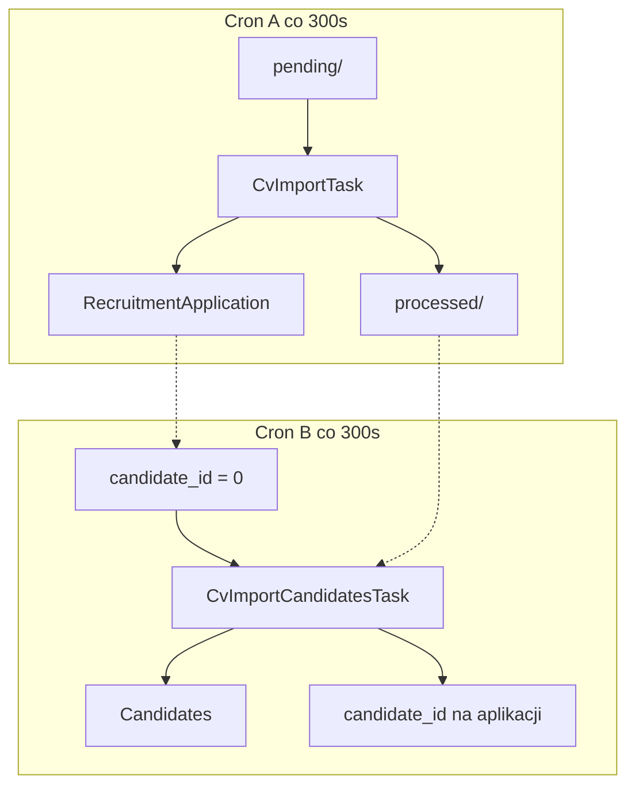

# Change Request: Podział importu CV na dwa crony

**Status:** Wdrożone (dev)  
**Powiązane:** [cr-RecruitmentApplication-import.md](cr-RecruitmentApplication-import.md), [module/RecruitmentApplication.md](module/RecruitmentApplication.md)

---

## Cel

Rozdzielić import CV na dwa niezależne procesy cron:

| Faza | Etykieta cron | Wejście | Wyjście |
|------|---------------|---------|---------|
| **A** | `LBL_SCHEDULED_CV_IMPORT_APPLICATIONS` | `import/cv/pending/*.json` | `RecruitmentApplication` + pliki w `processed/` |
| **B** | `LBL_SCHEDULED_CV_IMPORT_CANDIDATES` | aplikacje z `candidate_id=0` | `Candidates` + ustawione `candidate_id` |

Problem do rozwiązania: monolityczny `importPending()` tworzy aplikację i kandydata w jednej pętli; przy nakładających się uruchomieniach powstają duplikaty kandydatów (bug `Record::isNew` po pierwszym `save()`).

---

## Zasady

- Dwa wpisy w `vtiger_cron_task`; scheduler odpala je niezależnie — żaden cron nie woła drugiego.
- Handoff między fazami wyłącznie przez stan DB (`candidate_id=0`), nie przez łańcuch wywołań.
- Usunąć `importPending()`; wszystkie call site'y wołają jawne metody fazy A lub B.
- Brak dodatkowych `flock` w PHP — serializacja przez `cache/cron.lock` i `vtiger_cron_task.status`.
- Usunąć `CvImportLock` z importera (i plik klasy, jeśli brak innych użyć).
- Ręczny import UI i prod script: faza A, potem B w jednym request.

---

## Architektura



| | Cron A | Cron B |
|---|--------|--------|
| Handler | `CvImportTask` | `CvImportCandidatesTask` |
| Metoda importera | `importApplicationsFromPending()` | `importCandidatesFromApplications()` |
| Pliki | skan `pending/`, `moveToProcessed` | odczyt CV z `processed/` |
| Idempotencja | `UNIQUE(application_number)` | re-check `candidate_id`, `GET_LOCK` po email w `createNewCandidate()` |

---

## Zakres plików

### Nowe (2)

| Plik | Opis |
|------|------|
| `src/Modules/RecruitmentApplication/Cron/CvImportCandidatesTask.php` | Handler crona B |
| `src/Modules/Cron/Migration/MigrateCvImportSplitApplicationsAndCandidates.php` | Rejestracja crona B w istniejącej DB |

### Modyfikowane (11)

| Plik | Zmiana |
|------|--------|
| `RecruitmentApplicationImporter.php` | Split na 2 metody publiczne; fix `createFromDto`; bez `CvImportLock` |
| `CvJsonParser.php` | `parseJsonContent()` |
| `ApplicationImportRepository.php` | `fetchApplicationIdsWithoutCandidate()` |
| `CandidateApplicationSideEffects.php` | Usunąć `moveToProcessed` z `addCvToCandidate()` |
| `CvImportTask.php` | Woła fazę A |
| `ImportCandidatesManually.php` | A + B |
| `importNewCandidates.php` | A + B |
| `RunImportCandidatesWorkflow.php` | Tylko B |
| `install_schema/data.sql` + `Base2.php` | Seed crona B |
| `languages/pl_pl/RecruitmentApplication.json` | Etykieta crona B |
| `languages/en_us/RecruitmentApplication.json` | Etykieta crona B |
| `.cursor/rules/docker-commands.mdc` | Dokumentacja dwóch serwisów cron |

### Usuwane (1)

| Plik | Warunek |
|------|---------|
| `CvImportLock.php` | Gdy brak innych referencji po zmianie importera |

### Bez zmian

- `CvFilePaths.php`, `CvFileOperations.php`, `cleanup-candidates-created-on-date.php`

---

## Wdrożenie — zmiany per plik

### 1. `RecruitmentApplicationImporter.php`

**Usunąć:** `importPending()`, `processPendingFiles()`, użycie `CvImportLock`.

**Dodać:**

```php
public function importApplicationsFromPending(?int $limit = null): void
public function importCandidatesFromApplications(?int $limit = null): void
```

Oba respektują `CV_IMPORT_LIMIT` z env.

**Faza A — `processPendingApplicationFiles`:**

- Pętla `glob(pending/*.json)` jak dziś.
- Duplikat w DB → `moveToProcessed($dto)` (zamiast `deleteFiles`).
- Nowy rekord → `createFromDto($dto)` → `moveToProcessed($dto)`.
- Bez tworzenia kandydata w tej pętli.
- `IntegrityException` na `application_number` → `moveToProcessed` jeśli dto istnieje.

**`createFromDto()` — po `$record->save()`:**

```php
$id = (int) $record->getId();
self::persistApplicationNumber($id, $dto->applicationNumber);
return \App\Modules\Base\Models\Record::getInstanceById($id, 'RecruitmentApplication');
```

**Faza B — `processApplicationsWithoutCandidate`:**

Dla każdego ID z `fetchApplicationIdsWithoutCandidate($limit)`:

1. `Record::getInstanceById($id, 'RecruitmentApplication')`
2. `(int) candidate_id > 0` → skip
3. Pusty `application_json_content` → log error, skip
4. `CvJsonParser::parseJsonContent(CvFilePaths::processed(), application_number, rawJson)`
5. Ustaw `cvAttachmentPath` z `cv_saved_filename` + `processed/` gdy plik istnieje
6. `resolveCandidate` → `addCommentToCandidate` → `addCvToCandidate` → `bindCandidateToProject`
7. Świeży `getInstanceById` → ustaw `candidate_id`, opcjonalnie `cv_document_id` → jeden `save()`

### 2. `CvJsonParser.php`

```php
public static function parseJsonContent(
    string $fileDirectory,
    string $applicationNumber,
    string $rawJson,
    string $jsonFilePath = ''
): CvApplicationDto
```

`parseFile()` = `file_get_contents` + delegacja do `parseJsonContent`.

### 3. `ApplicationImportRepository.php`

```php
/**
 * @return list<int>
 */
public static function fetchApplicationIdsWithoutCandidate(?int $limit = null): array
```

```sql
SELECT ra.recruitmentapplicationid
FROM vtiger_recruitmentapplication ra
INNER JOIN vtiger_crmentity e ON e.crmid = ra.recruitmentapplicationid
INNER JOIN vtiger_recruitmentapplicationcf cf ON cf.recruitmentapplicationid = ra.recruitmentapplicationid
WHERE e.deleted = 0
  AND (cf.candidate_id IS NULL OR cf.candidate_id = 0)
  AND ra.application_number IS NOT NULL AND ra.application_number != ''
ORDER BY e.createdtime ASC
```

Opcjonalny `LIMIT` z parametru.

### 4. `CandidateApplicationSideEffects.php`

Usunąć linię `CvFileOperations::moveToProcessed($dto)` z `addCvToCandidate()`.

### 5. `CvImportTask.php`

```php
(new RecruitmentApplicationImporter())->importApplicationsFromPending();
```

### 6. `CvImportCandidatesTask.php` (nowy)

Struktura jak `CvImportTask`; `execute()` woła `importCandidatesFromApplications()`.

### 7. `MigrateCvImportSplitApplicationsAndCandidates.php` (nowy)

1. UPDATE `name` crona A: `LBL_SCHEDULED_CV_IMPORT` → `LBL_SCHEDULED_CV_IMPORT_APPLICATIONS`.
2. Jeśli brak wiersza dla `CvImportCandidatesTask::class` → `registerClassTask('LBL_SCHEDULED_CV_IMPORT_CANDIDATES', CvImportCandidatesTask::class, 300, 'RecruitmentApplication', ENABLED, <sequence>, 'Materialize candidates for imported CV applications')`.

### 8. Install seed

- `data.sql`: zaktualizować opis crona A; dodać INSERT crona B (id kolejny wolny w seedzie).
- `Base2.php`: analogicznie w tablicy seed cron.

### 9. Tłumaczenia

**pl_pl:**

```json
"LBL_SCHEDULED_CV_IMPORT_APPLICATIONS": "Zaplanowany import aplikacji CV",
"LBL_SCHEDULED_CV_IMPORT_CANDIDATES": "Zaplanowany import kandydatów z aplikacji CV"
```

**en_us:**

```json
"LBL_SCHEDULED_CV_IMPORT_APPLICATIONS": "Scheduled CV application ingest",
"LBL_SCHEDULED_CV_IMPORT_CANDIDATES": "Scheduled CV candidate materialization"
```

### 10. Call site'y

**ImportCandidatesManually.php** i **importNewCandidates.php:**

```php
$importer = new \App\Modules\RecruitmentApplication\Services\RecruitmentApplicationImporter();
$importer->importApplicationsFromPending();
$importer->importCandidatesFromApplications();
```

**RunImportCandidatesWorkflow.php:**

```php
(new \App\Modules\RecruitmentApplication\Services\RecruitmentApplicationImporter())
    ->importCandidatesFromApplications();
```

### 11. `docker-commands.mdc`

Sekcja CV import: dwa serwisy cron, pełny cykl dev (sync → A → B).

---

## Kolejność wdrożenia

1. Kod PHP (importer, parser, repository, side-effects, crony).
2. Tłumaczenia + install seed (świeże instalacje).
3. Migracja na dev/test: `MigrateCvImportSplitApplicationsAndCandidates::execute()`.
4. Weryfikacja (checklist poniżej).
5. Deploy na test/prod + migracja cron.

---

## Weryfikacja

| # | Test | Oczekiwany wynik |
|---|------|------------------|
| 1 | `SELECT name, handler_class FROM vtiger_cron_task WHERE name LIKE '%CV_IMPORT%'` | 2 wiersze |
| 2 | JSON w `pending/` → cron A | 1 aplikacja, pliki w `processed/`, `candidate_id=0` |
| 3 | Cron B | 1 kandydat, `candidate_id` ustawione |
| 4 | Ponowny cron B | Brak nowych kandydatów |
| 5 | 2× cron B z rzędu (service=) | Drugi run pominięty lub idempotentny (brak duplikatów) |

**Komendy dev:**

```bash
docker compose exec -T cron php cron/vtigercron.php service=LBL_SCHEDULED_CV_IMPORT_APPLICATIONS
docker compose exec -T cron php cron/vtigercron.php service=LBL_SCHEDULED_CV_IMPORT_CANDIDATES

docker compose exec -T app php -r '
chdir("/var/www/html");
require "vendor/autoload.php";
\App\Modules\Cron\Bootstrap::init();
\App\Modules\Cron\Migration\MigrateCvImportSplitApplicationsAndCandidates::execute();
'
```
