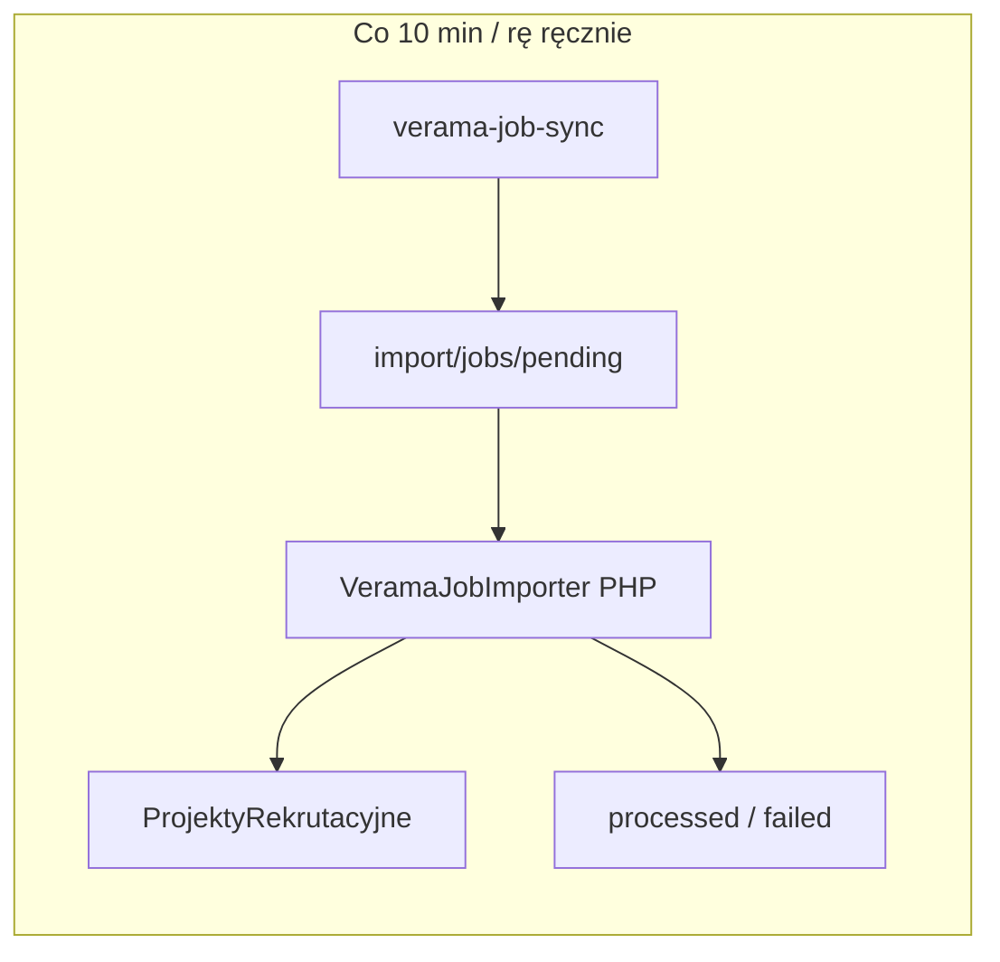

# Change Request: Verama job importer → ProjektyRekrutacyjne

**Status:** Implemented (dev)  
**Depends on:** [cr-verama-job-sync.md](cr-verama-job-sync.md) (JSON w `import/jobs/`)  
**Scope:** PHP importer + orchestracja fetch→import; **bez** pośredniego modułu CRM

---

## Goal

Zaimportować oferty z `import/jobs/pending/verama_*.json` bezpośrednio do **`ProjektyRekrutacyjne`**, z:

- deduplikacją po nowych polach źródła,
- mapowaniem statusów Verama → `etap_sprzedazy` (bez publikacji WWW przy OPEN),
- selektywnym update przy ponownym imporcie,
- przenoszeniem plików `pending/` → `processed/` / `failed/`,
- **jednym przebiegiem operacyjnym**: fetch + importer co ~10 min (CLI ręczny + cron).

---

## Stance

- **Bez pośredniego modułu** — staging = pliki JSON; rekord biznesowy = projekt.
- **Jeden importer**, jeden klucz dedup, jeden katalog `pending/` (wzorzec CV).
- **No fallbacks** — brak mapowania / brak pliku / błąd `save()` → abort runu (exit ≠ 0).
- Mapowanie JSON→CRM w PHP; fetcher nie zna pól FreeCRM.
- `class_alias()` / równoległe ścieżki importu — zabronione.

---

## Decisions (confirmed)

| # | Decision |
|---|----------|
| D1 | Pełny importer PHP (`Record::save`), nie dry-run. |
| D2 | Trigger: **CLI ręczny** + **cron FreeCRM** (~10 min). |
| D3 | **Jeden orchestrator**: najpierw fetch, potem import (ten sam cykl). |
| D4 | Nowe pola na projekcie: źródło + external id (unikalność). |
| D5 | Re-import: **update tylko wybranych pól** (lista poniżej); reszta CRM nietykalna. |
| D6 | Po sukcesie: plik → `import/jobs/processed/`; błąd → `failed/` + **abort**. |
| D7 | `OPEN` → `etap_sprzedazy = Na potrzeby RFI` (bez publikacji). |
| D8 | `CLOSED` → `etap_sprzedazy = Sprzedaż utracona`. |
| D9 | Przeterminowane `lastDayOfApplications` przy `OPEN` — **nadal import jako RFI** (nie zamykać). |
| D10 | `nazwa_projektu` = `trim(api.title)`. |
| D11 | Sekcje → `your_duties` / `our_requirements` / `we_offer` gdy się da; inaczej tylko `tresc` (HTML). |
| D12 | REQUIRED → `needed_skills`; PREFERRED → `nice_to_have_skills`. |
| D13 | Lokalizacje PL → `miejsce_pracy` / `workplace_for_map` jako CSV miast. |
| D14 | `remoteness` → `tryb_pracy` (reguła poniżej). |
| D15 | Stawka tylko do `remuneration` (tekst). |
| D16 | `endDate` → `oczekiwana_data_zakonczenia`. |
| D17 | `numberOfPositions` → `ilosc_wakatow`. |
| D18 | `level` / `skillRole` — tylko w `tresc` (API description), bez osobnych pól. |
| D19 | URL Veramy + tekst klienta → `informacje_dodatkowe`. |
| D20 | `kontrahent` = stałe Accounts **Ework Verama** (lookup po `accountname`). |
| D21 | `assigned_user_id` = user **`automat`**. |
| D22 | `rodzaj` = **`Dla klienta`**. |
| D23 | Nowa wartość picklisty `zrodlo_pozyskania_projektu` = **`Verama www`**. |
| D24 | Abort całego runu przy pierwszym błędzie pliku. |
| D25 | Częstotliwość docelowa: **10 min**. |
| D26 | Zawsze pełny skan `pending/`. |
| D27 | Bez Documents / maili / komentarzy. |
| D28 | Etap bez publikacji (`Na potrzeby RFI`, nie `Aktywna`). |

---

## Assumptions

| # | Assumption |
|---|------------|
| A1 | Sync v1 już działa i pisze kontrakt z [cr-verama-job-sync.md](cr-verama-job-sync.md). |
| A2 | User `automat` (id 17 na dev) istnieje w każdym środowisku. |
| A3 | Picklista `etap_sprzedazy` już zawiera `Na potrzeby RFI` i `Sprzedaż utracona`. |
| A4 | Publikacja WWW (`generateProjectsFile`) filtruje po `Aktywna` — RFI nie wycieka na stronę. |
| A5 | Cały cykl (fetch + import) działa **wyłącznie w kontenerze `cron`** (supercronic) — **bez** host crontab / `docker compose run` z hosta jako scheduler. |
| A6 | Obraz używany przez `cron` ma Pythona + zależności Verama (rozszerzenie Dockerfile cron / wspólnego PHP), credentials Verama w env kontenera `cron`. |

---

## Remoteness → tryb_pracy (D14)

Obserwowane wartości w sync PL: `0, 25, 50, 75, 100`.

| `api.remoteness` | `tryb_pracy` |
|------------------|--------------|
| `0` | `praca na miejscu` |
| `1`–`99` | `praca hybrydowa` |
| `≥ 100` | `praca zdalna` |
| brak / nie-liczba | **abort** (fail visible) |

---

## Field mapping

### Create + selective update (D5)

Pola **ustawiane przy create i nadpisywane przy update**:

| CRM field | Source |
|-----------|--------|
| `nazwa_projektu` | `trim(api.title)` |
| `etap_sprzedazy` | `OPEN`→`Na potrzeby RFI`; `CLOSED`→`Sprzedaż utracona` |
| `rodzaj` | stałe `Dla klienta` |
| `zrodlo_pozyskania_projektu` | `Verama www` |
| `job_source` *(new)* | `verama` |
| `external_job_id` *(new)* | `external_id` / `api.id` |
| `reference_no` | `system_id` / `api.systemId` (np. `JR-53007`) |
| `tresc` | `description_html`; jeśli sekcje OK — nadal pełny HTML w `tresc` jako kanon ogłoszenia |
| `your_duties` | sekcja mapped (`responsibilities` / `description` / podobne) lub puste gdy brak |
| `our_requirements` | sekcja `requirements` (+ długie „value” bloki mapped jako requirements) lub puste |
| `we_offer` | sekcja `offer` lub puste |
| `needed_skills` | skills `priority=REQUIRED` → nazwy, separator `, ` |
| `nice_to_have_skills` | skills `PREFERRED` |
| `miejsce_pracy` | unikalne `locations[].city`, join `, ` |
| `workplace_for_map` | to samo co `miejsce_pracy` (v1) |
| `tryb_pracy` | reguła remoteness |
| `remuneration` | np. `135 PLN / h` z `rate.maxRate`, `rate.currency`, `rate.clientRateType` |
| `oczekiwana_data_zakonczenia` | `api.endDate` (date) |
| `ilosc_wakatow` | `api.numberOfPositions` |
| `informacje_dodatkowe` | URL + klient + admin (tekst; **nadpisywane** przy update — format kanoniczny importera) |

Przy **create only** (nie nadpisywać przy update):

| CRM field | Value |
|-----------|--------|
| `assigned_user_id` | `automat` |
| `kontrahent` | puste |
| `contact_person`, `priorytet`, budżety, `job_advertisement_links`, `statistics`, `cv_boolean_query`, … | nietykalne |

Jeśli przy update rekord ma już inny `etap_sprzedazy` ustawiony ręcznie (nie RFI / nie Sprzedaż utracona) — **v1 i tak nadpisuje etap z Veramy** (OPEN/CLOSED). Alternatywa „nie ruszaj etapu po ręcznej zmianie” = follow-up; tu świadomie sync ze źródłem.

### Section scatter (D11)

Best-effort z `description_sections`:

| Section keys (przykłady) | CRM |
|--------------------------|-----|
| `responsibilities`, `description`, `about` (gdy to opis roli) | `your_duties` / część `tresc` |
| `requirements`, długie slugi „value/ideal candidate” | `our_requirements` |
| `offer` | `we_offer` |

Jeśli po mapowaniu wszystkie trzy puste → tylko `tresc` = HTML (sekcje CRM puste).  
`tresc` **zawsze** dostaje pełny `description_html` (źródło prawdy ogłoszenia).

### `informacje_dodatkowe` template

```
Źródło: Verama
URL: https://app.verama.com/app/job-requests/{id}
systemId: JR-…
Klient: {legalEntityClient.name}
Administrator: {administratorLegalEntityClient.name}
scraped_at: …
```

---

## Impact

### Code being added

| Path | Role |
|------|------|
| `src/Modules/ProjektyRekrutacyjne/Services/Verama/VeramaJobImportDto.php` | DTO |
| `…/VeramaJobJsonParser.php` | Walidacja JSON |
| `…/VeramaJobFieldMapper.php` | Mapowanie pól + remoteness + skills |
| `…/VeramaJobImporter.php` | Orkiestracja pending → save → move |
| `…/VeramaJobFilePaths.php` / `VeramaJobFileOperations.php` | Ścieżki pending/processed/failed |
| `src/Modules/ProjektyRekrutacyjne/Cron/VeramaJobImportTask.php` | Cron handler |
| `migrations/ProjektyRekrutacyjne/m…_verama_job_import_fields.php` | Pola + picklista + cron row |
| `scripts/verama_job_sync/run-verama-job-sync.sh` | Orchestrator: fetch → import |
| `languages/en_us|pl_pl/ProjektyRekrutacyjne.json` | Labele pól + cron |
| `documentation/cr-verama-job-importer.md` | Ten CR |

### Code being modified

| Path | Change |
|------|--------|
| `docker/cron/crontab` | Wpis co 10 min: jeden skrypt fetch+import (`flock`) |
| `docker/php/Dockerfile.cron` (lub równoważne) | Python 3 + deps Verama dla serwisu `cron` |
| `docker-compose.yml` | `cron.build` → Dockerfile z Pythonem; `env_file` / env `VERAMA_*`; mount `scripts/verama_job_sync` jeśli potrzebny |
| `.gitignore` | bez zmian jeśli `/import` już ignoruje artefakty |

### Code being deleted

Brak.

### Database

| Change | Detail |
|--------|--------|
| Nowe pola | `external_job_id` (V~64), `job_source` (V~32) na `u_yf_projektyrekrutacyjne` (lub cf) |
| Unikalność | UNIQUE(`job_source`, `external_job_id`) na nieskasowanych — egzekwowane w app + indeks DB (soft-delete: unikalność w aplikacji po `deleted=0`) |
| Picklista | `zrodlo_pozyskania_projektu` += `Verama www` |
| Cron | `vtiger_cron_task`: `LBL_SCHEDULED_VERAMA_JOB_IMPORT`, handler `VeramaJobImportTask`, ~600 s |

### Module metadata

- Layout: nowe pola w bloku sensownym (np. informacje / źródło).
- Po migracji: `bin/regenerate_user_privileges.php`.

### Observable

- Nowe projekty w liście `ProjektyRekrutacyjne` (etap RFI).
- CLOSED → etap `Sprzedaż utracona`.
- Brak zmian WWW (nie `Aktywna`).

---

## Architecture



### Orchestrator (D3) — tylko kontener `cron`

**Zakaz:** host crontab, WSL scheduler, `docker compose run` jako jedyny sposób cyklicznego odpalania.

**Jedyny scheduler:** `docker/cron/crontab` (supercronic w serwisie `cron`), wzorzec jak cv-sync.

`scripts/verama_job_sync/run-verama-job-sync.sh` (uruchamiany **wewnątrz** kontenera `cron`):

1. `flock -n /var/www/html/cache/verama-job-sync.lock`
2. Sync: `python -m verama_job_sync` (kod z `scripts/verama_job_sync`, `PYTHONPATH` ustawiony; env `VERAMA_*` z compose/`verama-job-sync.env` zamontowanego do `cron`)
3. Import: `gosu www-data php …` — ten sam kod co `VeramaJobImportTask` (bezpośredni CLI **albo** `vtigercron.php service=LBL_SCHEDULED_VERAMA_JOB_IMPORT`)
4. Log: `cache/logs/verama-job-sync.log`

Wpis crontab (co 10 min):

```cron
*/10 * * * * flock -n /var/www/html/cache/verama-job-sync.lock env … /var/www/html/scripts/verama_job_sync/run-verama-job-sync.sh >> /var/www/html/cache/logs/verama-job-sync.log 2>&1
```

**Obraz `cron`:** musi zawierać Python 3 + `requirements.txt` Veramy. Preferencja implementacyjna:

1. **`docker/php/Dockerfile.cron`** — `FROM` obrazu PHP FreeCRM + `apt install python3` + `pip install -r …` (nie puchnie serwis `app`), **albo**
2. wspólny Dockerfile z opcjonalną warstwą Python (gorsze — zbędne w `app`).

Serwis `verama-job-sync` (profile `verama-job-sync`) zostaje do **ręcznego** fetch-only / debug; cykl produkcyjny/dev scheduled = wyłącznie `cron`.

Ręczny pełny cykl na dev:

```bash
docker compose exec -T cron /var/www/html/scripts/verama_job_sync/run-verama-job-sync.sh
```

Po zmianie crontab / skryptu sync: `docker compose up -d cron` (supercronic nie zawsze hot-reloaduje).

### Importer loop

1. Skan `import/jobs/pending/verama_*.json`
2. Parse + validate (wymagane: `source`, `external_id`, `status`, `api` z `title`)
3. Find existing by `job_source=verama` + `external_job_id`
4. Create lub selective update → `save()`
5. Move → `processed/`
6. Na wyjątku: move → `failed/` (jeśli plik jeszcze w pending), log, **abort** (nie przetwarzaj dalszych)

---

## Functional requirements

| ID | Requirement |
|----|-------------|
| F1 | Import wszystkich `verama_*.json` z pending w jednym runie (do pierwszego błędu). |
| F2 | Dedup po `(job_source, external_job_id)`. |
| F3 | OPEN → create/update z etapem `Na potrzeby RFI`. |
| F4 | CLOSED → update (lub create tombstone-minimal) z etapem `Sprzedaż utracona`. |
| F5 | Selective field update wg tabeli powyżej. |
| F6 | `assigned_user_id=automat` tylko przy create. |
| F7 | Picklista zawiera `Verama www`. |
| F8 | CLI + cron wywołują ten sam `VeramaJobImporter`. |
| F9 | Log: `cache/logs/system.log` + podsumowanie (created/updated/closed/failed). |

### Out of scope

| Item | Follow-up |
|------|-----------|
| Tworzenie/linkowanie `Accounts` | Później |
| Auto `Aktywna` / publikacja WWW | Ręcznie |
| Continue-on-error | Po stabilizacji |
| Inne źródła job board | Osobne CR |
| Zachowanie ręcznego etapu przy update | Opcjonalnie |

---

## Data migration

```text
-- Conceptual (via FreeCRM migration API, not raw SQL in app code)
ADD job_source VARCHAR(32) NULL
ADD external_job_id VARCHAR(64) NULL
INDEX/UNIQUE application-level on (job_source, external_job_id) WHERE deleted=0
INSERT picklist value "Verama www" into zrodlo_pozyskania_projektu
INSERT vtiger_cron_task for VeramaJobImportTask
```

**Rollback:** drop new fields (jeśli puste), usuń wartość picklisty jeśli nieużywana, usuń cron row; projekty już utworzone — zostają (restore backup jeśli trzeba cofnąć dane).

Idempotent migration: safe to re-run.

---

## Implementation plan

1. Migracja: pola `job_source`, `external_job_id` + picklista `Verama www` + wpis cron.
2. `VeramaJobFilePaths` / `FileOperations` (pending/processed/failed + ensure dirs).
3. Parser + DTO + mapper (remoteness, skills, sections, remuneration text).
4. `VeramaJobImporter` (create/update/move/abort).
5. `VeramaJobImportTask` + CLI `scripts/verama_job_sync/../` lub `src/Modules/ProjektyRekrutacyjne/scripts/importVeramaJobs.php`.
6. Języki `en_us` + `pl_pl`.
7. `Dockerfile.cron` + env Verama na `cron` + `run-verama-job-sync.sh` + wpis `*/10` w `docker/cron/crontab`; `docker compose up -d cron`.
8. Regeneracja privileges; smoke: `docker compose exec -T cron …/run-verama-job-sync.sh` na pending JSON.
9. Usunięcie martwego kodu — N/A.

---

## Testing

1. Import jednego pliku `verama_82044.json` → projekt: tytuł, RFI, skills, lokalizacje, remuneration, `reference_no=JR-53007`, źródło `Verama www`, owner automat, kontrahent pusty.
2. Drugi import tego samego → update selected; `assigned_user_id` bez zmiany; brak duplikatu.
3. Plik `status=CLOSED` → etap `Sprzedaż utracona`; move processed.
4. Zepsuty JSON → failed + abort; kolejne pliki nietknięte.
5. Brak `title` → abort.
6. Remoteness 0 / 50 / 100 → trzy tryby pracy.
7. Cron label widoczny w admin; ręczne CLI = ten sam wynik.
8. Regresja: CV import (`import/cv`) nietknięty; projekty `Aktywna` na WWW bez zmian.

Logi: `cache/logs/system.log`, log synca osobno.

---

## Rollback plan

- Revert commit(s); wyłączyć cron.
- DROP nowych kolumn jeśli nieużywane produkcyjnie; w przeciwnym razie zostawić.
- Dane projektów: soft-delete ręczny lub restore DB backup.
- Downtime: brak. Utrata: tylko zaimportowane projekty Verama od deployu.

---

## Edge cases

| Case | Handling |
|------|----------|
| CLOSED bez wcześniejszego OPEN w CRM | Create minimal/full z JSON + etap utracona |
| Puste `description_sections` | Tylko `tresc` |
| Brak `rate.maxRate` | `remuneration` puste (dozwolone) |
| Brak `endDate` | `oczekiwana_data_zakonczenia` puste |
| Duplikat DB przy race | UNIQUE/app check → abort |
| Plik nie-`verama_*.json` w pending | Ignoruj lub abort? → **ignoruj** obce nazwy |
| `status` inny niż OPEN/CLOSED | **abort** |

---

## Risks

| ID | Risk | Severity | Mitigation |
|----|------|----------|------------|
| R1 | Python w obrazie `cron` (rozmiar / rebuild) | Low | Osobny `Dockerfile.cron`; `app` bez Pythona |
| R1b | Credentials Verama w env `cron` | Med | `env_file` gitignore (jak `verama-job-sync.env`); nie logować hasła |
| R2 | Nadpisanie ręcznego etapu przy re-import | Med | Udokumentowane; follow-up flaga „locked stage” |
| R3 | Sekcje BS4 nietrafione → puste duties/requirements | Low | `tresc` zawsze pełne |
| R4 | Unikalność soft-delete | Med | Lookup `deleted=0`; nie reuse id po trash bez świadomej decyzji |

---

## Deliverables checklist

- [ ] Impact + brak usuwania legacy
- [ ] Migracja pól / picklista / cron
- [ ] Implementation steps
- [ ] Testing
- [ ] Rollback
- [ ] Rationale: bezpośredni import do `ProjektyRekrutacyjne`

---

## Scheduler (locked)

| | |
|--|--|
| Scheduler | **Tylko** `docker/cron/crontab` w kontenerze `cron` |
| Host crontab | **Nie** |
| Ręcznie | `docker compose exec -T cron …/run-verama-job-sync.sh` |
| Profile `verama-job-sync` | Opcjonalny debug fetch-only |

Jeśli akceptujesz CR — przechodzimy do implementacji.
