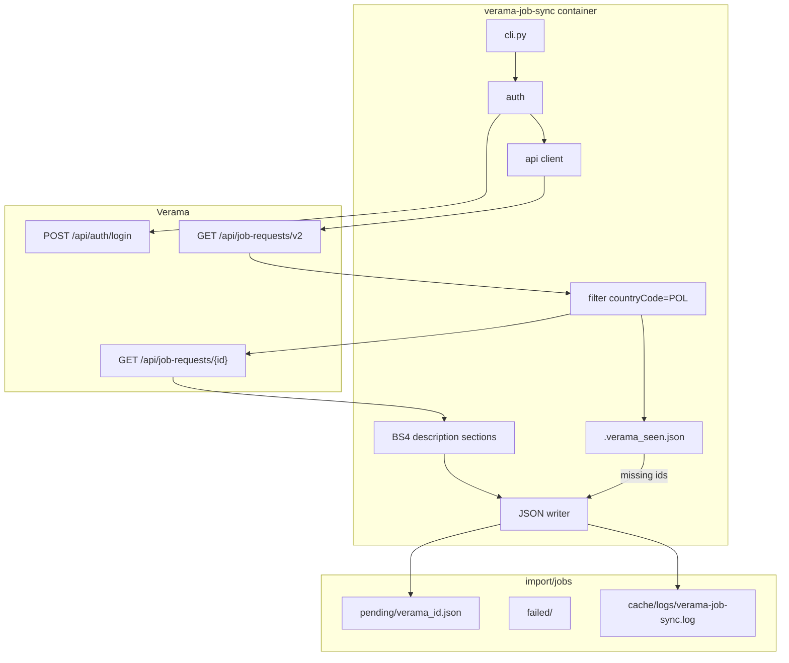

# Change Request: Verama job sync → JSON

**Status:** Implemented (dev) — sync + Docker; CRM import out of scope  
**Scope:** Python Verama job sync only (no FreeCRM PHP importer in this CR)  
**Target env:** dev (`docker compose`); push to test/prod only after successful manual runs

---

## Goal

Dodać **dedykowany Verama job sync** (Ework Verama), który:

1. Loguje się do [app.verama.com](https://app.verama.com) przez nieoficjalne REST API SPA.
2. Pobiera **otwarte oferty z `countryCode=POL`** (~61 z ~187 na dzień badań).
3. Dla każdej oferty zapisuje **ustrukturyzowany JSON** (pełny payload detail API + wyodrębnione sekcje z HTML `description`).
4. Oznacza oferty **CLOSED**, gdy zniknęły z aktualnej listy OPEN/POL względem poprzedniego stanu.
5. Zapisuje wynik pod `import/jobs/` pod przyszły import do `ProjektyRekrutacyjne` (osobny CR).

Uruchomienie v1: **ręczne** przez Docker. Harmonogram co 10 min — wymóg docelowy, poza tym CR (lub osobny krok po akceptacji ręcznych runów).

---

## Stance

- **Jedno źródło w tym CR:** tylko Verama. Kod w `scripts/verama_job_sync/` — bez wspólnego frameworka multi-source; katalog nadrzędny zostawia miejsce na kolejne synce.
- **API-first, nie HTML SPA:** lista i szczegóły z `/api/job-requests/…`; BeautifulSoup tylko do parsowania HTML `description`.
- **Brak fallbacków ukrywających błędy:** nieudany auth / lista / detail → abort (exit ≠ 0); brak „pustego sukcesu”.
- **Sekrety poza gitem:** credentials wyłącznie w lokalnym env (gitignore).
- **Bez zapisu do CRM / DB FreeCRM** w tym CR.

---

## Assumptions

| # | Assumption |
|---|------------|
| A1 | SPA Verama nadal wystawia `POST /api/auth/login`, `GET /api/job-requests/v2`, `GET /api/job-requests/{id}` (zbadane 2026-07-17). |
| A2 | `POST /api/auth/login` z emailem/hasłem działa bez Playwright dla konta firmowego; jeśli reCAPTCHA zablokuje — fail visible (osobna decyzja: Playwright). |
| A3 | Filtr kraju po stronie klienta: pole listy `countryCode == "POL"` (parametry query `countryCodes` / `countries` **nie filtrują**). |
| A4 | Stabilny klucz oferty: numeryczne `id` (np. `82044`); `systemId` (`JR-53007`) jako pole pomocnicze. |
| A5 | Katalog `/import` jest już w `.gitignore`; artefakty crawl’a nie trafiają do gita. |
| A6 | Mapowanie JSON → `ProjektyRekrutacyjne` i wartość źródła w CRM (`verama`) — **follow-up CR**. |

---

## Impact

### Code being added

| Path | Role | Observable? |
|------|------|-------------|
| `scripts/verama_job_sync/` | Pakiet sync (CLI, client, parser, writer) | CLI / pliki |
| `scripts/verama_job_sync/requirements.txt` | `requests`, `beautifulsoup4`, `lxml` (parser BS4) | Build |
| `scripts/verama_job_sync/README.md` | Jak uruchomić, schema JSON, sekrety | Docs |
| `docker/verama-job-sync/Dockerfile` | Obraz Python | Docker |
| `docker/verama-job-sync/verama-job-sync.env.example` | Szablon credentials (bez haseł) | Config |
| `docker-compose.yml` | Serwis `verama-job-sync` | Dev ops |
| `.gitignore` | `docker/verama-job-sync/verama-job-sync.env` | Secrets |
| `documentation/cr-verama-job-sync.md` | Ten CR | Docs |

### Code being modified

| Path | Change | Observable? |
|------|--------|-------------|
| `docker-compose.yml` | Nowy serwis + volume `./import` | Dev |
| `.gitignore` | Ignore `verama-job-sync.env` | Internal |

### Code being deleted

Brak — nowa funkcjonalność.

### Database / module metadata / PHP cron

**Brak.** Żadnych zmian FreeCRM DB, `vtiger_cron_task`, ani importera PHP.

### External consumers

- **Verama** — ruch HTTP z konta firmowego (rate limit 2 s między requestami szczegółów).
- Future: PHP importer czyta `import/jobs/pending/` (poza scope).

---

## Functional requirements

### In scope

| ID | Requirement |
|----|-------------|
| F1 | Auth: `POST /api/auth/login` → JWT + session; refresh jeśli API tego wymaga (`/api/auth/refresh`). |
| F2 | Lista: paginacja `GET /api/job-requests/v2` (np. `size=100`); filtr **tylko** `countryCode == "POL"`. |
| F3 | Detail: `GET /api/job-requests/{id}` dla każdej oferty PL; delay **2 s** między detailami. |
| F4 | Output: **jeden plik na ofertę** `import/jobs/pending/verama_{id}.json` (pełny detail + metadane crawl + sekcje z description). |
| F5 | `description`: BS4 wycina **sekcje** (nagłówki / bloki); jeśli nie da się — `description_text` (plain) + `description_html` + `description_sections: {}` puste / częściowe, bez ukrywania błędu parsowania w logu. |
| F6 | CLOSED: po udanym pełnym crawl PL, oferty z `import/jobs/.verama_seen.json` nieobecne na aktualnej liście OPEN/POL → zapis/aktualizacja JSON ze `"status": "CLOSED"` (i/lub pole `closed_detected_at`) w `pending/` (lub nadpisanie istniejącego pliku). |
| F7 | Abort: błąd auth, listy, paginacji **lub** pojedynczego detail → log + exit ≠ 0; częściowo zapisane pliki zostają (run nie jest transakcyjny). |
| F8 | Raport końcowy (stdout + `cache/logs/verama-job-sync.log`): fetched / written / closed / failed / duration. |
| F9 | Run ręczny: `docker compose run --rm verama-job-sync`. |
| F10 | JSON jest **odzwierciedleniem API/strony**, nie pól CRM; `source: "verama"`. |

### Out of scope (follow-up)

| Item | Why deferred |
|------|----------------|
| Import do `ProjektyRekrutacyjne` | Osobny CR (PHP `Record::save`) |
| Picklista / `vtiger_application_source` = Verama | Przy importerze |
| Cron co 10 min w Dockerze | Po stabilnych runach ręcznych |
| Inne portale / wspólny adapter framework | Świadomie poza v1 |
| Playwright / omijanie reCAPTCHA | Tylko jeśli login API padnie |
| Snapshot raw HTML strony | Świadomie wyłączone |

---

## Architecture



### Proposed package layout

```
scripts/verama_job_sync/
  __init__.py
  __main__.py          # python -m entry
  cli.py               # argparse: run, --dry-run optional later
  config.py            # env: VERAMA_EMAIL, VERAMA_PASSWORD, paths, delay
  auth.py              # login / token storage in memory for run
  client.py            # list + detail HTTP
  filter_pl.py         # countryCode == POL
  description.py       # BS4 → sections + plain text
  closed.py            # seen-state + CLOSED emit
  writer.py            # pending/failed paths
  report.py
  requirements.txt
  README.md

docker/verama-job-sync/
  Dockerfile
  verama-job-sync.env.example
  verama-job-sync.env           # gitignored — local only
```

### JSON contract (per job file)

Plik jest **nadzbiorem** odpowiedzi detail API (pola 1:1 z Veramy) plus envelope crawl’a:

```json
{
  "source": "verama",
  "external_id": "82044",
  "system_id": "JR-53007",
  "url": "https://app.verama.com/app/job-requests/82044",
  "scraped_at": "2026-07-17T08:00:00+00:00",
  "status": "OPEN",
  "closed_detected_at": null,
  "description_html": "<p>…</p>",
  "description_text": "…",
  "description_sections": {
    "about": "…",
    "responsibilities": "…",
    "requirements": "…",
    "offer": "…",
    "other": "…"
  },
  "api": { }
}
```

- `api` — pełny obiekt JSON z `GET /api/job-requests/{id}` (bez obcinania).
- `status` — z API (`OPEN`, …) albo nadpisane na `CLOSED` przez detekcję zniknięcia.
- Nazwy kluczy w `description_sections` — best-effort z nagłówków HTML; nieustandaryzowane między ofertami (mapowanie CRM później).

### CLOSED algorithm

1. Po udanym pobraniu pełnej listy PL OPEN: zbiór `current_ids`.
2. Wczytaj `import/jobs/.verama_seen.json` → `previous_ids` (+ opcjonalnie last status).
3. Dla `id in previous_ids - current_ids`: zapisz/aktualizuj `verama_{id}.json` ze `status: "CLOSED"`, `closed_detected_at: now` (jeśli brak lokalnego detail — minimalny tombstone z `external_id` + status; preferuj update istniejącego pliku z `pending/` jeśli jest).
4. Zapisz nowy seen = `current_ids`.
5. Pierwszy run (brak seen): **nie** oznaczaj CLOSED; tylko utwórz seen.

### Secrets

| Variable | Where |
|----------|--------|
| `VERAMA_EMAIL` | `docker/verama-job-sync/verama-job-sync.env` |
| `VERAMA_PASSWORD` | same |
| Optional overrides | `VERAMA_BASE_URL`, `VERAMA_REQUEST_DELAY_SEC=2`, `VERAMA_OUTPUT_DIR=/var/www/import/jobs` |

Compose: `env_file: docker/verama-job-sync/verama-job-sync.env`.  
**Nie** commitować `verama-job-sync.env`. Hasło podane w czacie projektowym — **zmienić w Veramie** przed użyciem w pliku lokalnym.

### Docker service (sketch)

```yaml
verama-job-sync:
  build:
    context: .
    dockerfile: docker/verama-job-sync/Dockerfile
  env_file:
    - docker/verama-job-sync/verama-job-sync.env
  volumes:
    - ./import:/var/www/import
    - ./cache/logs:/var/www/html/cache/logs
    - ./scripts/verama_job_sync:/app:ro
  working_dir: /app
  profiles: ["verama-job-sync"]   # nie startuje z domyślnym `up`
  restart: "no"
```

Uruchomienie:

```bash
docker compose --profile verama-job-sync run --rm verama-job-sync
```

---

## Data migration

**No data migration required.** (Brak zmian MariaDB / FreeCRM.)

Katalogi do utworzenia przy pierwszym runie (przez crawler lub `.gitkeep` jeśli kiedyś wyjątek z `/import`):

- `import/jobs/pending/`
- `import/jobs/failed/`
- `import/jobs/.verama_seen.json` (tworzony runtime)

---

## Implementation plan

Ordered, each step leaves repo usable.

1. **Scaffold** — `scripts/verama_job_sync/` + `requirements.txt` + README stub; `.gitignore` dla `verama-job-sync.env`; `verama-job-sync.env.example`.
2. **Config + auth + client** — login, list pagination, detail; fail hard na HTTP ≠ 2xx / brak tokena.
3. **PL filter + writer** — `pending/verama_{id}.json` z envelope + pełnym `api`.
4. **Description parser (BS4)** — `description_html` / `_text` / `_sections`; log gdy sekcje puste mimo HTML.
5. **CLOSED + seen state** — algorytm powyżej.
6. **CLI + report + logging** — stdout + `cache/logs/verama-job-sync.log`.
7. **Docker** — Dockerfile, compose service z profile `verama-job-sync`, dokumentacja run.
8. **Manual smoke na dev** — wg checklisty Testing; poprawki selektorów sekcji jeśli trzeba.
9. **(Opcjonalnie później)** cron co 10 min — poza tym CR lub osobny mały follow-up po akceptacji.

**Legacy deletion:** N/A.

---

## Testing

### Manual smoke

1. Skopiuj `verama-job-sync.env.example` → `verama-job-sync.env`, uzupełnij credentials (po rotacji hasła).
2. `docker compose --profile verama-job-sync build verama-job-sync`
3. `docker compose --profile verama-job-sync run --rm verama-job-sync`
4. Sprawdź: liczba plików w `pending/` ≈ liczba PL (~61); spot-check `82044` (Unix Specialist) — `api.id`, skills, locations PL, `description_sections` niepuste jeśli HTML ma nagłówki.
5. Drugi run: te same `external_id` nadpisane; brak duplikatów nazw plików.
6. Symulacja CLOSED: usuń jedno `id` z mocka listy **albo** ręcznie dodaj fake id do `.verama_seen.json` i uruchom — oczekiwany plik `status: CLOSED`.
7. Błędne hasło → exit ≠ 0, brak „sukcesu”, log z błędem auth.
8. (Opcjonalnie) odłącz sieć mid-detail → abort, log.

### Regression

- Istniejący stack FreeCRM (`web`/`app`/`cron`/`db`) — bez zmian zachowania.
- CV import (`import/cv/`) — nietknięty.

### Logs

- `cache/logs/verama-job-sync.log`
- stdout kontenera

### Automated tests

- Lekkie unit testy parsera `description.py` na 2–3 zapisanych fragmentach HTML z Veramy (fixture w `scripts/verama_job_sync/tests/`) — zalecane w tym CR.
- Brak testów e2e przeciwko live Verama w CI (credentials / flaky).

---

## Rollback plan

- Usunąć serwis z compose / nie budować obrazu; usunąć katalog `scripts/verama_job_sync/` i `docker/verama-job-sync/`.
- Skasować lokalnie `import/jobs/**` i `.verama_seen.json` — brak wpływu na DB CRM.
- Downtime: brak. Utrata danych: tylko lokalne JSON z crawl’a.

---

## Edge cases

| Case | Handling |
|------|----------|
| Pierwszy run (brak seen) | Brak CLOSED |
| Oferta PL z wieloma lokalizacjami | `countryCode=POL` na liście wystarczy |
| Oferta bez `countryCode` | Pomijana (nie PL) |
| `description` bez nagłówków | `description_sections` puste/partial + pełny text/html; log warning |
| Detail 404/5xx | Abort całego runu (F7) |
| reCAPTCHA blokuje login | Abort + jasny komunikat; follow-up Playwright |
| Równoległe dwa runy | v1: dokumentować „nie uruchamiać równolegle”; opcjonalnie `flock` w follow-up cron |
| Zmiana shape API Veramy | Abort / JSON error — fix crawler (kontrakt zewnętrzny) |

---

## Decision rationale & tradeoffs

| Decision | Why | Alternative rejected |
|----------|-----|----------------------|
| API zamiast HTML+Playwright | Stabilniejsze, szybsze, pełne pola | Czysty BS4 na SPA — nie działa |
| Tylko PL | Biznesowo istotne; ~2 min @ 2 s delay | Wszystkie 187 — dłuższy run, szum |
| Jeden plik / oferta | Jak CV pending; prostszy przyszły importer | Jeden duży JSON |
| Pełny `api` + envelope | Mapowanie CRM później bez ponownego crawl | Wczesne mapowanie na pola CRM |
| Profile `crawler` w compose | Nie zaśmieca `docker compose up` | Stały serwis z cronem od dnia 1 |
| Abort na detail | Szybka diagnoza w v1 | Continue+failed — lepsze pod cron później |

---

## Risks

| Risk | Severity | Mitigation |
|------|----------|------------|
| Verama zmienia / zamyka nieoficjalne API | High | Fail visible; monitoring logów; ewentualnie Playwright |
| reCAPTCHA na login | Med | Abort; token refresh jeśli sesja żyje; Playwright follow-up |
| ToS / akceptowalne użycie scrapingu | Med | Konto firmowe, delay 2 s, tylko PL; świadoma decyzja biznesowa |
| Sekcje BS4 niestabilne między ofertami | Low | Zostawiamy HTML+text; sekcje best-effort |
| Wyciek credentials | High | gitignore env; rotacja hasła z czatu |

---

## Deliverables checklist

- [ ] Impact (powyżej) — brak usuwania legacy
- [ ] No DB migration
- [ ] Implementation steps 1–8
- [ ] Testing checklist
- [ ] Rollback plan
- [ ] Rationale + risks

---

## Follow-up CRs (nie ten)

1. **Importer PHP** `import/jobs/pending` → `ProjektyRekrutacyjne` + źródło `verama`.
2. **Cron 10 min** w `verama-job-sync` / supercronic.
3. Ewentualnie **Playwright login**, jeśli API login padnie na captcha.
