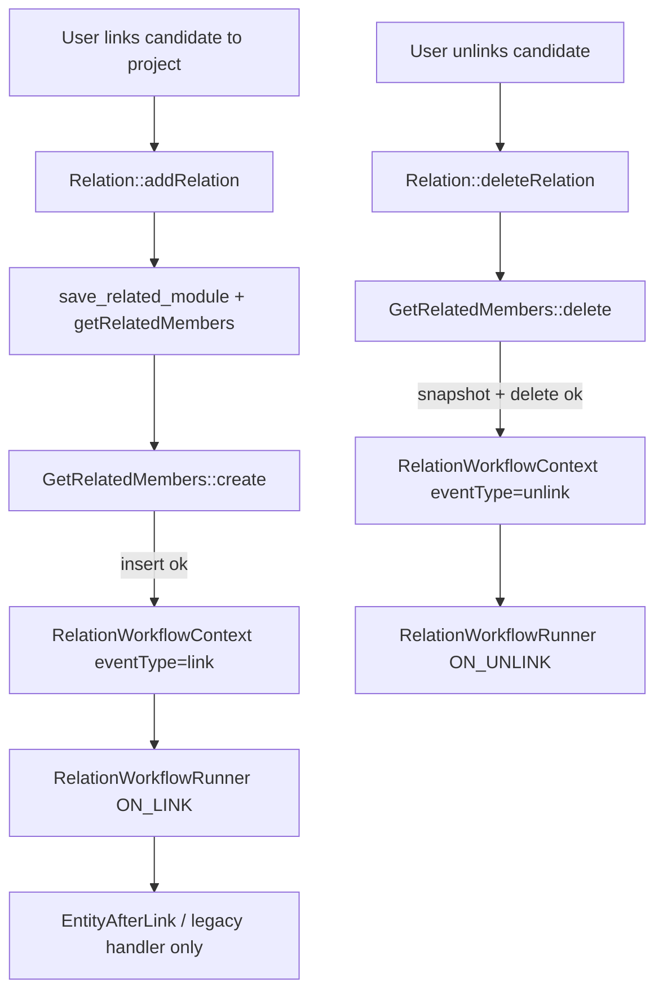

# FreeCRM Link / Unlink Workflow Triggers — MVP

**Status:** MVP specification (ready for implementation)  
**Author:** bmankowski@gmail.com  
**Date:** 2026-05-22  
**Related:** [workflow-relations-modification.md](./workflow-relations-modification.md) (`ON_RELATION_MODIFY`)  
**Scope:** Workflow automation when **two records are linked** or **unlinked** via a custom relation row (membership add/remove). First runtime hooks: recruitment `ProjektyRekrutacyjne` ↔ `Kandydaci`; trigger types and runner are **module-agnostic**.

---

## 1. Goal

Administrators must be able to define workflows that run when:

1. **ON_LINK** — a relation membership row is created (e.g. candidate added to project).
2. **ON_UNLINK** — a relation membership row is deleted (e.g. candidate removed from project).

These events are **not** entity saves and **not** relation-field updates. They must not be folded into `ON_MODIFY` or `ON_RELATION_MODIFY`.

**Out of scope for this MVP**

- Additional relation-pair **hooks** beyond the recruitment `GetRelatedMembers` integration (runner/UI still support any module pair in config).
- `ON_RELATED` (constant `10`) — remains unused/deprecated; use `ON_LINK` instead.
- Disabling or replacing `NewCandidateInProject` (handler stays active in MVP).
- ModTracker entries for link/unlink.
- `EntityAfterLink` as the sole hook (see §5).

---

## 2. Business events

| User action | Technical effect | MVP trigger |
|-------------|------------------|-------------|
| Add candidate to project (either related list) | Insert into `u_yf_projekty_rekrutacyjne_relations_members_entity` with `recruitment_status_rel = PPL_APPLIED` | `ON_LINK` |
| Remove candidate from project | Delete row from same table | `ON_UNLINK` |
| Change candidate status on kanban | Update `recruitment_status_rel` | `ON_RELATION_MODIFY` (existing) |

A single user session may fire **ON_LINK** and later **ON_RELATION_MODIFY** (e.g. link then drag card). **Confirmed:** both may run in sequence; do not suppress ON_LINK when a status change follows.

---

## 3. Key decisions (MVP)

| Topic | Decision |
|-------|----------|
| Trigger names | `ON_LINK` (12), `ON_UNLINK` (13) |
| `ON_RELATED` (10) | Do not enable in UI; do not implement runner |
| Relation pair (first hooks) | `ProjektyRekrutacyjne` (source) ↔ `Kandydaci` (destination) in `GetRelatedMembers` |
| Canonical orientation | Normalize to project = source, candidate = destination, regardless of UI tab (recruitment); same pattern for future pairs |
| Hook location (MVP) | `GetRelatedMembers::create()` / new `GetRelatedMembers::delete()` after successful DB op |
| Symmetric link/unlink | Fix `ProjektyRekrutacyjne` and **`Kandydaci`** `save_related_module` / `delete_related_module` — both use `GetRelatedMembers` only when `relatedName === 'getRelatedMembers'` |
| Runner | Extend existing `RelationWorkflowRunner` (same as `ON_RELATION_MODIFY`) |
| Context | Extend `RelationWorkflowContext` with `eventType`: `link` \| `unlink` \| `modify` |
| Config storage | Reuse `com_vtiger_workflow_relation_triggers` (one row per workflow) |
| Workflow anchor module | **Any module** — `module_name` is the module chosen in Settings (standard workflow anchor); runner matches relation config to the event |
| Allowed tasks | Same as modify: `VTEmailTask`, `VTEmailTemplateTask`, `VTSendNotificationTask`, `VTEntityMethodTask` |
| Variables | `source.*`, `destination.*`, `relation.*` via `RelationFieldResolver` |
| Counters on link/unlink | **Do not change** — no counter recalc or project save inside `create()` / `delete()`; leave `NewCandidateInProject` (and existing paths) unchanged |
| `ONCE` (`once_per_pair`) | Supported for **ON_LINK and ON_UNLINK**. Key: `workflow_id + sourceRecordId + destinationRecordId` (same table as modify) |
| Legacy handler | **Keep** `NewCandidateInProject` (comments + counters); workflows coexist — avoid duplicate emails in workflow definitions |
| Status filters | **Universal** — empty `source_value` / `destination_value` = no filter (any value); non-empty = must match context status for that side |

---

## 4. Trigger constants

Add to `VTWorkflowManager` / `Workflow::executionConditionAsLabel()` / Settings `Module::$triggerTypes`:

| Constant | Value | PL label (suggested) | EN label (suggested) |
|----------|-------|----------------------|----------------------|
| `ON_LINK` | `12` | Powiązanie rekordów | Record linked |
| `ON_UNLINK` | `13` | Usunięcie powiązania | Record unlinked |
| `ON_RELATION_MODIFY` | `11` | (existing) | (existing) |

Update `Vtiger_Workflow_Handler` / `VTWorkflowEventHandler`: keep `$doEvaluate = false` for 12 and 13 (never run on entity save).

---

## 5. Execution architecture

### 5.1 Why not only `EntityAfterLink`?

- Recruitment uses a **custom relation table**, not only `vtiger_crmentityrel`.
- Link from **project → candidate** today may skip the custom table (default `saveRelatedToDB`) — MVP **must** fix this.
- On unlink, the row is gone **after** `EntityAfterUnLink`; workflows need a snapshot **before** delete.

### 5.2 Choke points (required)

```text
Relation::addRelation()
  -> Utils::relateEntities() [EntityBeforeLink / EntityAfterLink still fire for ModTracker etc.]
  -> CRMEntity::save_related_module(..., relatedName)
       -> GetRelatedMembers::create(projectId, candidateId)   [both modules, after fix]
            -> INSERT custom table
            -> RelationWorkflowRunner::run(context, ON_LINK)

Relation::deleteRelation()
  -> CRMEntity::delete_related_module(...)
       -> GetRelatedMembers::delete(projectId, candidateId)   [new method; both modules]
            -> SELECT relation row (snapshot)
            -> DELETE custom table
            -> RelationWorkflowRunner::run(context, ON_UNLINK)
```

Do **not** add a second runner call from `EntityAfterLink` in MVP (risk of double execution).  
Do **not** recalculate project counters inside `create()` / `delete()` (legacy handler only).

### 5.3 Flow diagram



### 5.4 Order of operations (link)

```text
1. Permission checks (existing)
2. If relation row already exists -> return false, no ON_LINK
3. INSERT custom relation row (status PPL_APPLIED)
4. Build RelationWorkflowContext (link)
5. RelationWorkflowRunner::run(..., ON_LINK)
6. EntityAfterLink side effects (ModTracker, `NewCandidateInProject`, etc.) — **no counter changes in steps 1–5**
```

### 5.5 Order of operations (unlink)

```text
1. Permission checks
2. Load relation row -> relationDataBefore; if no row -> return false, no ON_UNLINK
3. Read relation field value for filters (e.g. recruitment_status_rel)
4. DELETE row (bidirectional OR on crmid/relcrmid)
5. Build RelationWorkflowContext (unlink)
6. RelationWorkflowRunner::run(..., ON_UNLINK)
7. EntityAfterUnLink side effects — **no counter changes in workflow choke point**
```

---

## 6. RelationWorkflowContext (extensions)

Reuse the existing constructor; add optional parameter or factory methods:

| Field | ON_LINK | ON_UNLINK |
|-------|---------|-----------|
| `eventType` | `link` | `unlink` |
| `relationDataBefore` | `[]` | full row before delete |
| `relationDataAfter` | full row after insert | `[]` |
| `sourceStatus` | `''` | last `recruitment_status_rel` |
| `destinationStatus` | `PPL_APPLIED` (or value from row) | `''` |
| `sourceModule` / IDs | normalized project / candidate | same |

Expose in `toParams()` and templates:

```text
$relation.eventType$
$relation.recruitment_status_rel$
$relation.destinationStatusLabel$   (link: initial status label)
$relation.sourceStatusLabel$        (unlink: last status label)
```

---

## 7. Configuration UI (Settings → Workflows → Step 2)

Reuse the relation trigger panel used for `ON_RELATION_MODIFY`, shown when `execution_condition` is 12 or 13.

| Trigger | Show source status filter | Show destination status filter | Label hint |
|---------|---------------------------|--------------------------------|------------|
| `ON_LINK` | Hidden (not evaluated) | Optional: initial relation field value (`destination_value`; **empty = any**) | Fires when records are linked |
| `ON_UNLINK` | Optional: value before removal (`source_value`; **empty = any**) | Hidden (not evaluated) | Fires when records are unlinked |
| `ON_RELATION_MODIFY` | Optional from-status (`source_value`; empty = any) | Optional to-status (`destination_value`; empty = any) | (unchanged) |

Triggers **ON_LINK** / **ON_UNLINK** / **ON_RELATION_MODIFY** are selectable for **any** workflow module in Settings (not restricted to `ProjektyRekrutacyjne`).  
Modules/table/field in the relation panel remain **read-only** (server-resolved per pair), same as modify MVP.

`relation_once_per_pair`: checkbox, same semantics as modify.

---

## 8. Runner matching rules

Extend `RelationWorkflowRunner::run(RelationWorkflowContext $context, int $executionCondition)`:

1. Load workflows for `executionCondition` where `module_name` is **either** `context.sourceModule` or `context.destinationModule` (merge lists, dedupe by workflow id).
2. Load `RelationTrigger::getByWorkflowId()` for each candidate workflow.
3. Match `source_module`, `destination_module`, `relation_table`, `relation_field` to the event context.
4. Status filters (interpret by trigger type):

| Trigger | `destination_value` | `source_value` |
|---------|---------------------|----------------|
| `ON_LINK` | If non-empty: must equal `context.destinationStatus` (initial value on link) | **Ignored** — do not evaluate (skip check, not “match all”) |
| `ON_UNLINK` | **Ignored** — do not evaluate | If non-empty: must equal `context.sourceStatus` (value before delete) |
| `ON_RELATION_MODIFY` | If non-empty: must equal `context.destinationStatus` | If non-empty: must equal `context.sourceStatus` |

**Ignored** means the runner **does not read** that config column for matching (it is not treated as “empty = match any”).  
**Empty** (`''` or null) on an evaluated column means **no filter** (any value passes).

5. `once_per_pair`: use existing `com_vtiger_workflow_relation_activatedonce` table (enabled for ON_LINK and ON_UNLINK workflows in UI).
6. `performTasks($sourceRecord, $context)` with allowed task classes only (`sourceRecord` = record of workflow `module_name` when it equals source module, else destination record — same rule as `ON_RELATION_MODIFY`).

**Re-link after unlink:** `activatedonce` rows are **not** cleared on unlink (decision **A** in §13). A second membership of the same pair does not re-fire ON_LINK with `once_per_pair`.

---

## 9. Code changes (implementation checklist)

### 9.1 Constants and labels

- [ ] `src/Modules/Workflow/VTWorkflowManager.php` — `$ON_LINK = 12`, `$ON_UNLINK = 13`
- [ ] `src/Modules/Workflow/Workflow.php` — labels array
- [ ] `src/Modules/Settings/Workflows/Models/Module.php` — `12 => 'ON_LINK'`, `13 => 'ON_UNLINK'`
- [ ] `languages/pl_pl/Settings/Workflows.json`, `languages/en_us/Settings/Workflows.json`
- [ ] `src/Modules/Base/Handlers/Vtiger_Workflow_Handler.php` — cases 12/13 → `$doEvaluate = false`
- [ ] `src/Modules/Workflow/VTWorkflowEventHandler.php` — same (if still used)

### 9.2 Context and runner

- [ ] `RelationWorkflowContext` — `eventType`, factories `forLink()` / `forUnlink()`
- [ ] `RelationWorkflowRunner` — accept execution condition; status filter logic per §8
- [ ] `Settings/Workflows/Views/Edit.php`, `EditTask.php`, `Models/Record.php` — treat 12/13 like 11 for task filtering and Step 2 flags

### 9.3 Relation handler

- [ ] `GetRelatedMembers::create()` — after successful insert, build context, `RelationWorkflowRunner::run(..., ON_LINK)`
- [ ] `GetRelatedMembers::delete()` — new: snapshot, bidirectional delete, runner `ON_UNLINK`
- [ ] `Kandydaci::save_related_module` — keep `relatedName === 'getRelatedMembers'` guard (verify parity with project side)
- [ ] `Kandydaci::delete_related_module` — delegate to `GetRelatedMembers::delete()` when `ProjektyRekrutacyjne` **and** `relatedName === 'getRelatedMembers'` (mirror save guard)
- [ ] `ProjektyRekrutacyjne/ProjektyRekrutacyjne.php` — add `save_related_module` / `delete_related_module` mirroring `Kandydaci.php` (create/delete via `GetRelatedMembers`)

### 9.4 Settings persistence

- [ ] `Settings/Workflows/Actions/Save.php` — persist relation config when `execution_condition` in (11, 12, 13); clear workflow cache
- [ ] `layouts/basic/modules/Settings/Workflows/Step2.tpl` — conditional labels/fields for link vs unlink vs modify
- [ ] `Settings/Workflows/Views/Edit.php` — assign `IS_RELATION_LINK_TRIGGER`, `IS_RELATION_UNLINK_TRIGGER` (or single `IS_RELATION_PAIR_TRIGGER`)

### 9.5 Normalization helper (recommended)

- [ ] `RelationPairNormalizer::fromLinkEvent(sourceModule, sourceRecordId, destinationModule, destinationRecordId)`  
  Returns canonical `[projectId, candidateId]` for both tab directions.

---

## 10. Bug fix included in MVP (blocking)

**Project → Candidate link** must write the custom table, not only `vtiger_crmentityrel`.

Without this fix, ON_LINK workflows would not run when linking from the project related list.

Verify both relation IDs in DB use `getRelatedMembers` (tab 553/554) and both directions call the same `create()` implementation.

**Unlink delete** in `Kandydaci::delete_related_module` uses fixed `crmid`/`relcrmid` orientation and may omit `relatedName`; replace with `GetRelatedMembers::delete()` (bidirectional `OR` like `getRelationData()`).  
**Save/delete guards** on both `Kandydaci` and `ProjektyRekrutacyjne` must require `relatedName === 'getRelatedMembers'` so other Projekt relations are unaffected.

---

## 11. MVP test checklist

Test in **browser**; check `cache/logs/system.log` after each scenario.

1. Link candidate → project from **Kandydaci** related list → ON_LINK workflow runs; optional filter `destination_value = PPL_APPLIED` matches.
2. Link from **ProjektyRekrutacyjne** related list → same ON_LINK (after §10 fix).
3. Link same pair again → no second ON_LINK (insert no-op).
4. Unlink from either tab → ON_UNLINK runs; optional `source_value` filter matches last status.
5. ON_LINK workflow with non-matching `destination_value` does not run.
6. Link/unlink does **not** trigger project `ON_MODIFY` workflows (no counter save in `create()` / `delete()`).
7. Email task resolves `$destination.email$`, `$source.nazwa_projektu$`, `$relation.destinationStatusLabel$` on link.
8. `ONCE` per pair (ON_LINK): duplicate link does not re-fire; ON_UNLINK `once_per_pair` fires at most once per pair per workflow.
9. Re-link after unlink: ON_LINK with `once_per_pair` does **not** run again (decision A).
10. Kanban status change still triggers only `ON_RELATION_MODIFY`, not link/unlink.
11. No duplicate workflow run from `EntityAfterLink` (single runner invocation per action).

---

## 12. Example workflows (seed ideas for QA)

| Summary | Trigger | Filter | Task |
|---------|---------|--------|------|
| Email candidate on join | ON_LINK | any | Email template to `$destination.email$` |
| Notify owner on join | ON_LINK | `PPL_APPLIED` | Notification to project owner |
| Log removal | ON_UNLINK | any | Entity method or email |
| Alert on offer-stage removal | ON_UNLINK | source = `PPL_OFFER` (if used) | Notification |

---

## 13. Product decisions (locked)

| # | Topic | Decision |
|---|--------|----------|
| 1 | Legacy `NewCandidateInProject` | **Keep** — handler and workflows coexist; avoid duplicate mail in workflow config |
| 2 | ON_LINK then ON_RELATION_MODIFY | **Yes** — both may fire; no suppression |
| 3 | Document filename | **`link_unlink_workflows.md`** |
| 4 | `once_per_pair` | **ON_LINK and ON_UNLINK** — checkbox applies to both trigger types |

Also locked: use **`ON_LINK` / `ON_UNLINK`** (not `ON_RELATED`); first hooks at **`GetRelatedMembers`**; triggers/workflows **not limited to one CRM module**.

| 5 | Re-link after unlink + `once_per_pair` | **A** — do **not** clear `activatedonce` on unlink; ON_LINK with once per pair runs at most once per workflow + pair **ever** (until row is removed manually or by future feature) |
| 6 | Counters on link/unlink | **Do not modify** in workflow integration — legacy handler / existing behavior only |
| 7 | Filter “ignored” vs empty | **Ignored** = skip column in runner; **empty** = no filter (any value) — universal for all modules |
| 8 | `Kandydaci` save/delete | **`relatedName === 'getRelatedMembers'`** required on both (same as project side) |
| 9 | Unlink with no relation row | **No ON_UNLINK** (same as duplicate link → no ON_LINK) |
| 10 | Workflow module scope | **Any module** in Settings; runner matches relation config + anchor `module_name` |

---

## 14. Relationship to other docs

| Document / component | Role |
|---------------------|------|
| [workflow-relations-modification.md](./workflow-relations-modification.md) | Status **change** (`ON_RELATION_MODIFY`) |
| [link_unlink_workflows.md](./link_unlink_workflows.md) (this file) | Membership **add/remove** (`ON_LINK` / `ON_UNLINK`) |
| `RelationWorkflowRunner.php` | Shared runtime for all three triggers |
| `GetRelatedMembers.php` | Single integration point for recruitment relation CRUD |

---

## 15. MVP delivery summary

**Deliverable:** Administrators can create workflows on **any module** with trigger **Powiązanie rekordów** or **Usunięcie powiązania**, optional universal status filters, and email/notification/entity-method tasks using source + destination + relation variables. First executed path: recruitment link/unlink via `GetRelatedMembers`.

**Minimum code path:** `create()` → ON_LINK, new `delete()` → ON_UNLINK, symmetric `ProjektyRekrutacyjne` + `Kandydaci` save/delete with `getRelatedMembers`, runner extended for constants 12/13 (no counter changes in choke point).

**Estimated touch surface:** ~12 PHP files, 2 language files, 1 tpl, 0 new DB tables (reuse existing relation trigger tables).
