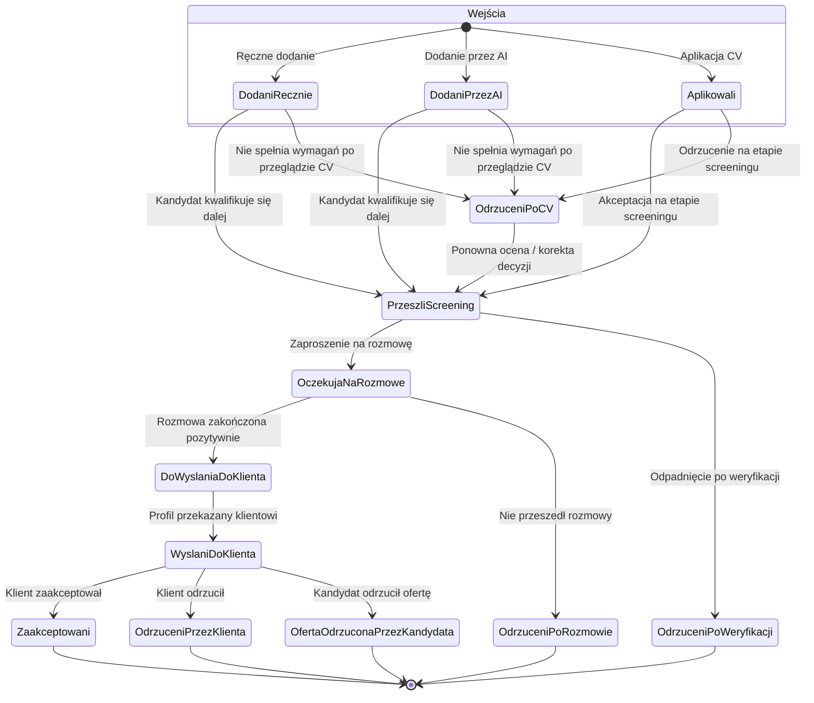

# Statusy kandydatów w projektach rekrutacyjnych

Dokument opisuje cykl życia kandydata powiązanego z projektem rekrutacyjnym: dostępne statusy, dozwolone przejścia między nimi oraz warunki biznesowe, przy których dana zmiana ma sens.

Konfiguracja przejść jest zarządzana w **Ustawienia → Rekrutacja → Przejścia statusów**. System stosuje model **whitelisty** — dozwolone są wyłącznie przejścia zapisane w macierzy. Próba niedozwolonej zmiany (np. przeciągnięcie na tablicy Kanban) kończy się komunikatem o błędzie.

---

## Statusy

| Status | Opis |
|--------|------|
| **Dodani ręcznie** | Kandydat dodany ręcznie przez rekrutera do projektu. |
| **Dodani przez AI** | Kandydat dodany do projektu automatycznie przez system AI. |
| **Aplikowali** | Kandydat złożył aplikację przez formularz rekrutacyjny lub został zaimportowany z CV. |
| **Odrzuceni po CV** | Kandydat nie przeszedł wstępnego screeningu dokumentów. |
| **Przeszli screening** | CV zostało zaakceptowane po wstępnej ocenie. |
| **Oczekują na rozmowę** | Kandydat został zaproszony lub oczekuje na rozmowę kwalifikacyjną. |
| **Do wysłania do klienta** | Rozmowa zakończona pozytywnie; profil jest gotowy do przekazania klientowi. |
| **Wysłani do klienta** | Profil kandydata został przekazany klientowi; oczekiwanie na decyzję. |
| **Zaakceptowani** | Klient zaakceptował kandydata — proces zakończony sukcesem. |
| **Odrzuceni po weryfikacji** | Kandydat odpadł po głębszej weryfikacji (po pozytywnym screeningu CV). |
| **Odrzuceni po rozmowie** | Kandydat nie przeszedł rozmowy kwalifikacyjnej. |
| **Oferta odrzucona przez kandydata** | Kandydat odmówił oferty po pozytywnej opinii klienta. |
| **Odrzuceni przez klienta** | Klient odrzucił kandydata. |

---

## Wejście do procesu

Kandydat może trafić do projektu na trzy sposoby:

| Sposób | Początkowy status |
|--------|-------------------|
| Aplikacja CV (formularz, import) | **Aplikowali** |
| Ręczne dodanie przez rekrutera (przycisk + na tablicy Kanban, wybór z listy) | **Dodani ręcznie** |
| Automatyczne dodanie przez AI | **Dodani przez AI** |

---

## Diagram przejść

Poniższy diagram pokazuje **aktualnie skonfigurowane** dozwolone przejścia. Stany końcowe nie mają dalszych wyjść — aby je zmienić, administrator musi rozszerzyć macierz w ustawieniach.



---

## Szczegółowy opis przejść

### Etap 1 — Pozyskanie i screening CV

| Z statusu | Do statusu | Kiedy powinno być możliwe |
|-----------|------------|---------------------------|
| *(nowy kandydat)* | **Aplikowali** | Kandydat złożył aplikację lub został zaimportowany z CV. |
| *(nowy kandydat)* | **Dodani ręcznie** | Rekruter ręcznie dodał kandydata do projektu. |
| *(nowy kandydat)* | **Dodani przez AI** | System AI automatycznie dodał kandydata do projektu. |
| **Aplikowali** | **Przeszli screening** | CV spełnia wymagania projektu po wstępnej ocenie. |
| **Aplikowali** | **Odrzuceni po CV** | CV nie spełnia wymagań (brak doświadczenia, umiejętności, dopasowania profilu, języka itp.). |
| **Dodani ręcznie** | **Przeszli screening** | Ręcznie dodany kandydat przeszedł ocenę i kwalifikuje się do dalszego procesu. |
| **Dodani ręcznie** | **Odrzuceni po CV** | Ręcznie dodany kandydat nie kwalifikuje się po przeglądzie dokumentów. |
| **Dodani przez AI** | **Przeszli screening** | Kandydat dodany przez AI przeszedł ocenę i kwalifikuje się do dalszego procesu. |
| **Dodani przez AI** | **Odrzuceni po CV** | Kandydat dodany przez AI nie kwalifikuje się po przeglądzie dokumentów. |
| **Odrzuceni po CV** | **Przeszli screening** | Wcześniejsza decyzja była błędna lub pojawiły się nowe informacje uzasadniające przywrócenie kandydata. |

Na zakładce **Screening** (lista powiązanych kandydatów w projekcie) dostępne są przyciski **Akceptuj** i **Odrzuj** — dotyczą wyłącznie kandydatów w statusie **Aplikowali**. Przy odrzuceniu rekruter wybiera powód z listy (np. brak doświadczenia, brak kluczowych kompetencji, niedopasowanie profilu).

### Etap 2 — Weryfikacja i rozmowa

| Z statusu | Do statusu | Kiedy powinno być możliwe |
|-----------|------------|---------------------------|
| **Przeszli screening** | **Oczekują na rozmowę** | Kandydat został zaproszony na rozmowę lub oczekuje na jej termin. |
| **Przeszli screening** | **Odrzuceni po weryfikacji** | Kandydat odpadł po głębszej weryfikacji (np. rozmowa wstępna, test, brak zgód). |
| **Oczekują na rozmowę** | **Do wysłania do klienta** | Rozmowa kwalifikacyjna zakończona pozytywnie; kandydat jest gotowy do przekazania klientowi. |
| **Oczekują na rozmowę** | **Odrzuceni po rozmowie** | Kandydat nie spełnił oczekiwań podczas rozmowy kwalifikacyjnej. |

### Etap 3 — Klient i oferta

| Z statusu | Do statusu | Kiedy powinno być możliwe |
|-----------|------------|---------------------------|
| **Do wysłania do klienta** | **Wysłani do klienta** | Profil kandydata został faktycznie przekazany klientowi. |
| **Wysłani do klienta** | **Zaakceptowani** | Klient zaakceptował kandydata. |
| **Wysłani do klienta** | **Odrzuceni przez klienta** | Klient odrzucił kandydata. |
| **Wysłani do klienta** | **Oferta odrzucona przez kandydata** | Kandydat odmówił oferty po pozytywnej opinii klienta. |

---

## Ścieżka główna (happy path)

Typowy przebieg pozytywnego procesu rekrutacji:

```
Aplikowali
  → Przeszli screening
  → Oczekują na rozmowę
  → Do wysłania do klienta
  → Wysłani do klienta
  → Zaakceptowani
```

Dla kandydatów dodanych ręcznie ścieżka zaczyna się od **Dodani ręcznie**, a następnie łączy się z etapem **Przeszli screening**.

Dla kandydatów dodanych przez AI ścieżka zaczyna się od **Dodani przez AI**, a następnie łączy się z etapem **Przeszli screening** (przejścia analogiczne do ręcznego dodania).

---

## Stany końcowe

Z poniższych statusów **nie ma** skonfigurowanych dalszych przejść — kandydat pozostaje w danym stanie do końca procesu w tym projekcie:

- **Zaakceptowani**
- **Odrzuceni po weryfikacji**
- **Odrzuceni po rozmowie**
- **Oferta odrzucona przez kandydata**
- **Odrzuceni przez klienta**

Wyjątek: status **Odrzuceni po CV** pozwala na powrót do **Przeszli screening** (jedyna skonfigurowana ścieżka „cofnięcia” decyzji).

---

## Tablica Kanban na karcie projektu

Tablica Kanban na zakładce podsumowania projektu grupuje statusy w cztery sekcje, zgodnie z etapami procesu:

1. **Wejścia** — dwie kolumny: *Dodani ręcznie* (przycisk + do wyszukiwania i dodawania) | *Dodani przez AI*.
2. **Screening** — trzy kolumny: *Odrzuceni po CV* | *Aplikowali* | *Przeszli screening*.
3. **Proces ofertowy** — osiem kolumn: *Oczekują na rozmowę* → *Przekazani do sprzedaży* → *Do wysłania do klienta* → *Wysłani do klienta* → *1 etap* → *2 etap* → *3 etap* → *Zatrudnieni*.
4. **Odrzucenia późne** — cztery kolumny: *Odrzuceni po weryfikacji*, *Odrzuceni po rozmowie*, *Oferta odrzucona przez kandydata*, *Odrzuceni przez klienta*.

Zmiana statusu na Kanbanie odbywa się przez przeciągnięcie kandydata między kolumnami. Dozwolone kolumny docelowe są podświetlane na zielono; niedozwolone — na czerwono.

---

## Powiązane działania systemu

| Działanie | Kiedy występuje |
|-----------|-----------------|
| Komentarz na karcie projektu i kandydata | Przy każdej udanej zmianie statusu (w tym Akceptuj/Odrzuć na Screening). |
| Aktualizacja liczników na projekcie | Po każdej udanej zmianie statusu. |
| Powiadomienie e-mail do kandydata | Przy wybranych przejściach na Kanbanie, zgodnie z macierzą szablonów w **Ustawienia → Rekrutacja → Maile przy przejściach**. |
| Automatyczne workflowy | Mogą zmieniać status niezależnie od macierzy przejść — konfiguracja w **Ustawienia → Workflowy**. |

---

## Zarządzanie regułami

| Obszar | Gdzie konfigurować |
|--------|-------------------|
| Dozwolone przejścia między statusami | Ustawienia → Rekrutacja → Przejścia statusów |
| Szablony e-mail przy zmianie statusu | Ustawienia → Rekrutacja → Maile przy przejściach |
| Automatyczne akcje po zmianie statusu | Ustawienia → Workflowy (wyzwalacz: modyfikacja relacji) |

Przy pierwszej wizycie w konfiguracji przejść interfejs pokazuje **sugerowane domyślne** zaznaczenia — reguły zaczynają obowiązywać dopiero po zapisaniu macierzy przez administratora.

---

*Ostatnia aktualizacja dokumentu: lipiec 2026 — na podstawie aktywnej konfiguracji przejść w systemie.*
