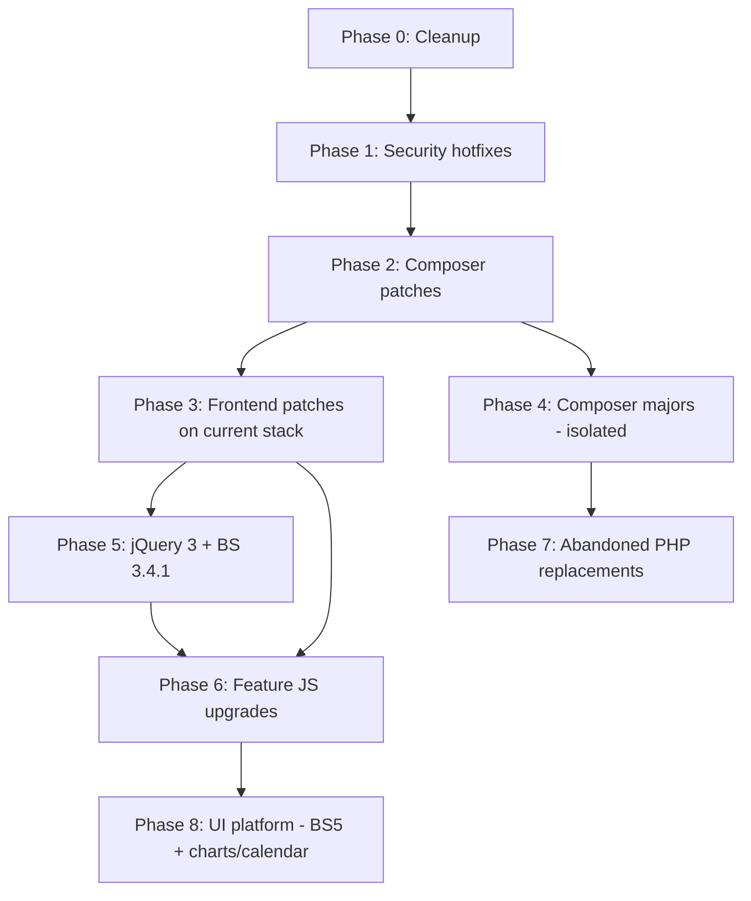

# FreeCRM — library version audit

Audit date: June 2026. Compares **installed versions in the repo** against **latest available releases**.

Sources: `composer.lock`, `package.json`, on-disk headers under `public/libraries/`, Packagist/npm registry.

**Short answer:** Most libraries are **not** up to date. A handful of Composer packages are current or one patch behind; the bundled frontend stack is largely years behind, and several items are EOL or unmaintained.

Related: credits page is generated from `scripts/generate-credits.php` → `licenses/Credits.html`.

Version tables below list **installed vs latest** only. Every library has **purpose** and **used in** in the [Library catalog](#library-catalog).

---

## Library catalog

Format: **Purpose** (what it does) · **Used in** (concrete paths). Global JS/CSS = loaded on authenticated pages via `src/Base/Controllers/BaseViewController.php` and `src/Modules/Base/Views/Basic.php`.

### Lineage

#### YetiForce CRM
- **Purpose:** Direct codebase ancestor; layout, settings patterns, and module structure FreeCRM evolved from.
- **Used in:** Historical headers and docs; `src/Runtime/Yeti_Layout.php`; `src/SystemWarnings/YetiForce/`; install schemas; composer autoload suffix `YT`.

#### Vtiger CRM
- **Purpose:** Earlier CRM ancestor (via YetiForce); naming and data model conventions.
- **Used in:** `src/Http/Vtiger_Request.php`, `Vtiger_Session.php`, `Vtiger_Theme.php`, `Vtiger_Language_Handler.php`; `src/Database/PearDatabase.php`; `src/Core/CRMEntity.php`; `src/Webservices/*`; `vtiger_*` tables; `src/ModuleManagement/Adapters/` (`vtlib\` namespace).

---

### Composer — runtime PHP

#### Yii 2 `yiisoft/yii2`
- **Purpose:** Application framework — database, logging, migrations, console.
- **Used in:** `index.php`; `src/Db/Db.php`, `Command.php`, `Query.php`; `src/Log/Log.php`, `FileTarget.php`, `SqlLogTarget.php`; `config/console.php`; `\yii\db\Expression` across Settings and query modules.

#### Smarty `smarty/smarty`
- **Purpose:** Server-side template engine for all CRM views.
- **Used in:** `src/Runtime/CRM_Viewer.php`; all `layouts/**/*.tpl`; `src/Runtime/TemplateHelpers.php`; installer `src/Modules/Install/Install.php`.

#### PHPMailer `phpmailer/phpmailer`
- **Purpose:** SMTP and outbound email transport.
- **Used in:** `src/Email/Mailer.php`; `src/Modules/Mail/Smtp/Sender.php`; `src/Modules/Mail/Imap/Client.php` (SMTP test).

#### HTML Purifier `ezyang/htmlpurifier`
- **Purpose:** Server-side HTML sanitization on input and output.
- **Used in:** `src/Security/Purifier.php`; `src/Http/Vtiger_Request.php`; `src/Modules/Base/UiTypes/Text.php`; mail, reports, recruitment CV import, and other modules calling `Purifier::`.

#### PhpSpreadsheet `phpoffice/phpspreadsheet`
- **Purpose:** Excel (XLS/XLSX) generation for exports.
- **Used in:** `src/Modules/Base/Actions/QuickExport.php`; `src/Modules/Reports/ReportRun.php`; library gate in `src/Modules/Settings/ModuleManager/Models/Library.php`, `ListView` models.

#### webklex/php-imap `webklex/php-imap`
- **Purpose:** IMAP client for built-in mail module.
- **Used in:** `src/Modules/Mail/Imap/Client.php`, `Fetcher.php`, `Appender.php`, `FolderTree.php`; `Cron/Scanner.php`; mail account actions and models.

#### Requests for PHP `rmccue/requests`
- **Purpose:** HTTP client for outbound integrations.
- **Used in:** `src/Modules/Rss/Actions/GetHtml.php`; `src/Modules/SMSNotifier/providers/*`; `src/Modules/PBXManager/Connectors/PBXManager.php`; `src/SystemWarnings/YetiForce/Newsletter.php`, `Stats.php`.

#### Recurr `simshaun/recurr`
- **Purpose:** Expands RRULE recurring patterns for calendar Events.
- **Used in:** `src/Modules/Events/Models/RecuringEvents.php`; cron `src/Modules/Events/Cron/RecurringEventsTask.php`.

#### ANTLR4 PHP runtime `antlr/antlr4-php-runtime`
- **Purpose:** Lexer/parser for workflow event condition expressions.
- **Used in:** `src/Events/VTEventConditionParserLexer.php`, `VTEventConditionParserParser.php`; `src/Events/include.php`.

#### libphonenumber-for-php `giggsey/libphonenumber-for-php`
- **Purpose:** Parse and normalize phone numbers on import.
- **Used in:** `src/Modules/RecruitmentApplication/Services/CvImport/PhoneNormalizer.php`.

#### Linfo `linfo/linfo`
- **Purpose:** Server hardware/OS diagnostics in Settings.
- **Used in:** `src/Modules/Settings/ConfReport/Models/Module.php`; `src/Modules/Settings/ConfReport/Views/Index.php`.

#### monolog/monolog
- **Purpose:** PSR-3 logging (declared in Composer).
- **Used in:** **Not imported in `src/`** — app logs via Yii `src/Log/Log.php` instead.

#### symfony/var-dumper `symfony/var-dumper`
- **Purpose:** Variable dump formatting (declared in Composer).
- **Used in:** **Not imported in `src/`** — Yii `\yii\helpers\VarDumper` used in log targets.

#### filp/whoops `filp/whoops`
- **Purpose:** Pretty error pages (declared in Composer).
- **Used in:** **Not imported in `src/`** — `src/EntryPoint/WebUI_ErrorHandler.php` handles errors.

---

### Composer — development only

#### PHP Debug Bar `php-debugbar/php-debugbar`
- **Purpose:** In-browser debug toolbar when debug mode is on.
- **Used in:** `src/Debug/Debugger.php`, `DebugBarDatabase.php`, `DebugBarLogs.php`; assets `public/libraries/debugbar/`.

#### PHPStan `phpstan/phpstan`
- **Purpose:** Static analysis in CI/local dev.
- **Used in:** `phpstan.neon` → `src/`.

#### Rector `rector/rector`
- **Purpose:** Automated PHP refactors in dev.
- **Used in:** `rector.php`; `src/Rector/`.

---

### PHP — bundled (not Composer)

#### SabreDAV `libraries/SabreDAV/`
- **Purpose:** CalDAV and CardDAV server; vCard/iCalendar handling.
- **Used in:** `src/Api/dav.php`; `src/Modules/API/Models/CalDAV.php`, `CardDAV.php`.

#### HTTP_Session `libraries/HTTP_Session/`
- **Purpose:** Session storage for legacy webservice API (cookie-less).
- **Used in:** `src/Webservices/SessionManager.php`; `src/Http/Vtiger_Session.php`; `src/Webservices/Logout.php`, `ExtendSession.php`.

#### CSRF-magic `libraries/csrf-magic/`
- **Purpose:** Automatic CSRF token injection for forms.
- **Used in:** `src/EntryPoint/WebUI.php`; `config/csrf_config.php`; `public/index.php`, `api.php`, `file.php`, `shorturl.php`; JS `public/libraries/csrf-magic/csrf-magic.js`.

#### RSS & Atom Feeds for PHP `libraries/RSSFeeds/`
- **Purpose:** Parse RSS/Atom feeds for dashboard widget.
- **Used in:** `libraries/RSSFeeds/Feed.php`; `src/Modules/Rss/Models/Record.php`; `src/Modules/Base/Dashboards/Rss.php`.

---

### JavaScript & CSS — global stack

Loaded on **all authenticated pages** unless noted. Asset registration: `src/Base/Controllers/BaseViewController.php` + `src/Modules/Base/Views/Basic.php`. Behavior: `public/libraries/resources/app.js`, `helper.js`, `ProgressIndicator.js`.

#### jQuery `public/libraries/jquery/jquery.js`
- **Purpose:** DOM manipulation and AJAX foundation.
- **Used in:** Global header script; virtually all module JS under `public/layouts/basic/modules/`.

#### jQuery Migrate `public/libraries/jquery/jquery-migrate.js`
- **Purpose:** Compatibility shims for older jQuery APIs used in legacy code.
- **Used in:** Global header script (paired with jQuery 2.x).

#### jQuery UI `public/libraries/jquery/jquery-ui/`
- **Purpose:** Draggable, sortable, dialog, and other UI widgets.
- **Used in:** Global CSS + footer script; install wizard `src/Modules/Install/tpl/JSResources.tpl`.

#### Bootstrap 3 `public/libraries/bootstrap3/`
- **Purpose:** Primary CSS/JS UI framework (grid, forms, modals, nav).
- **Used in:** Global CSS + JS; all `layouts/basic/modules/Base/MainLayout.tpl` and module templates.

#### Bootstrap 5 utilities `public/libraries/bootstrap5/`
- **Purpose:** Bootstrap 5 utility classes on selected screens (partial adoption).
- **Used in:** `src/Modules/ProjektyRekrutacyjne/Views/Detail.php`; synced via `npm run bootstrap:sync`.

#### Font Awesome 6 `public/libraries/@fortawesome/fontawesome-free/`
- **Purpose:** Icon font and CSS icons in menus, buttons, fields.
- **Used in:** Global CSS; `public/layouts/basic/skins/icons/userIcons.css`, `adminIcons.css`; menu templates `layouts/basic/modules/Base/menu/`.

#### Select2 `public/libraries/jquery/select2/`
- **Purpose:** Searchable/enhanced `<select>` widgets.
- **Used in:** Global CSS + JS; `public/libraries/resources/app.js` (`showSelect2ElementView`).

#### Perfect Scrollbar `public/libraries/jquery/perfect-scrollbar/`
- **Purpose:** Custom scrollbars in panels and modals.
- **Used in:** Global CSS + JS; `app.js` (`PerfectScrollbar`).

#### jQuery Validation Engine `public/libraries/jquery/posabsolute-jQuery-Validation-Engine/`
- **Purpose:** Client-side form validation rules.
- **Used in:** Global CSS + JS + locale files; `app.js` (`validationEngine`).

#### PNotify `public/libraries/jquery/pnotify/`
- **Purpose:** Toast / notification popups.
- **Used in:** Global CSS + JS; `public/libraries/resources/helper.js`.

#### Bootbox.js `public/libraries/bootstrap3/js/bootbox.js`
- **Purpose:** Bootstrap-styled alert/confirm dialogs.
- **Used in:** Global footer JS; `public/libraries/resources/helper.js`.

#### jQuery blockUI `public/libraries/jquery/jquery.blockUI.js`
- **Purpose:** Block UI with loading overlay during AJAX.
- **Used in:** Global footer JS; `public/libraries/resources/ProgressIndicator.js`.

#### jQuery PJAX `public/libraries/jquery/defunkt-jquery-pjax/`
- **Purpose:** Partial page loads without full reload.
- **Used in:** Global footer JS; main navigation flow.

#### Autosize `public/libraries/jquery/autosize/`
- **Purpose:** Auto-growing textareas.
- **Used in:** Global footer JS; `app.js`.

#### SlimScroll `public/libraries/jquery/rochal-jQuery-slimScroll/`
- **Purpose:** Custom scroll areas (legacy).
- **Used in:** Global footer JS; `app.js` (`slimScroll`).

#### jQuery outside events `public/libraries/jquery/jquery.ba-outside-events.js`
- **Purpose:** Detect clicks outside an element (close dropdowns).
- **Used in:** Global footer JS.

#### jQuery placeholder `public/libraries/jquery/jquery.placeholder.js`
- **Purpose:** Placeholder attribute polyfill for old browsers.
- **Used in:** Global footer JS.

#### jQuery hoverIntent `public/libraries/jquery/jquery.hoverIntent.minified.js`
- **Purpose:** Delayed hover for menus (avoid accidental open).
- **Used in:** Global footer JS; left menu behavior.

#### jStorage `public/libraries/jquery/jstorage.js`
- **Purpose:** Wrapper for `localStorage` / `sessionStorage`.
- **Used in:** Global footer JS; client-side prefs/cache.

#### DOMPurify `public/libraries/jquery/dompurify/purify.js`
- **Purpose:** Client-side HTML sanitization before DOM insert.
- **Used in:** Global footer JS; rich text and dynamic HTML in UI.

#### Input Mask `public/libraries/jquery/inputmask/`
- **Purpose:** Input masks (phone, date, numeric formats).
- **Used in:** `Basic.php` footer; `public/layouts/basic/modules/Base/resources/Edit.js`, `Detail.js`, `FieldValidator.js`.

#### Mousetrap `public/libraries/jquery/mousetrap/`
- **Purpose:** Keyboard shortcuts.
- **Used in:** `Basic.php` footer.

#### Bootstrap Datepicker (Eternicode) `public/libraries/bootstrap/js/eternicode-bootstrap-datepicker/`
- **Purpose:** Calendar date picker on edit forms.
- **Used in:** `Basic.php`, `Base/Views/Popup.php`; locale JS per language.

#### Bootstrap ClockPicker `public/libraries/jquery/clockpicker/`
- **Purpose:** Time-of-day picker widget.
- **Used in:** Global CSS; `Basic.php`, `Popup.php`, `TreePopup.php`.

#### Date.js `public/libraries/jquery/dangrossman-bootstrap-daterangepicker/date.js`
- **Purpose:** Date parsing helper (dependency for range filters).
- **Used in:** Global footer JS.

#### Legacy datepicker `public/libraries/jquery/datepicker/`
- **Purpose:** Additional date picker used alongside Eternicode.
- **Used in:** Global CSS + `jquery/datepicker/js/datepicker.js` in `BaseViewController`.

---

### JavaScript & CSS — feature-specific

#### CKEditor 4 `public/libraries/jquery/ckeditor/`
- **Purpose:** WYSIWYG rich text editor.
- **Used in:** `Settings/Workflows/Views/Edit.php`; `Settings/Dashboard/Views/Index.php`; `Base/Views/Index.php`; `public/layouts/basic/modules/Base/resources/CkEditor.js`; lazy load in `CustomView/resources/CustomView.js`.

#### CodeMirror 5 `public/libraries/codemirror/`
- **Purpose:** Syntax-highlighted code/HTML editor.
- **Used in:** `EmailTemplates/Views/Edit.php`; `TemplateElements/Views/Edit.php`; `DocumentTemplates/Views/Edit.php`.

#### js-beautify `public/libraries/js-beautify/`
- **Purpose:** Format HTML in template editors.
- **Used in:** Same three template editor views as CodeMirror.

#### clipboard.js `public/libraries/jquery/clipboardjs/`
- **Purpose:** Copy-to-clipboard buttons.
- **Used in:** `EmailTemplates`, `DocumentTemplates`, `TemplateElements`, `OSSPasswords` views; `Settings/Workflows`, `LayoutEditor`, `CustomRecordNumbering`.

#### DataTables `public/libraries/jquery/datatables/`
- **Purpose:** Sortable, filterable data tables.
- **Used in:** `Settings/Dashboard`, `LangManagement`, `Notifications`, `RecordAllocation`, `Menu`; `KnowledgeBase/Views/Tree.php`; `Base/Views/TreeRecords.php`, `AutoAssignRecord.php`; `Notification/Views/NotificationConfig.php`.

#### FullCalendar `public/libraries/fullcalendar/`
- **Purpose:** Interactive calendar views.
- **Used in:** `Calendar/Views/Calendar.php`; `Reservations/Views/Calendar.php`; `OSSTimeControl/Views/Calendar.php`; `Home/Views/Index.php`; `Base/Views/DashBoard.php`.

#### Moment.js `public/libraries/fullcalendar/moment.min.js`
- **Purpose:** Date/time parsing for FullCalendar.
- **Used in:** Same views as FullCalendar (loaded together).

#### Gridster `public/libraries/jquery/gridster/`
- **Purpose:** Drag-and-drop dashboard widget grid.
- **Used in:** `Home/Views/Index.php`; `Base/Views/DashBoard.php`.

#### jqPlot `public/libraries/jquery/jqplot/`
- **Purpose:** Charts on dashboards and reports.
- **Used in:** `Home/Views/Index.php`; `Base/Views/DashBoard.php`; `Reports/Views/ChartDetail.php`.

#### Flot `public/libraries/jquery/flot/`
- **Purpose:** Charts in dashboards and detail views.
- **Used in:** `Home/Views/Index.php`; `DashBoard.php`; `HelpDesk/Views/Detail.php`; `Project/Views/Detail.php`; `Settings/LangManagement/Views/Index.php`.

#### BxSlider `public/libraries/jquery/boxslider/`
- **Purpose:** Image/content carousel on Home dashboard.
- **Used in:** `Home/Views/Index.php`.

#### jsTree `public/libraries/jquery/jstree/`
- **Purpose:** Hierarchical tree UI (menus, categories, KB).
- **Used in:** `Settings/Menu/Views/Index.php`; `KnowledgeBase/Views/Tree.php`; `Base/Views/TreeRecords.php`, `TreePopup.php`, `TreeCategoryModal.php`.

#### Color picker (eyecon) `public/libraries/jquery/colorpicker/`
- **Purpose:** Color selection in Settings.
- **Used in:** `Settings/Calendar/Views/ActivityTypes.php`, `UserColors.php`; `Settings/Users/Views/Colors.php`.

#### malihu custom scrollbar `public/libraries/jquery/malihu-custom-scrollbar/`
- **Purpose:** Custom scrollbars in picklist dependency editor.
- **Used in:** `Settings/PickListDependency/Views/ListView.php`, `Edit.php`.

#### Date picker for jQuery (Keith Wood) `public/libraries/jquery/jquery.datepick.package-4.1.0/`
- **Purpose:** Date picker in workflows and reports.
- **Used in:** `Settings/Workflows/Views/Edit.php`; `Reports/Views/Edit.php`, `ChartEdit.php`.

#### Leaflet `public/libraries/leaflet/`
- **Purpose:** Interactive maps (OpenStreetMap).
- **Used in:** `Base/Views/Detail.php` (map widget); `OpenStreetMap/Views/MapModal.php`.

#### Leaflet.markercluster `public/libraries/leaflet/plugins/markercluster/`
- **Purpose:** Cluster map markers at low zoom.
- **Used in:** Same map views as Leaflet.

#### Leaflet.awesome-markers `public/libraries/leaflet/plugins/awesome-markers/`
- **Purpose:** Font/glyph-based map pin icons.
- **Used in:** Same map views as Leaflet.

#### html2canvas `public/libraries/html2canvas/`
- **Purpose:** Capture page screenshot for issue reporting.
- **Used in:** `Base/Views/Basic.php` (when user can create HelpDesk tickets); `ReportIssue` JS.

#### jQuery Cycle `public/libraries/jquery/jquery.cycle.min.js`
- **Purpose:** Cycle product images on detail view.
- **Used in:** `Products/Views/Detail.php`.

#### jQuery MultiFile `public/libraries/jquery/multiplefileupload/`
- **Purpose:** Multiple file selection on upload forms.
- **Used in:** `Base/Views/FileUpload.php`; `Products/Views/Edit.php`.

---

### npm — development tooling

#### terser
- **Purpose:** Minify JavaScript (`*.js` → `*.min.js`).
- **Used in:** `package.json` scripts `minify-js`, `minify-js-all`.

#### clean-css-cli
- **Purpose:** Minify CSS (`*.css` → `*.min.css`).
- **Used in:** `package.json` scripts `minify-css`, `minify-css-all`.

#### bootstrap (npm)
- **Purpose:** Source for Bootstrap 5 dist copied into `public/libraries/bootstrap5/`.
- **Used in:** `package.json` script `bootstrap:sync`.

#### perfect-scrollbar (npm)
- **Purpose:** Upstream package; runtime uses bundled copy under `public/libraries/jquery/perfect-scrollbar/`.
- **Used in:** `package.json` devDependency only; not loaded from `node_modules` at runtime.

---

## Up to date (or effectively current)

| Library | Installed | Latest | Purpose | Used in |
|---------|-----------|--------|---------|---------|
| PHPMailer | 7.1.1 | 7.1.1 | Outbound SMTP mail | `src/Email/Mailer.php`, Mail SMTP/IMAP modules |
| ANTLR4 PHP runtime | 0.9.1 | 0.9.1 | Workflow condition parser | `src/Events/VTEventConditionParser*.php` |
| html2canvas | 1.4.1 | 1.4.1 | Page screenshot for issue report | `Base/Views/Basic.php` (HelpDesk permission) |
| Bootstrap 5 utilities | 5.3.8 | 5.3.8 | BS5 utility CSS (partial) | `ProjektyRekrutacyjne/Views/Detail.php` |
| Perfect Scrollbar | 1.5.6 | 1.5.6 | Custom scrollbars | Global stack; `app.js` |
| Flot | 0.8.3 | 0.8.3 | Charts (**unmaintained**) | Home, DashBoard, HelpDesk, Project, LangManagement |
| Gridster | 0.5.6 | 0.5.6 | Dashboard widget grid (**unmaintained**) | `Home/Views/Index.php`, `DashBoard.php` |
| CodeMirror 5 | 5.65.21 | 5.65.21 | Code editor for templates | EmailTemplates, DocumentTemplates, TemplateElements |
| npm: clean-css-cli | 5.6.3 | 5.6.3 | CSS minification (dev) | `package.json` `minify-css` scripts |
| npm: terser | 5.39.x | 5.48.x | JS minification (dev) | `package.json` `minify-js` scripts |

---

## Composer — minor/patch updates available (low effort)

Run on host: `composer outdated --direct`

| Library | Installed | Latest | Gap | Purpose | Used in |
|---------|-----------|--------|-----|---------|---------|
| Yii 2 | 2.0.53 | 2.0.55 | Patch | App framework (DB, log, migrate) | `src/Db/*`, `src/Log/*`, `config/console.php` |
| HTML Purifier | 4.18.0 | 4.19.0 | Minor | Server HTML sanitization | `src/Security/Purifier.php`, `Vtiger_Request`, UiTypes |
| PhpSpreadsheet | 5.7.0 | 5.8.0 | Minor | Excel export | `QuickExport.php`, `Reports/ReportRun.php` |
| libphonenumber-for-php | 9.0.28 | 9.0.32 | Patch | Phone normalization | `RecruitmentApplication/.../PhoneNormalizer.php` |
| monolog/monolog | 3.9.0 | 3.10.0 | Patch | Logging (**unused in `src/`**) | — |
| phpstan (dev) | 2.1.31 | 2.2.2 | Dev | Static analysis | `phpstan.neon` |
| rector (dev) | 2.1.7 | 2.4.5 | Dev | PHP refactoring | `rector.php`, `src/Rector/` |

---

## Composer — major updates available (breaking / migration work)

| Library | Installed | Latest | Risk | Purpose | Used in |
|---------|-----------|--------|------|---------|---------|
| Smarty | 4.5.6 | **5.8.0** | Major | Template engine | `CRM_Viewer.php`, all `layouts/**/*.tpl` |
| webklex/php-imap | 5.5.0 | **6.2.0** | Major | IMAP mail client | `Mail/Imap/*`, mail cron fetcher |
| rmccue/requests | 1.7.0 | **2.0.18** | Major | HTTP client | RSS, SMS, PBX, system warnings |
| Recurr | 2.2.3 | **6.0.0** | Major | Recurring Events RRULE | `Events/Models/RecuringEvents.php`, cron |
| Linfo | 3.0.1 | **4.0.9** | Major | Server diagnostics | `Settings/ConfReport/` |
| php-debugbar (dev) | 2.2.4 | **3.7.6** | Major | Debug toolbar | `src/Debug/Debugger.php` |
| symfony/var-dumper | 7.3.5 | **8.1.0** | **Unused** | Var dump (**unused**) | — |

---

## Frontend — severely outdated (high priority)

Vendored under `public/libraries/`. Versions from file headers unless noted.

| Library | Installed | Latest | Severity | Purpose | Used in |
|---------|-----------|--------|----------|---------|---------|
| **DOMPurify** | **0.8.9** | **3.4.10** | Critical | Client HTML sanitization | Global footer; `BaseViewController` |
| **jQuery** | **2.1.4** | 3.7.x / 4.0 | EOL | DOM/AJAX core | Global header; all module JS |
| jQuery Migrate | 1.2.1 | 4.0.2 | Ancient | jQuery 1.x compat | Global header |
| jQuery UI | 1.11.4 | 1.14.2 | Behind | UI widgets | Global CSS+JS |
| **Bootstrap 3** | 3.3.5 | 3.4.1 | **EOL** | Primary UI framework | Global CSS+JS; all layouts |
| CKEditor 4 | 4.6.2 | 4.25.1 | Security | Rich text editor | Workflows, Dashboard, CkEditor.js |
| FullCalendar | 2.3.1 | 6.1.20 | Major gap | Calendar views | Calendar, Home, DashBoard, OSSTimeControl |
| DataTables | 1.10.7 | 2.3.8 | Major | Sortable tables | Settings lists, KnowledgeBase, trees |
| Leaflet | 1.0.0-rc.3 | 1.9.4 | Behind | Maps | Detail map, OpenStreetMap modal |
| Moment.js | 2.9.0 | 2.30.1 | Maintenance | Dates for FullCalendar | With FullCalendar views |
| Select2 | 4.0.13 | 4.1.0 | Minor | Enhanced selects | Global; `app.js` |
| clipboard.js | 1.5.16 | 2.0.11 | Major | Copy to clipboard | Templates, OSSPasswords, Settings |
| Bootbox.js | 4.4.0 | 6.0.4 | Major | Modal dialogs | Global; `helper.js` |
| PNotify | 2.0.1 | 5.2.0 | Major | Toast notifications | Global; `helper.js` |
| jsTree | 3.2.1 | 3.3.17 | Minor | Tree UI | Settings Menu, KB, tree views |
| Font Awesome | 6.5.2 | 7.2.0 | Minor/major | Icons | Global CSS; menu/skins |
| Mousetrap | 1.5.2 | 1.6.5 | Minor | Keyboard shortcuts | `Basic.php` |
| Autosize | 1.14 | 6.0.1 | Major | Auto-grow textareas | Global; `app.js` |
| BxSlider | 4.1 | 4.2.17 | Minor | Home carousel | `Home/Views/Index.php` |
| jqPlot | 1.0.8 | 1.0.9 | Unmaintained | Dashboard charts | Home, DashBoard, Reports |
| Input Mask | legacy | 5.0.9 | Behind | Input masks | `Basic.php`; Base Edit/Detail JS |

---

## PHP bundled — legacy / abandoned

| Library | Installed | Latest | Notes | Purpose | Used in |
|---------|-----------|--------|-------|---------|---------|
| **SabreDAV** | **3.1.3** | **4.7.0** | Upgrade via Composer | CalDAV/CardDAV API | `src/Api/dav.php`, API CalDAV/CardDAV models |
| HTTP_Session | PEAR-era | — | Abandoned | Webservice sessions | `Webservices/SessionManager.php`, `Vtiger_Session.php` |
| CSRF-magic | 1.0.4 | — | Abandoned | Form CSRF tokens | `WebUI.php`, `config/csrf_config.php`, entrypoints |
| RSS & Atom Feeds for PHP | 1.2 | 1.2 | Stable | RSS dashboard widget | `RSSFeeds/Feed.php`, `Rss` module, `Dashboards/Rss.php` |

---

## Lineage (not versioned dependencies)

| Project | Purpose | Used in |
|---------|---------|---------|
| YetiForce CRM | Direct codebase ancestor | Layout/warnings patterns; `Yeti_Layout.php`; install schema |
| Vtiger CRM 6.4.0 | Historical CRM ancestor | `Vtiger_*` classes; `vtiger_*` schema; `vtlib\` adapters |

Not applicable for “up to date” version checks.

---

## Overall summary

| Category | Status |
|----------|--------|
| Composer runtime (~11 used packages) | ~3 current, ~4 patch/minor behind, ~4 major behind |
| Frontend core (jQuery + Bootstrap 3 + plugins) | Years behind; BS3 and jQuery 2 are EOL |
| Security-sensitive JS | DOMPurify 0.8.9 and CKEditor 4.6.2 are the largest gaps |
| Bundled PHP libs | SabreDAV outdated; HTTP_Session and csrf-magic should be replaced |
| Unused Composer deps | `symfony/var-dumper`, `monolog/monolog`, `filp/whoops` — candidates for removal |

---

## Recommended upgrade priority

See **[Update plan](#update-plan)** below for phased work items, verification, and ordering.

Quick reference:

1. **Security first** — DOMPurify, CKEditor 4 LTS, Composer patches
2. **Medium effort** — Select2, jsTree, Font Awesome 6.7.x, Bootstrap 3.4.1
3. **Large projects** — jQuery 3, Bootstrap 5, FullCalendar 6, DataTables 2, SabreDAV 4
4. **Cleanup** — remove unused Composer deps, regenerate credits

---

## Update plan

Phased rollout for library updates. Each phase is a separate deployable unit (branch/PR). **No parallel code paths** — when a library is replaced, delete the old vendored copy and update every reference in the same phase.

### Principles

- **One library family per PR** when the change is risky (jQuery, Bootstrap, FullCalendar, Smarty).
- **Drop-in patch upgrades** can be batched (Composer minors, Font Awesome 6.5 → 6.7).
- After every phase: run minify for touched JS/CSS (`npm run minify-js` / `minify-css`), smoke-test on `dev.itconnect.pl`, check `cache/logs/system.log`.
- Update `scripts/generate-credits.php` and regenerate `licenses/Credits.html`.
- Prefer **npm → `public/libraries/`** for new frontend assets (see `package.json` `bootstrap:sync` pattern) over hand-copying minified blobs.

### Dependency order



Phase 5 blocks Phase 6 (Bootbox, PNotify, many plugins assume jQuery/Bootstrap versions). Phase 8 (Bootstrap 5) is last — partial BS5 utilities already exist in `ProjektyRekrutacyjne` only.

---

### Phase 0 — Cleanup (low risk)

**Goal:** Remove dead weight; no user-visible change.

| Task | Action |
|------|--------|
| Unused Composer deps | Remove `symfony/var-dumper`, `monolog/monolog`, `filp/whoops` from `composer.json`; `composer update`; grep `src/` for stray imports |
| Credits accuracy | Fix SabreDAV version to 3.1.3 in `scripts/generate-credits.php`; pin CodeMirror to 5.65.21 |
| npm dev tools | `npm update terser` (optional) |

**Verify:** `composer install`, login, Settings index, one ListView, one DetailView.

**Estimate:** 1–2 h.

---

### Phase 1 — Security hotfixes (high priority, contained)

**Goal:** Close the worst security gaps without changing the UI framework.

| Library | From → To | Touch points |
|---------|-----------|--------------|
| DOMPurify | 0.8.9 → 3.4.x | `public/libraries/jquery/dompurify/`, `BaseViewController::getFooterScripts()`, test rich-text preview / any `purify` usage in `app.js` |
| CKEditor 4 | 4.6.2 → 4.25.x LTS | `public/libraries/jquery/ckeditor/`, Workflows edit, Dashboard, Base Index, TreesManager |
| HTML Purifier | 4.18 → 4.19 | `composer update ezyang/htmlpurifier` |

**Work:**

1. Replace vendored files; run minify on any edited non-min sources.
2. Manual test: Workflow HTML field, email template editor, mail detail HTML body.
3. Regression: forms that accept HTML still save and display correctly.

**Verify:** Browser console clean on pages that load CKEditor; paste sanitization in compose fields.

**Estimate:** 1–2 days.

---

### Phase 2 — Composer patch/minor batch

**Goal:** Bring runtime PHP deps to latest compatible minor.

```bash
composer update yiisoft/yii2 ezyang/htmlpurifier phpoffice/phpspreadsheet giggsey/libphonenumber-for-php --with-dependencies
composer update phpstan/phpstan rector/rector --dev  # optional
```

| Package | Verify |
|---------|--------|
| Yii 2.0.55 | Migrations, ListView, cron |
| PhpSpreadsheet 5.8 | Quick Export, Reports Excel export |
| libphonenumber 9.0.32 | CV import phone fields |

**Verify:** `docker compose exec -T app php yii migrate --interactive=0` (no-op ok), export XLSX from Reports, import row with phone.

**Estimate:** half day (+ fix any PhpSpreadsheet API deprecations if they appear).

---

### Phase 3 — Frontend patches (still jQuery 2 + Bootstrap 3)

**Goal:** Low-risk JS/CSS bumps that should not require jQuery migration.

| Library | From → To | Notes |
|---------|-----------|-------|
| Bootstrap 3 | 3.3.5 → 3.4.1 | Last BS3 release; replace `public/libraries/bootstrap3/` |
| Font Awesome 6 | 6.5.2 → 6.7.2 | `public/libraries/@fortawesome/`; check custom `userIcons.css` / `adminIcons.css` |
| Select2 | 4.0.13 → 4.1.0 | Global select widgets |
| jsTree | 3.2.1 → 3.3.17 | Settings Menu, KnowledgeBase, tree popups |
| Leaflet | 1.0.0-rc.3 → 1.9.4 | Detail map tab, OpenStreetMap modal; retest markercluster + awesome-markers |
| clipboard.js | 1.5.16 → 2.0.11 | Workflows, OSSPasswords, template editors |
| Mousetrap | 1.5.2 → 1.6.5 | Keyboard shortcuts |
| BxSlider | 4.1 → 4.2.17 | Home dashboard |
| html2canvas | — | Already current; skip |
| Inputmask | legacy → 5.0.x | Align bundled copy with `vendor/bower-asset/inputmask` or npm |

**Verify:** Settings → Menu (jsTree), map on Account/Contact detail, Select2 on edit forms, clipboard on password module.

**Estimate:** 2–3 days.

---

### Phase 4 — Composer major upgrades (one PR each)

Do **not** batch these. Each needs dedicated testing.

#### 4a — `rmccue/requests` 1.7 → 2.x

- **Touch:** `src/` RSS, SMS providers, PBX, YetiForce stats.
- **Verify:** RSS dashboard widget, one outbound HTTP integration.

#### 4b — `webklex/php-imap` 5.5 → 6.x

- **Touch:** Mail module IMAP client, folder tree, fetcher cron.
- **Verify:** Mail inbox sync, folder list, read message.

#### 4c — `simshaun/recurr` 2.2 → 6.x

- **Touch:** `src/Modules/Events/Models/RecuringEvents.php`.
- **Verify:** Recurring Events create/edit/expand on calendar.

#### 4d — `linfo/linfo` 3.0 → 4.x

- **Touch:** Settings configuration report.
- **Verify:** Settings page that shows server info.

#### 4e — `smarty/smarty` 4.5 → 5.x

- **Touch:** `CRM_Viewer`, all `.tpl` rendering, installer.
- **Verify:** Full UI crawl — highest risk Composer upgrade; schedule dedicated QA.

#### 4f — `php-debugbar` 2.x → 3.x (dev only)

- **Touch:** `src/Debug/Debugger.php`, `public/libraries/debugbar/`.
- **Verify:** Debug mode toolbar with `DISPLAY_DEBUG_CONSOLE`.

**Estimate:** 1–3 days each; Smarty may take a week.

---

### Phase 5 — jQuery 3 + jQuery UI (foundation)

**Goal:** Leave Bootstrap 3 for now; fix EOL jQuery 2.x.

| Step | Action |
|------|--------|
| 1 | Upgrade `public/libraries/jquery/jquery.js` to 3.7.x |
| 2 | Upgrade `jquery-migrate` to 3.x (temporary; log warnings) |
| 3 | Upgrade jQuery UI 1.11 → 1.14.x |
| 4 | Fix breakages: `.size()`, `$.browser`, deferred patterns, widget APIs |
| 5 | Run `tests/e2e` crawl; fix ListView, DetailView, Edit, Settings |

**Touch:** `BaseViewController`, `Basic.php`, `public/libraries/resources/app.js`, every module script using deprecated APIs.

**Verify:** Full e2e module crawl (`npm run crawl:modules`); zero new errors in `system.log`.

**Estimate:** 1–2 weeks.

---

### Phase 6 — Feature JS (after Phase 5)

Upgrade widgets that depend on jQuery/Bootstrap but not yet on BS5.

| Library | From → To | Touch points |
|---------|-----------|--------------|
| Bootbox | 4.4 → 6.x | Global modals; API changes |
| PNotify | 2.0 → 5.x | Toast API rewrite |
| Autosize | 1.14 → 6.x | Textareas |
| DataTables | 1.10 → 2.x | Settings lists, KnowledgeBase — **breaking API** |
| FullCalendar | 2.3 → 6.x | Calendar, Home, Dashboard, OSSTimeControl, Reservations — **replace Moment with native/date-fns** |
| jqPlot | 1.0.8 → 1.0.9 or replace | Consider Chart.js long-term; jqPlot unmaintained |
| Flot / Gridster | — | Unmaintained; plan replacement in Phase 8 |

**FullCalendar** and **DataTables** each deserve their own PR.

**Estimate:** 2–4 weeks total.

---

### Phase 7 — Replace abandoned PHP libraries

| Library | Replacement direction | Touch points |
|---------|----------------------|--------------|
| CSRF-magic | Yii CSRF token / native session + middleware | `WebUI.php`, `config/csrf_config.php` |
| HTTP_Session | PHP `session_*` or Yii session | `Webservices/SessionManager.php`, `Http/Vtiger_Session.php` |
| SabreDAV 3.x | `sabre/dav` 4.x via Composer | Remove `libraries/SabreDAV/`, update `src/Api/dav.php`, CalDAV/CardDAV models |

**Verify:** Web login + webservice session, CalDAV/CardDAV sync with external client.

**Estimate:** 1–2 weeks per library.

---

### Phase 8 — UI platform migration (long-term)

**Goal:** Exit Bootstrap 3 EOL and unify on Bootstrap 5.

| Track | Scope |
|-------|--------|
| 8a — Bootstrap 5 layout | `MainLayout.tpl`, `BodyLeft.tpl`, skins, glyphicons → FA icons |
| 8b — Remove Bootstrap 3 | Delete `public/libraries/bootstrap3/` after full migration |
| 8c — Chart modernization | Replace jqPlot/Flot with maintained chart lib |
| 8d — Font Awesome 7 | Optional after BS5 stable |

This is a **multi-month** effort. Extend existing `bootstrap5` partial usage (`ProjektyRekrutacyjne`) as the pattern.

**Do not start** until Phases 5–6 are stable.

---

### Per-phase checklist

- [ ] Branch from `main`; one phase (or sub-phase) per PR
- [ ] Update vendored files or `composer.json` / `package.json`
- [ ] Minify touched assets under `public/`
- [ ] Grep for old paths (`libraries/jquery/dompurify/purify.js`, etc.)
- [ ] Update `scripts/generate-credits.php` versions
- [ ] Run `docker compose exec -T app php scripts/generate-credits.php`
- [ ] Smoke on `https://dev.itconnect.pl` (login, Settings, one module List/Detail/Edit)
- [ ] Tail `cache/logs/system.log` during smoke
- [ ] Document any deferred items in this file

### Suggested timeline (indicative)

| Phase | Duration | Cumulative |
|-------|----------|------------|
| 0 Cleanup | 0.5 d | 0.5 d |
| 1 Security | 1–2 d | 2.5 d |
| 2 Composer patches | 0.5 d | 3 d |
| 3 Frontend patches | 2–3 d | 6 d |
| 4 Composer majors | 5–15 d | 3–4 wk |
| 5 jQuery 3 | 5–10 d | 5–6 wk |
| 6 Feature JS | 10–20 d | 8–10 wk |
| 7 PHP replacements | 10–15 d | 10–13 wk |
| 8 BS5 platform | months | separate roadmap |

### Out of scope (defer or won’t fix)

| Item | Reason |
|------|--------|
| jQuery 4 | Ecosystem not ready; target 3.7 LTS |
| Moment.js upgrade beyond 2.30 | Drop when FullCalendar 6 no longer needs it |
| jqPlot / Flot / Gridster feature parity | Replace rather than patch |
| Gantt / AJAXChat | Optional external YetiForce libs; not shipped |
| Sugar CRM lineage | Historical only |

---

## How to re-check versions

```bash
# Composer (direct dependencies)
composer outdated --direct

# npm dev tools (root package.json)
npm outdated

# Regenerate credits page after updates
docker compose exec -T app php scripts/generate-credits.php
```

For bundled JS under `public/libraries/`, read version banners in source files or compare paths referenced in `src/Base/Controllers/BaseViewController.php` and per-module `getFooterScripts()`.
