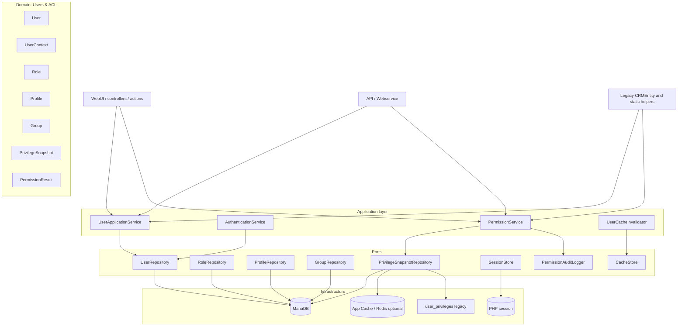

# Target architecture plan: users and permissions in FreeCRM

This document describes the target, straightforward, maintainable architecture for the user-facing area of FreeCRM. It is intended as a change roadmap for modules related to users, sessions, caches, roles, profiles, groups, user switching, and permission checks.

The document does not describe the current state in detail. The current state is covered in [users.md](users.md), and the current permission system in [privileges.md](privileges.md). This file describes the target state and the sequence for reaching it.

---

## 1. Architecture goals

The target architecture should meet the following goals:

1. One clear user model instead of mixing `Users`, `Record`, sessions, and static helpers.
2. One official entry point for permission checks.
3. Separation of domain from HTTP transport, sessions, cache files, and legacy CRMEntity.
4. Predictable caching with clear read and invalidation points.
5. Ability to migrate gradually without rewriting all of FreeCRM at once.
6. Compatibility with existing modules through adapters.
7. Testability: user and permission logic should be testable without the full Web UI.
8. Good observability: an access decision should have a reason, context, and optional diagnostic logging.
9. No new global static dependencies.
10. No `class_alias()` and no further expansion of the legacy layer.

The most important principle: new code should depend on services and domain interfaces, while legacy code should use thin adapters.

---

## 2. Scope

The architecture covers:

- users and their lifecycle,
- login and context of the current user,
- user preferences,
- user switching (impersonation),
- roles, profiles, and groups,
- user caches,
- permission snapshots,
- permission checks for module, action, and record,
- SQL conditions / query builder for lists,
- cache regeneration and invalidation after changes in Settings,
- compatibility with existing FreeCRM modules.

Out of scope for this plan:

- full rework of the Settings module,
- replacing the entire CRM module engine,
- changing all Smarty views,

---

## 3. Design principles

1. **Domain first**: user and permission logic must not depend on `$_SESSION`, `$_REQUEST`, PHP files under `user_privileges/`, or controller classes.
2. **Adapters at the edges**: Web UI, API, CRMEntity, legacy files, and session are adapters.
3. **One contract for ACL**: new modules query only `PermissionService`.
4. **Explicit context**: methods that check permissions accept `UserContext`; they must not read the global session alone.
5. **Cache as infrastructure**: the domain does not know whether a snapshot comes from DB, Redis, a file, or process memory.
6. **Value objects instead of arrays**: new APIs return types such as `UserId`, `RoleId`, `PermissionResult`, `PrivilegeSnapshot`.
7. **Compatibility via adapters**: old methods remain but delegate to the new core.
8. **Phased migration**: each phase must leave the application working via the Web UI.

---

## 4. Target layer split



---

## 5. Modules and responsibilities

### 5.1 Domain

Suggested target directories:

```text
src/Domain/User/
src/Domain/Permission/
```

If the project is unified under the `FreeCRM\` namespace, new classes should be created under the target `FreeCRM\Domain\...`. While active code still uses `App\`, a transitional stage in `App\Domain\...` or `App\Modules\Users\Domain\...` is acceptable. What matters is not growing legacy CRMEntity further as business logic.

Target domain objects:

| Object | Meaning |
|--------|---------|
| `User` | User business data: ID, username, status, admin flag, role, public profile |
| `UserId` | Explicit user identifier |
| `UserContext` | Effective user, real user, context source, whether impersonation is active |
| `Role` | Role and its place in hierarchy |
| `Profile` | Set of module and action permissions |
| `Group` | Owner group / sharing |
| `PrivilegeSnapshot` | Compiled permission image for a user |
| `PermissionRequest` | Module, action, record, user context |
| `PermissionResult` | Decision `allow/deny`, reason, layer, diagnostic data |

Principle: domain objects must not run SQL queries or read the session.

### 5.2 Application services

Suggested application services:

| Service | Responsibility |
|---------|----------------|
| `UserApplicationService` | Create, edit, deactivate, read user |
| `AuthenticationService` | Login, password verification, rehash, login lockouts |
| `CurrentUserProvider` | Read `UserContext` from request/session via `SessionStore` port |
| `UserPreferenceService` | User preferences |
| `UserImpersonationService` | User switching and return to real account |
| `PermissionService` | Single official permission check entry point |
| `PrivilegeSnapshotService` | Build ACL snapshot after role/profile/group/user changes |
| `UserCacheInvalidator` | Single place for cache invalidation |
| `PermissionQueryService` | Query builder conditions for lists and popups |

Application services may use repositories, caches, sessions, and loggers via interfaces.

### 5.3 Infrastructure

Infrastructure implements ports:

| Port | Initial implementation | Target implementation |
|------|-------------------------|-------------------------|
| `UserRepository` | MariaDB Query Builder | MariaDB / ActiveRecord |
| `PrivilegeSnapshotRepository` | dual read: DB/cache, fallback to files | DB + application cache |
| `SessionStore` | `Vtiger_Session` | still `Vtiger_Session`, hidden behind interface |
| `CacheStore` | `App\Cache\Cache` | `App\Cache\Cache` / Redis |
| `PermissionAuditLogger` | application log | structured log + optional audit table |
| `LegacyPrivilegeFileGateway` | `user_privileges/*.php` | migration fallback only |

---

## 6. Target user context model

Context is currently spread across `Vtiger_Request`, `Vtiger_Session`, `Record::getCurrentUserModel()`, and `CurrentUser::get()`.

Target shape:

```php
final class UserContext
{
    public function effectiveUserId(): UserId;
    public function realUserId(): UserId;
    public function isImpersonated(): bool;
    public function isAdmin(): bool;
}
```

Rules:

1. Controllers and actions obtain context via `$request->getUserContext()` or `CurrentUserProvider`.
2. `Record::getCurrentUserModel()` remains a legacy adapter and must not be used in new code.
3. `baseUserId` is hidden behind `UserContext::realUserId()`.
4. Permission checks never read the session alone if the caller can pass context.

Transitional adapter:

```php
$context = $currentUserProvider->fromRequest($request);
$result = $permissionService->can($context, new PermissionRequest('Accounts', 'DetailView', $recordId));
```

---

## 7. Target permission model

### 7.1 Single entry point

New API:

```php
interface PermissionService
{
    public function can(UserContext $context, PermissionRequest $request): PermissionResult;
    public function assertCan(UserContext $context, PermissionRequest $request): void;
}
```

Legacy adapters:

| Current API | Target behavior |
|-------------|-----------------|
| `Security\Privilege::isPermitted()` | delegates to `PermissionService`, returns `bool` |
| `Users\Models\Privileges::isPermitted()` | delegates to `PermissionService`, returns `bool` |
| `UserInfoUtil::isPermitted()` | delegates to `PermissionService`, maps `true/false` to `yes/no` |
| module `getListViewSecurityParameter()` | ultimately removed or delegates to `PermissionQueryService` |

### 7.2 `PermissionResult`

The decision should be explicit:

```php
final class PermissionResult
{
    public function allowed(): bool;
    public function reasonCode(): string;
    public function layer(): string;
    public function diagnostics(): array;
}
```

Example `reasonCode` values:

- `ALLOW_ADMIN`
- `ALLOW_MODULE_NO_SECURITY`
- `DENY_MODULE_INACTIVE`
- `DENY_MODULE_PROFILE`
- `DENY_ACTION_PROFILE`
- `ALLOW_GLOBAL_VIEW`
- `ALLOW_GLOBAL_EDIT`
- `ALLOW_OWNER`
- `ALLOW_SHARED_OWNER`
- `ALLOW_ROLE_HIERARCHY`
- `ALLOW_SHARING_RULE`
- `DENY_RECORD_PRIVATE`
- `DENY_NO_RECORD_ACCESS`
- `DENY_SNAPSHOT_NOT_FOUND`

This replaces the global `Privilege::$isPermittedLevel`.

### 7.3 Check order

The target engine should be a chain of small checkers:

1. `ModuleExistsChecker`
2. `ModuleActiveChecker`
3. `ModuleWithoutSecurityChecker`
4. `SettingsAccessChecker`
5. `AdminChecker`
6. `ProfileModuleChecker`
7. `ProfileActionChecker`
8. `GlobalPermissionChecker`
9. `RecordOwnershipChecker`
10. `SharedOwnerChecker`
11. `RoleHierarchyChecker`
12. `RelatedRecordChecker`
13. `SharingRuleChecker`
14. `AdvancedPermissionChecker`

Each checker receives `PermissionRequest`, `UserContext`, and `PrivilegeSnapshot`. A checker must not fetch data globally.

---

## 8. Permission snapshot

### 8.1 Purpose

`PrivilegeSnapshot` should replace runtime `require` of `user_privileges/user_privileges_{id}.php` files directly.

Snapshot contains:

- user ID,
- admin flag,
- user status,
- role ID,
- parent role sequence,
- profiles,
- groups,
- global permissions,
- module permissions,
- action permissions,
- subordinate roles,
- users in subordinate roles,
- default organisation sharing,
- per-module sharing,
- snapshot version,
- generation timestamp.

### 8.2 Target storage

Simplest target model:

```text
u_#__user_privilege_snapshot
  user_id int primary key
  version int not null
  payload_json mediumtext not null
  checksum varchar(64) not null
  generated_at datetime not null
  invalidated_at datetime null
```

Optional:

```text
u_#__user_privilege_snapshot_event
  id bigint primary key
  user_id int null
  reason varchar(64)
  created_at datetime
  payload_json text
```

In the first phase the repository may read from files and map them to `PrivilegeSnapshot`. At the target stage files become fallback only or a migration aid.

### 8.3 Runtime cache

Cache layers:

1. Per-request in-memory cache in `PrivilegeSnapshotRepository`.
2. `App\Cache\Cache` / Redis for the snapshot.
3. DB as source of truth for the snapshot.
4. `user_privileges` files only as transitional fallback.

Rule: invalidation goes through `UserCacheInvalidator`, not scattered `clearCache()` calls across classes.

---

## 9. Cache and invalidation

Target: a single service:

```php
interface UserCacheInvalidator
{
    public function invalidateUser(UserId $userId, string $reason): void;
    public function invalidateAll(string $reason): void;
    public function invalidateRole(RoleId $roleId, string $reason): void;
    public function invalidateProfile(ProfileId $profileId, string $reason): void;
    public function invalidateGroup(GroupId $groupId, string $reason): void;
}
```

Responsibilities:

- clear `Record` cache,
- clear `Privileges` cache,
- clear sharing cache,
- clear `App\Cache\Cache` keys related to users,
- mark snapshot as stale,
- optionally trigger synchronous or asynchronous rebuild.

Minimal set of invalidation reasons:

| Reason | When |
|--------|------|
| `USER_UPDATED` | user data changed |
| `USER_STATUS_CHANGED` | activation/deactivation |
| `USER_ROLE_CHANGED` | role changed |
| `ROLE_UPDATED` | role hierarchy changed |
| `PROFILE_UPDATED` | profile changed |
| `GROUP_UPDATED` | group changed |
| `SHARING_RULE_UPDATED` | sharing rule changed |
| `MODULE_PERMISSION_CHANGED` | module install/deactivation |
| `IMPORT_REBUILD` | data import |

---

## 10. Query permissions for lists

Current `PrivilegeQuery` has two styles: SQL strings and query builder tweaks. Target: one core:

```php
interface PermissionQueryService
{
    public function applyRecordVisibility(Query $query, UserContext $context, string $moduleName): Query;
    public function buildRecordVisibilityCondition(UserContext $context, string $moduleName): Condition;
}
```

Legacy adapter:

```php
PrivilegeQuery::getAccessConditions($moduleName, $user)
```

should be a thin layer that serializes `Condition` to SQL only where legacy code still requires it.

Rule: modules should not maintain their own copies of `getListViewSecurityParameter()`. If a module has a specific rule, it supplies a checker or module policy registered on `PermissionService`.

---

## 11. User management

### 11.1 Reading and saving users

Target API:

```php
interface UserRepository
{
    public function get(UserId $id): ?User;
    public function getByUsername(string $username): ?User;
    public function save(User $user): void;
    public function exists(UserId $id): bool;
}
```

`Users\Models\Record` remains an integration model for legacy UI, but business logic should move to `UserApplicationService`.

### 11.2 Lifecycle

`UserLifecycleService` should handle:

- user creation,
- activation/deactivation,
- soft delete,
- record ownership transfer,
- deletion blockers,
- cache and snapshot invalidation after changes.

### 11.3 Preferences

User preferences should have a dedicated port:

```php
interface UserPreferenceRepository
{
    public function get(UserId $userId, string $name, mixed $default = null): mixed;
    public function set(UserId $userId, string $name, mixed $value): void;
}
```

Do not mix preferences with the permission model.

---

## 12. Authentication

Target: `AuthenticationService` is the single place for:

- password verification,
- password rehash,
- LDAP integration,
- brute-force lockouts,
- login history persistence,
- session setup via `SessionStore`.

Controller `Users\Actions\Login` should only:

1. read the request,
2. call `AuthenticationService`,
3. persist the result to the session,
4. perform redirection.

It should not synchronize several user models itself.

---

## 13. User switching (impersonation)

Target: responsibility moves to `UserImpersonationService`:

```php
interface UserImpersonationService
{
    public function canSwitch(UserContext $context, UserId $targetUserId): PermissionResult;
    public function switchTo(UserContext $context, UserId $targetUserId): UserContext;
    public function switchBack(UserContext $context): UserContext;
}
```

Rules:

- admin may switch to active users,
- non-admin uses a switching-rules repository,
- `switchUsers.php` is legacy fallback,
- events are logged via `ImpersonationAuditLogger` port,
- session stores only `effectiveUserId` and optional `realUserId`.

---

## 14. Legacy compatibility

We do not rewrite all of FreeCRM at once. We keep adapters:

| Legacy | Target adapter |
|--------|----------------|
| `\App\Modules\Users\Users` | delegates to `UserApplicationService`, `AuthenticationService`, `UserPreferenceService` |
| `\App\Modules\Users\Models\Record` | UI/legacy model, delegates logic to services |
| `\App\Modules\Users\Models\Privileges` | adapter to `PermissionService` and `PrivilegeSnapshotRepository` |
| `\App\Security\Privilege` | static adapter to `PermissionService` |
| `\App\Security\PrivilegeQuery` | adapter to `PermissionQueryService` |
| `user_privileges/*.php` | fallback via `LegacyPrivilegeFileGateway` |

New code should not add more static methods to those classes beyond migration adapters.

---

## 15. Suggested directory layout

Transitional variant aligned with current code:

```text
src/Modules/Users/
  Domain/
    User.php
    UserId.php
    UserContext.php
    Role.php
    Profile.php
    Group.php
  Application/
    UserApplicationService.php
    AuthenticationService.php
    CurrentUserProvider.php
    UserPreferenceService.php
    UserLifecycleService.php
    UserImpersonationService.php
  Infrastructure/
    DbUserRepository.php
    DbUserPreferenceRepository.php
    VtigerSessionStore.php
    LegacyUsersAdapter.php

src/Security/
  Domain/
    PermissionRequest.php
    PermissionResult.php
    PrivilegeSnapshot.php
  Application/
    PermissionService.php
    PermissionQueryService.php
    PrivilegeSnapshotService.php
    UserCacheInvalidator.php
  Infrastructure/
    DbPrivilegeSnapshotRepository.php
    LegacyPrivilegeFileGateway.php
    AppCachePrivilegeSnapshotCache.php
    PermissionAuditLogger.php
  Checker/
    AdminChecker.php
    ModuleActiveChecker.php
    ProfileModuleChecker.php
    ProfileActionChecker.php
    RecordOwnershipChecker.php
    SharingRuleChecker.php
```

Target variant after namespace unification:

```text
src/User/
src/Permission/
```

or:

```text
src/Domain/User/
src/Domain/Permission/
```

Namespace decision needs alignment because existing code relies heavily on `App\`.

---

## 16. Migration plan

### Phase 0: Contracts and baseline tests

Scope:

- add `PermissionRequest`, `PermissionResult`, `UserContext`,
- add smoke tests for current behavior,
- document scenarios: admin, normal user, record owner, shared owner, role hierarchy, no module access,
- add diagnostic ACL decision logging behind a config flag.

Exit criteria:

- current system still works,
- tests describe actual behavior,
- new domain classes can be used without switching production runtime.

### Phase 1: `PermissionService` as façade

Scope:

- create `PermissionService` delegating to current `Security\Privilege::isPermitted()`,
- wire new call sites to `PermissionService`,
- `Security\Privilege` becomes an adapter,
- `Privileges::isPermitted()` becomes an adapter,
- `UserInfoUtil::isPermitted()` becomes adapter for `yes/no`.

Exit criteria:

- new modules do not call static `isPermitted()` directly,
- ACL decisions expose `PermissionResult`.

### Phase 2: `UserContext` and `CurrentUserProvider`

Scope:

- introduce `CurrentUserProvider`,
- attach `UserContext` to request,
- gradually replace `Record::getCurrentUserModel()` in controllers with `$request->getUserContext()` / `$request->getUser()`,
- hide `baseUserId` behind `UserContext`.

Exit criteria:

- Web UI and API controllers do not read session directly,
- impersonation is visible in `UserContext`.

### Phase 3: Snapshot repository

Scope:

- create `PrivilegeSnapshotRepository`,
- initially read existing files and map to `PrivilegeSnapshot`,
- add snapshot tables,
- add dual read: DB/cache primary, files fallback,
- move snapshot generation to `PrivilegeSnapshotService`.

Exit criteria:

- runtime need not `require` files on new paths,
- files remain for legacy and emergency fallback only.

### Phase 4: Checker pipeline

Scope:

- split monolithic `isPermitted()` into checkers,
- preserve same decision order as today,
- add unit tests for checkers,
- `PermissionService` starts using checker pipeline instead of delegating to old monolith.

Exit criteria:

- `PermissionResult::reasonCode()` explains why access was granted or denied,
- legacy `Privilege::$isPermittedLevel` not needed on new paths.

### Phase 5: Query permissions

Scope:

- create `PermissionQueryService`,
- migrate list views and popups to query builder,
- reduce module-specific `getListViewSecurityParameter()`,
- keep SQL strings as adapter for oldest paths.

Exit criteria:

- single record visibility implementation for lists,
- less duplication in modules.

### Phase 6: Legacy cleanup

Scope:

- mark old APIs `@deprecated`,
- remove direct `require user_privileges/*.php` from modules,
- eliminate duplicate file generation once DB snapshot is stable,
- simplify `Users`, `Record`, `Privileges`, `Privilege`, `PrivilegeQuery`.

Exit criteria:

- new code uses only services,
- legacy stays as thin compatibility shell.

---

## 17. Impact on specific FreeCRM modules

| Module / area | Change |
|----------------|--------|
| `Users` | move logic from `Record` and `Users` into application services |
| `Settings/Roles` | invalidate snapshots after hierarchy change |
| `Settings/Profiles` | invalidate snapshots after profile change |
| `Settings/Groups` | invalidate snapshots for affected group users |
| `Settings/GlobalPermission` | invalidate snapshots for users with profile |
| `EntryPoint/WebUI` | build `UserContext` once per request |
| `Http/Vtiger_Request` | store `UserContext` alongside `Record` |
| `Security/Privilege` | adapter to `PermissionService` |
| `Security/PrivilegeQuery` | adapter to `PermissionQueryService` |
| `Fields/Owner` | read selectable owners via service instead of scattered cache |
| `Import` | rebuild snapshots after user import |
| `ModuleManagement` | global invalidation after module install/deactivation |
| business modules | remove local copies of security SQL |

---

## 18. Testing and acceptance criteria

### Technical tests

- unit tests for checkers,
- snapshot repository tests,
- cache invalidation tests,
- legacy file → `PrivilegeSnapshot` mapping tests,
- `UserContext` tests for normal login and impersonation.

### Integration tests

- admin sees all records,
- normal user sees own records,
- shared owner sees shared record,
- parent-role user sees subordinate records per rule,
- no module access blocks Web UI,
- deactivated user cannot log in,
- profile change immediately affects access after invalidation,
- user import rebuilds snapshots.

### Web tests

Per project guidelines CLI tests alone are insufficient. Each phase must be verified via Web UI:

- login,
- open Dashboard,
- open module list,
- open record,
- change profile/role/group in Settings,
- check `cache/logs/system.log`.

---

## 19. Rollout guidelines

1. Ship ACL changes behind a configuration flag where possible.
2. In early phases keep dual path: new API + legacy fallback.
3. Do not change business behavior without a comparison test.
4. Do not remove `user_privileges` files until all legacy paths are rewired.
5. Each phase should have a data migration or rebuild script.
6. Each phase should have rollback: revert to legacy adapter.

---

## 20. Risks

| Risk | Mitigation |
|------|------------|
| Permission regressions | smoke tests, reason codes, compare old vs new decision |
| Performance drop | snapshot cache, measure list views, DB indexes |
| Legacy vs new API drift | adapters delegating to one core |
| Import issues | snapshot rebuild + diagnostics for missing users |
| Scope creep | phased migration, module by module |
| Inconsistent namespace | architectural decision before many new classes |

---

## 21. Architectural decisions to make

1. Do we create domain classes in current `App\...` style or start targeting `FreeCRM\...`?
2. Should permission snapshots live in DB as JSON, or in Redis-first with DB fallback?
3. Should snapshot rebuild be synchronous after Settings save, or asynchronous via queue/cron?
4. Should `PermissionResult` always log in debug, or only on deny?
5. Should `user_privileges/*.php` remain a long-term fallback or only multi-phase migration tooling?

---

## 22. Open questions

1. Is the priority simplifying `Users` code first, or `PermissionService` / ACL first?
2. Should FreeCRM target multiple web instances without shared filesystem? If yes, `user_privileges` files must be phased out sooner.
3. Accept adding new snapshot tables in next migration?
4. Keep compatibility with modules that read `user_privileges/*.php` directly, or actively rewire them?
5. Should impersonation have extra audit constraints (e.g. mandatory switch reason, block for selected users)?
6. For first `PermissionService` version, is `allow/deny + reasonCode` enough, or do we need full trace of every checker?
7. Should snapshot cache invalidate immediately or is short TTL acceptable?
8. Should new APIs be exposed to webservice/API as public contract?

---

## 23. Recommended first step

The best first step is not rebuilding storage first, but introducing contracts and a façade:

1. `UserContext`
2. `PermissionRequest`
3. `PermissionResult`
4. `PermissionService` delegating to current `Security\Privilege::isPermitted()`
5. legacy adapters still returning old types

This step orders new modules immediately yet does not require changing `user_privileges` files, sharing tables, or existing list views yet.
