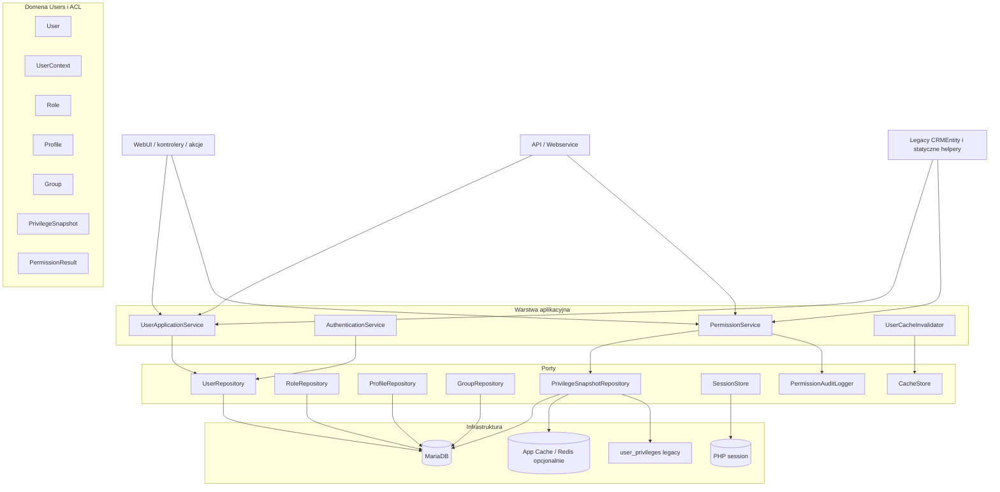

# Plan docelowej architektury użytkowników i uprawnień w FreeCRM

Ten dokument opisuje docelową, prostą i utrzymywalną architekturę obszaru użytkowników w FreeCRM. Ma służyć jako plan zmian dla modułów związanych z użytkownikami, sesją, cache, rolami, profilami, grupami, przełączaniem użytkowników i sprawdzaniem uprawnień.

Dokument nie opisuje szczegółowo obecnego stanu. Aktualny stan jest opisany w [users.md](users.md), a obecny system uprawnień w [privileges.md](privileges.md). Ten plik opisuje stan docelowy oraz kolejność dojścia do niego.

---

## 1. Cele architektury

Docelowa architektura ma spełniać następujące cele:

1. Jeden czytelny model użytkownika zamiast mieszania `Users`, `Record`, sesji i statycznych helperów.
2. Jeden oficjalny punkt wejścia do sprawdzania uprawnień.
3. Rozdzielenie domeny od transportu HTTP, sesji, plików cache i legacy CRMEntity.
4. Przewidywalne cacheowanie z jasnym miejscem odczytu i unieważniania.
5. Możliwość stopniowej migracji bez przepisywania całego FreeCRM naraz.
6. Zachowanie kompatybilności z istniejącymi modułami przez adaptery.
7. Testowalność: logika użytkowników i uprawnień ma dać się testować bez pełnego WebUI.
8. Dobra obserwowalność: decyzja o dostępie powinna mieć powód, kontekst i opcjonalny log diagnostyczny.
9. Brak nowych globalnych statycznych zależności.
10. Brak `class_alias()` i brak dalszego rozbudowywania warstwy legacy.

Najważniejsza zasada: nowy kod powinien zależeć od serwisów i interfejsów domenowych, a stary kod powinien korzystać z cienkich adapterów.

---

## 2. Zakres

Architektura obejmuje:

- użytkowników i ich cykl życia,
- logowanie i kontekst bieżącego użytkownika,
- preferencje użytkownika,
- przełączanie użytkowników,
- role, profile i grupy,
- cache użytkowników,
- snapshot uprawnień,
- sprawdzanie uprawnień do modułu, akcji i rekordu,
- warunki SQL / query builder dla list,
- regenerację i unieważnianie cache po zmianach w Settings,
- zgodność z istniejącymi modułami FreeCRM.

Poza zakresem tego planu są:

- przebudowa całego modułu Settings,
- wymiana całego silnika modułów CRM,
- zmiana wszystkich widoków Smarty,

---

## 3. Zasady projektowe

1. **Domena najpierw**: logika użytkowników i uprawnień nie powinna zależeć od `$_SESSION`, `$_REQUEST`, plików PHP w `user_privileges/` ani klas kontrolerów.
2. **Adaptery na brzegach**: WebUI, API, CRMEntity, pliki legacy i sesja są adapterami.
3. **Jeden kontrakt dla ACL**: nowe moduły pytają tylko `PermissionService`.
4. **Jawny kontekst**: metoda sprawdzająca uprawnienia przyjmuje `UserContext`, a nie sama odczytuje globalną sesję.
5. **Cache jako infrastruktura**: domena nie wie, czy snapshot pochodzi z DB, Redis, pliku czy pamięci procesu.
6. **Value objects zamiast tablic**: nowe API zwraca obiekty typu `UserId`, `RoleId`, `PermissionResult`, `PrivilegeSnapshot`.
7. **Kompatybilność przez adaptery**: stare metody pozostają, ale delegują do nowego rdzenia.
8. **Migracja etapami**: każdy etap musi zostawiać aplikację działającą przez WebUI.

---

## 4. Docelowy podział warstw



---

## 5. Moduly i odpowiedzialnosci

### 5.1 Domain

Proponowany katalog docelowy:

```text
src/Domain/User/
src/Domain/Permission/
```

Jesli projekt zostanie ujednolicony do przestrzeni `FreeCRM\`, nowe klasy powinny byc tworzone w docelowej przestrzeni `FreeCRM\Domain\...`. Dopoki aktywny kod uzywa `App\`, dopuszczalny jest etap przejsciowy w `App\Domain\...` lub `App\Modules\Users\Domain\...`. Wazne, aby nie rozbudowywac dalej legacy CRMEntity jako miejsca logiki biznesowej.

Docelowe obiekty domenowe:

| Obiekt | Znaczenie |
|--------|-----------|
| `User` | Dane biznesowe uzytkownika: ID, login, status, admin, rola, profil publiczny |
| `UserId` | Jawny identyfikator uzytkownika |
| `UserContext` | Efektywny uzytkownik, realny uzytkownik, zrodlo kontekstu, czy jest impersonation |
| `Role` | Rola i jej miejsce w hierarchii |
| `Profile` | Zestaw uprawnien do modulow i akcji |
| `Group` | Grupa wlascicieli / sharing |
| `PrivilegeSnapshot` | Skompilowany obraz uprawnien dla uzytkownika |
| `PermissionRequest` | Modul, akcja, rekord, kontekst uzytkownika |
| `PermissionResult` | Decyzja `allow/deny`, powod, warstwa, dane diagnostyczne |

Zasada: obiekty domenowe nie powinny wykonywac zapytan SQL ani czytac sesji.

### 5.2 Application Services

Proponowane serwisy aplikacyjne:

| Serwis | Odpowiedzialnosc |
|--------|------------------|
| `UserApplicationService` | Tworzenie, edycja, dezaktywacja, odczyt uzytkownika |
| `AuthenticationService` | Logowanie, weryfikacja hasla, rehash, blokady logowania |
| `CurrentUserProvider` | Odczyt `UserContext` z requestu/sesji przez port `SessionStore` |
| `UserPreferenceService` | Preferencje uzytkownika |
| `UserImpersonationService` | Przelaczanie uzytkownikow i powrot do realnego konta |
| `PermissionService` | Jedyny oficjalny punkt sprawdzania uprawnien |
| `PrivilegeSnapshotService` | Budowa snapshotu ACL po zmianach roli/profilu/grupy/uzytkownika |
| `UserCacheInvalidator` | Jedno miejsce uniewazniania cache |
| `PermissionQueryService` | Warunki query builder dla list i popupow |

Serwisy aplikacyjne moga korzystac z repozytoriow, cache, sesji i loggerow przez interfejsy.

### 5.3 Infrastructure

Warstwa infrastruktury implementuje porty:

| Port | Implementacja poczatkowa | Implementacja docelowa |
|------|--------------------------|-------------------------|
| `UserRepository` | MariaDB Query Builder | MariaDB / ActiveRecord |
| `PrivilegeSnapshotRepository` | dual read: DB/cache, fallback do plikow | DB + cache aplikacyjny |
| `SessionStore` | `Vtiger_Session` | nadal `Vtiger_Session`, ale ukryty za interfejsem |
| `CacheStore` | `App\Cache\Cache` | `App\Cache\Cache` / Redis |
| `PermissionAuditLogger` | log aplikacyjny | log strukturalny + opcjonalnie tabela audytu |
| `LegacyPrivilegeFileGateway` | `user_privileges/*.php` | tylko fallback migracyjny |

---

## 6. Docelowy model kontekstu uzytkownika

Obecnie kontekst jest rozproszony miedzy `Vtiger_Request`, `Vtiger_Session`, `Record::getCurrentUserModel()` i `CurrentUser::get()`.

Docelowo:

```php
final class UserContext
{
    public function effectiveUserId(): UserId;
    public function realUserId(): UserId;
    public function isImpersonated(): bool;
    public function isAdmin(): bool;
}
```

Zasady:

1. Kontrolery i akcje pobieraja kontekst przez `$request->getUserContext()` albo `CurrentUserProvider`.
2. `Record::getCurrentUserModel()` zostaje adapterem legacy i nie jest uzywany w nowym kodzie.
3. `baseUserId` jest ukryty za `UserContext::realUserId()`.
4. Sprawdzanie uprawnien nigdy nie odczytuje samo sesji, jesli wywolujacy moze przekazac kontekst.

Adapter przejsciowy:

```php
$context = $currentUserProvider->fromRequest($request);
$result = $permissionService->can($context, new PermissionRequest('Accounts', 'DetailView', $recordId));
```

---

## 7. Docelowy model uprawnien

### 7.1 Jeden punkt wejscia

Nowe API:

```php
interface PermissionService
{
    public function can(UserContext $context, PermissionRequest $request): PermissionResult;
    public function assertCan(UserContext $context, PermissionRequest $request): void;
}
```

Legacy adaptery:

| Obecne API | Docelowe zachowanie |
|------------|---------------------|
| `Security\Privilege::isPermitted()` | deleguje do `PermissionService`, zwraca `bool` |
| `Users\Models\Privileges::isPermitted()` | deleguje do `PermissionService`, zwraca `bool` |
| `UserInfoUtil::isPermitted()` | deleguje do `PermissionService`, mapuje `true/false` na `yes/no` |
| module `getListViewSecurityParameter()` | docelowo usuniete albo delegacja do `PermissionQueryService` |

### 7.2 `PermissionResult`

Decyzja powinna byc jawna:

```php
final class PermissionResult
{
    public function allowed(): bool;
    public function reasonCode(): string;
    public function layer(): string;
    public function diagnostics(): array;
}
```

Przykladowe `reasonCode`:

- `ALLOW_ADMIN`
- `ALLOW_MODULE_NO_SECURITY`
- `DENY_MODULE_INACTIVE`
- `DENY_MODULE_PROFILE`
- `DENY_ACTION_PROFILE`
- `ALLOW_GLOBAL_VIEW`
- `ALLOW_GLOBAL_EDIT`
- `ALLOW_OWNER`
- `ALLOW_SHARED_OWNER`
- `ALLOW_ROLE_HIERARCHY`
- `ALLOW_SHARING_RULE`
- `DENY_RECORD_PRIVATE`
- `DENY_NO_RECORD_ACCESS`
- `DENY_SNAPSHOT_NOT_FOUND`

Zastepuje to globalne `Privilege::$isPermittedLevel`.

### 7.3 Kolejnosc checkow

Docelowy silnik powinien byc lancuchem malych checkerow:

1. `ModuleExistsChecker`
2. `ModuleActiveChecker`
3. `ModuleWithoutSecurityChecker`
4. `SettingsAccessChecker`
5. `AdminChecker`
6. `ProfileModuleChecker`
7. `ProfileActionChecker`
8. `GlobalPermissionChecker`
9. `RecordOwnershipChecker`
10. `SharedOwnerChecker`
11. `RoleHierarchyChecker`
12. `RelatedRecordChecker`
13. `SharingRuleChecker`
14. `AdvancedPermissionChecker`

Kazdy checker dostaje `PermissionRequest`, `UserContext` i `PrivilegeSnapshot`. Checker nie pobiera danych globalnie.

---

## 8. Snapshot uprawnien

### 8.1 Cel

`PrivilegeSnapshot` ma zastapic bezposrednie `require` plikow `user_privileges/user_privileges_{id}.php` w runtime.

Snapshot zawiera:

- ID uzytkownika,
- flage admin,
- status uzytkownika,
- role ID,
- sekwencje roli nadrzednej,
- profile,
- grupy,
- uprawnienia globalne,
- uprawnienia do modulow,
- uprawnienia do akcji,
- role podrzedne,
- uzytkownikow z rol podrzednych,
- domyslne sharing organizacji,
- sharing per modul,
- wersje snapshotu,
- czas wygenerowania.

### 8.2 Storage docelowy

Najprostszy docelowy model:

```text
u_#__user_privilege_snapshot
  user_id int primary key
  version int not null
  payload_json mediumtext not null
  checksum varchar(64) not null
  generated_at datetime not null
  invalidated_at datetime null
```

Opcjonalnie:

```text
u_#__user_privilege_snapshot_event
  id bigint primary key
  user_id int null
  reason varchar(64)
  created_at datetime
  payload_json text
```

W pierwszym etapie repository moze czytac z plikow i mapowac je do `PrivilegeSnapshot`. W etapie docelowym pliki staja sie tylko fallbackiem lub narzedziem migracyjnym.

### 8.3 Cache runtime

Warstwy cache:

1. Per-request memory cache w `PrivilegeSnapshotRepository`.
2. `App\Cache\Cache` / Redis dla snapshotu.
3. DB jako zrodlo prawdy snapshotu.
4. Pliki `user_privileges` tylko jako fallback przejsciowy.

Zasada: invalidacja idzie przez `UserCacheInvalidator`, nie przez rozproszone `clearCache()` w wielu klasach.

---

## 9. Cache i invalidacja

Docelowo istnieje jeden serwis:

```php
interface UserCacheInvalidator
{
    public function invalidateUser(UserId $userId, string $reason): void;
    public function invalidateAll(string $reason): void;
    public function invalidateRole(RoleId $roleId, string $reason): void;
    public function invalidateProfile(ProfileId $profileId, string $reason): void;
    public function invalidateGroup(GroupId $groupId, string $reason): void;
}
```

Odpowiedzialnosci:

- czysci cache `Record`,
- czysci cache `Privileges`,
- czysci cache sharingu,
- czysci `App\Cache\Cache` dla kluczy zwiazanych z uzytkownikiem,
- oznacza snapshot jako nieaktualny,
- opcjonalnie uruchamia rebuild synchroniczny lub asynchroniczny.

Minimalny zestaw powodow invalidacji:

| Powod | Kiedy |
|-------|-------|
| `USER_UPDATED` | zmiana danych uzytkownika |
| `USER_STATUS_CHANGED` | aktywacja/dezaktywacja |
| `USER_ROLE_CHANGED` | zmiana roli |
| `ROLE_UPDATED` | zmiana hierarchii roli |
| `PROFILE_UPDATED` | zmiana profilu |
| `GROUP_UPDATED` | zmiana grupy |
| `SHARING_RULE_UPDATED` | zmiana sharing rules |
| `MODULE_PERMISSION_CHANGED` | instalacja/dezaktywacja modulu |
| `IMPORT_REBUILD` | import danych |

---

## 10. Query permissions dla list

Obecne `PrivilegeQuery` ma dwa style: SQL string i modyfikacja query buildera. Docelowo zostaje jeden rdzen:

```php
interface PermissionQueryService
{
    public function applyRecordVisibility(Query $query, UserContext $context, string $moduleName): Query;
    public function buildRecordVisibilityCondition(UserContext $context, string $moduleName): Condition;
}
```

Legacy adapter:

```php
PrivilegeQuery::getAccessConditions($moduleName, $user)
```

powinien byc cienka warstwa, ktora serializuje `Condition` do SQL tylko tam, gdzie stary kod nadal tego wymaga.

Zasada: moduly nie powinny implementowac wlasnych kopii `getListViewSecurityParameter()`. Jesli modul ma specyficzna regule, dostarcza checker lub polityke modulu rejestrowana w `PermissionService`.

---

## 11. User management

### 11.1 Odczyt i zapis uzytkownika

Docelowe API:

```php
interface UserRepository
{
    public function get(UserId $id): ?User;
    public function getByUsername(string $username): ?User;
    public function save(User $user): void;
    public function exists(UserId $id): bool;
}
```

`Users\Models\Record` pozostaje modelem integracyjnym dla starego UI, ale logika biznesowa powinna byc przenoszona do `UserApplicationService`.

### 11.2 Cykl zycia

`UserLifecycleService` powinien obslugiwac:

- utworzenie uzytkownika,
- aktywacje/dezaktywacje,
- soft delete,
- transfer wlasnosci rekordow,
- blokady usuniecia,
- invalidacje cache i snapshotow po zmianie.

### 11.3 Preferencje

Preferencje uzytkownika powinny miec osobny port:

```php
interface UserPreferenceRepository
{
    public function get(UserId $userId, string $name, mixed $default = null): mixed;
    public function set(UserId $userId, string $name, mixed $value): void;
}
```

Nie nalezy mieszac preferencji z modelem uprawnien.

---

## 12. Uwierzytelnianie

Docelowo `AuthenticationService` ma byc jedynym miejscem:

- weryfikacji hasla,
- rehash hasla,
- integracji LDAP,
- blokad brute force,
- zapisu historii logowania,
- ustawiania sesji przez `SessionStore`.

Kontroler `Users\Actions\Login` powinien tylko:

1. odczytac request,
2. wywolac `AuthenticationService`,
3. zapisac wynik w sesji,
4. wykonac przekierowanie.

Nie powinien sam synchronizowac kilku modeli uzytkownika.

---

## 13. Przelaczanie uzytkownikow

Docelowo odpowiedzialnosc przejmuje `UserImpersonationService`:

```php
interface UserImpersonationService
{
    public function canSwitch(UserContext $context, UserId $targetUserId): PermissionResult;
    public function switchTo(UserContext $context, UserId $targetUserId): UserContext;
    public function switchBack(UserContext $context): UserContext;
}
```

Zasady:

- admin moze przelaczac sie na aktywnych uzytkownikow,
- nie-admin korzysta z repozytorium zasad przelaczania,
- `switchUsers.php` jest fallbackiem legacy,
- logowanie zdarzen odbywa sie przez port `ImpersonationAuditLogger`,
- sesja zna tylko `effectiveUserId` i opcjonalny `realUserId`.

---

## 14. Kompatybilnosc z legacy

Nie przepisujemy od razu calego FreeCRM. Utrzymujemy adaptery:

| Legacy | Adapter docelowy |
|--------|------------------|
| `\App\Modules\Users\Users` | deleguje do `UserApplicationService`, `AuthenticationService`, `UserPreferenceService` |
| `\App\Modules\Users\Models\Record` | model UI/legacy, deleguje logike do serwisow |
| `\App\Modules\Users\Models\Privileges` | adapter do `PermissionService` i `PrivilegeSnapshotRepository` |
| `\App\Security\Privilege` | statyczny adapter do `PermissionService` |
| `\App\Security\PrivilegeQuery` | adapter do `PermissionQueryService` |
| `user_privileges/*.php` | fallback przez `LegacyPrivilegeFileGateway` |

Nowy kod nie powinien dodawac kolejnych statycznych metod do tych klas poza adapterami migracyjnymi.

---

## 15. Proponowana struktura katalogow

Wariant przejsciowy zgodny z obecnym kodem:

```text
src/Modules/Users/
  Domain/
    User.php
    UserId.php
    UserContext.php
    Role.php
    Profile.php
    Group.php
  Application/
    UserApplicationService.php
    AuthenticationService.php
    CurrentUserProvider.php
    UserPreferenceService.php
    UserLifecycleService.php
    UserImpersonationService.php
  Infrastructure/
    DbUserRepository.php
    DbUserPreferenceRepository.php
    VtigerSessionStore.php
    LegacyUsersAdapter.php

src/Security/
  Domain/
    PermissionRequest.php
    PermissionResult.php
    PrivilegeSnapshot.php
  Application/
    PermissionService.php
    PermissionQueryService.php
    PrivilegeSnapshotService.php
    UserCacheInvalidator.php
  Infrastructure/
    DbPrivilegeSnapshotRepository.php
    LegacyPrivilegeFileGateway.php
    AppCachePrivilegeSnapshotCache.php
    PermissionAuditLogger.php
  Checker/
    AdminChecker.php
    ModuleActiveChecker.php
    ProfileModuleChecker.php
    ProfileActionChecker.php
    RecordOwnershipChecker.php
    SharingRuleChecker.php
```

Wariant docelowy po ujednoliceniu namespace:

```text
src/User/
src/Permission/
```

albo:

```text
src/Domain/User/
src/Domain/Permission/
```

Decyzja o namespace wymaga uzgodnienia, bo obecny kod szeroko korzysta z `App\`.

---

## 16. Plan migracji

### Etap 0: Kontrakty i testy bazowe

Zakres:

- dodac `PermissionRequest`, `PermissionResult`, `UserContext`,
- dodac testy smoke dla obecnych zachowan,
- opisac scenariusze: admin, zwykly uzytkownik, wlasciciel rekordu, shared owner, hierarchia roli, brak dostepu do modulu,
- dodac log diagnostyczny decyzji ACL za flaga konfiguracji.

Kryterium wyjscia:

- obecny system nadal dziala,
- mamy testy opisujace aktualne zachowanie,
- nowe klasy domenowe moga byc uzywane bez przepinania produkcyjnego runtime.

### Etap 1: `PermissionService` jako fasada

Zakres:

- stworzyc `PermissionService`, ktory deleguje do obecnego `Security\Privilege::isPermitted()`,
- przepiac nowe miejsca w kodzie na `PermissionService`,
- `Security\Privilege` zostaje adapterem,
- `Privileges::isPermitted()` zostaje adapterem,
- `UserInfoUtil::isPermitted()` zostaje adapterem `yes/no`.

Kryterium wyjscia:

- nowe moduly nie wywoluja statycznego `isPermitted()` bezposrednio,
- decyzje ACL maja `PermissionResult`.

### Etap 2: `UserContext` i `CurrentUserProvider`

Zakres:

- wprowadzic `CurrentUserProvider`,
- dodac `UserContext` do requestu,
- stopniowo zastapic `Record::getCurrentUserModel()` w kontrolerach przez `$request->getUserContext()` / `$request->getUser()`,
- ukryc `baseUserId` za `UserContext`.

Kryterium wyjscia:

- kontrolery WebUI i API nie musza same czytac sesji,
- impersonation jest widoczne w `UserContext`.

### Etap 3: Snapshot repository

Zakres:

- stworzyc `PrivilegeSnapshotRepository`,
- poczatkowo czytac obecne pliki i mapowac je do `PrivilegeSnapshot`,
- dodac tabele snapshotow,
- dodac dual read: DB/cache jako podstawowe zrodlo, pliki jako fallback,
- przeniesc generowanie snapshotow do `PrivilegeSnapshotService`.

Kryterium wyjscia:

- runtime nie musi wykonywac `require` plikow w nowych sciezkach,
- pliki pozostaja tylko dla legacy i awaryjnego fallbacku.

### Etap 4: Checker pipeline

Zakres:

- rozbic monolit `isPermitted()` na checkery,
- zachowac ta sama kolejnosc decyzji co obecnie,
- dodac testy jednostkowe checkerow,
- `PermissionService` zaczyna uzywac checker pipeline zamiast delegacji do starego monolitu.

Kryterium wyjscia:

- `PermissionResult::reasonCode()` pokazuje, dlaczego dostep zostal przyznany lub odmowiony,
- stary `Privilege::$isPermittedLevel` nie jest potrzebny w nowych sciezkach.

### Etap 5: Query permissions

Zakres:

- stworzyc `PermissionQueryService`,
- przepiac list views i popupy na query builder,
- zredukowac module-specific `getListViewSecurityParameter()`,
- SQL string zostawic jako adapter dla najstarszych miejsc.

Kryterium wyjscia:

- jedna implementacja widocznosci rekordow dla list,
- mniej duplikacji w modulach.

### Etap 6: Cleanup legacy

Zakres:

- oznaczyc stare API jako deprecated,
- usuwac bezposrednie `require user_privileges/*.php` z modulow,
- skasowac podwojne generowanie plikow, gdy snapshot DB bedzie stabilny,
- uproscic `Users`, `Record`, `Privileges`, `Privilege`, `PrivilegeQuery`.

Kryterium wyjscia:

- nowy kod korzysta tylko z serwisow,
- legacy zostaje jako cienka warstwa kompatybilnosci.

---

## 17. Wplyw na konkretne moduly FreeCRM

| Modul / obszar | Zmiana |
|----------------|--------|
| `Users` | przeniesienie logiki z `Record` i `Users` do serwisow aplikacyjnych |
| `Settings/Roles` | invalidacja snapshotow po zmianie hierarchii |
| `Settings/Profiles` | invalidacja snapshotow po zmianie profilu |
| `Settings/Groups` | invalidacja snapshotow uzytkownikow grupy |
| `Settings/GlobalPermission` | invalidacja snapshotow uzytkownikow profilu |
| `EntryPoint/WebUI` | budowa `UserContext` raz na request |
| `Http/Vtiger_Request` | przechowywanie `UserContext` obok `Record` |
| `Security/Privilege` | adapter do `PermissionService` |
| `Security/PrivilegeQuery` | adapter do `PermissionQueryService` |
| `Fields/Owner` | odczyt dostepnych wlascicieli przez serwis zamiast rozproszonego cache |
| `Import` | rebuild snapshotow po imporcie uzytkownikow |
| `ModuleManagement` | invalidacja globalna po instalacji/dezaktywacji modulow |
| moduly biznesowe | usuwanie lokalnych kopii security SQL |

---

## 18. Testowanie i kryteria akceptacji

### Testy techniczne

- unit testy dla checkerow,
- testy repository snapshotow,
- testy invalidacji cache,
- testy mapowania legacy plikow na `PrivilegeSnapshot`,
- testy `UserContext` dla zwyklego logowania i impersonation.

### Testy integracyjne

- admin widzi wszystkie rekordy,
- zwykly uzytkownik widzi wlasne rekordy,
- shared owner widzi rekord wspoldzielony,
- uzytkownik z roli nadrzednej widzi rekord podwladnego zgodnie z reguly,
- brak dostepu do modulu blokuje WebUI,
- dezaktywowany uzytkownik nie loguje sie,
- zmiana profilu od razu zmienia dostep po invalidacji,
- import uzytkownikow odbudowuje snapshoty.

### Testy web

Zgodnie z zasadami projektu testy CLI nie wystarczaja. Kazdy etap musi byc zweryfikowany przez WebUI:

- logowanie,
- wejscie na Dashboard,
- wejscie na liste modulu,
- wejscie w rekord,
- zmiana profilu/roli/grupy w Settings,
- sprawdzenie `cache/logs/system.log`.

---

## 19. Zasady wdrazania

1. Zmiany w ACL wdrazac z flaga konfiguracyjna, gdy to mozliwe.
2. W pierwszych etapach utrzymywac dual path: nowe API + fallback legacy.
3. Nie zmieniac zachowania biznesowego bez testu porownawczego.
4. Nie usuwac plikow `user_privileges` dopoki wszystkie legacy sciezki nie sa przepiete.
5. Kazdy etap powinien miec migracje danych albo skrypt rebuild.
6. Kazdy etap powinien miec plan rollback: powrot do starego adaptera.

---

## 20. Ryzyka

| Ryzyko | Minimalizacja |
|--------|---------------|
| Regresje uprawnien | testy smoke, reason codes, porownanie starej i nowej decyzji |
| Spadek wydajnosci | cache snapshotow, pomiary list view, indeksy DB |
| Rozjazd legacy i nowego API | adaptery delegujace do jednego rdzenia |
| Problemy po imporcie | rebuild snapshotow i diagnostyka brakujacych uzytkownikow |
| Zbyt duzy zakres | migracja etapami, modul po module |
| Niejednolity namespace | decyzja architektoniczna przed tworzeniem wielu nowych klas |

---

## 21. Decyzje architektoniczne do podjecia

1. Czy nowe klasy domenowe tworzymy w obecnym stylu `App\...`, czy zaczynamy docelowa przestrzen `FreeCRM\...`?
2. Czy snapshot uprawnien ma byc przechowywany w DB jako JSON, czy od razu w cache typu Redis z DB jako fallback?
3. Czy rebuild snapshotow ma byc synchroniczny po zapisie Settings, czy asynchroniczny przez kolejke/cron?
4. Czy `PermissionResult` ma byc logowany zawsze w trybie debug, czy tylko przy odmowie dostepu?
5. Czy `user_privileges/*.php` maja zostac dlugoterminowym fallbackiem, czy tylko narzedziem migracyjnym na kilka etapow?

---

## 22. Pytania

1. Czy priorytetem jest najpierw uproszczenie kodu `Users`, czy najpierw uporzadkowanie `PermissionService` i ACL?
2. Czy FreeCRM ma docelowo dzialac na wielu instancjach web bez wspoldzielonego filesystemu? Jesli tak, pliki `user_privileges` musza zostac wycofane szybciej.
3. Czy akceptujemy dodanie nowych tabel snapshotow w najblizszej migracji?
4. Czy chcemy zachowac kompatybilnosc z modulami, ktore bezposrednio czytaja `user_privileges/*.php`, czy mozemy je aktywnie przepiac?
5. Czy impersonation ma miec dodatkowe ograniczenia audytowe, np. wymagany powod przelaczenia albo blokade dla wybranych uzytkownikow?
6. Czy w pierwszej wersji nowego `PermissionService` wystarczy wynik `allow/deny + reasonCode`, czy potrzebujemy pelnego sladu decyzji wszystkich checkerow?
7. Czy cache snapshotow ma byc invalidowany natychmiast, czy dopuszczalny jest krotki TTL?
8. Czy nowe API ma byc udostepnione rowniez dla webservice/API jako publiczny kontrakt?

---

## 23. Rekomendowany pierwszy krok

Najlepszy pierwszy krok to nie przebudowa storage, tylko wprowadzenie kontraktow i fasady:

1. `UserContext`
2. `PermissionRequest`
3. `PermissionResult`
4. `PermissionService` delegujacy do obecnego `Security\Privilege::isPermitted()`
5. adaptery legacy nadal zwracajace stare typy

Ten krok daje natychmiastowy porzadek w nowych modulach, a nie wymaga jeszcze zmiany plikow `user_privileges`, tabel sharing ani istniejacych list view.
