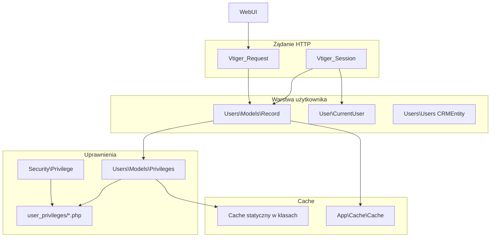

# Zarządzanie użytkownikami w FreeCRM

Ten dokument opisuje mechanizmy związane z użytkownikami: model danych, sesję, warstwę aplikacyjną, cache oraz system uprawnień (role, profile, grupy, sharing). Jest przeznaczony dla deweloperów pracujących nad modułem **Users** i integracjami wymagającymi kontekstu zalogowanego użytkownika.

Szczegółowy opis samego silnika uprawnień (`isPermitted`, sharing, list views) znajduje się w [privileges.md](privileges.md).

---

## 1. Przegląd architektury

FreeCRM dziedziczy model użytkowników z linii Vtiger/YetiForce, ale rozwija go w przestrzeni nazw `FreeCRM\` / `App\`. Warstwa użytkownika składa się z kilku współpracujących elementów:



| Warstwa | Klasa / plik | Odpowiedzialność |
|---------|----------------|------------------|
| Encja CRM | `\App\Modules\Users\Users` | Operacje DB, kompatybilność wsteczna, adaptery do serwisów |
| Model rekordu | `\App\Modules\Users\Models\Record` | Logika biznesowa, logowanie, preferencje, zapis użytkownika |
| Model uprawnień | `\App\Modules\Users\Models\Privileges` | Odczyt plików uprawnień, sprawdzanie dostępu do modułów/akcji |
| Kontekst bieżący | `\App\User\CurrentUser` | Uproszczony dostęp do zalogowanego użytkownika (request → sesja) |
| Żądanie | `\App\Http\Vtiger_Request` | Przechowuje `Record` zalogowanego użytkownika na czas requestu |
| Sesja | `\App\Http\Vtiger_Session` | `authenticated_user_id`, `baseUserId` (przełączanie użytkowników) |
| Silnik ACL | `\App\Security\Privilege` | `isPermitted()` – pełna ścieżka decyzji o dostępie |
| Pliki ACL | `user_privileges/` | Zmaterializowane uprawnienia i sharing per użytkownik |
| Generator plików | `\App\Modules\Users\Services\PrivilegeFileManager` | Regeneracja plików po zmianach użytkownika/roli/profilu |

---

## 2. Dane w bazie

### 2.1 Tabela użytkowników

Główna tabela to `vtiger_users` (powiązana z `vtiger_crmentity` jak każdy moduł CRM). Kluczowe pola:

- `user_name` – login
- `user_password` – hash Argon2id z pepperem (szczegóły: [PASSWORD_MIGRATION.md](PASSWORD_MIGRATION.md))
- `status` – np. `Active` / `Inactive`
- `is_admin` – flaga administratora (`on` / puste)
- `roleid` – przypisana rola
- `deleted` – soft delete

### 2.2 Role, profile i grupy

| Pojęcie | Tabele / konfiguracja | Znaczenie |
|---------|------------------------|-----------|
| **Rola** | `vtiger_role`, `vtiger_user2role` | Hierarchia organizacyjna; wpływa na sharing i podwładnych |
| **Profil** | `vtiger_profile`, `vtiger_role2profile`, `vtiger_user2role` | Macierz uprawnień: moduły, akcje, globalne View All / Edit All |
| **Grupa** | `vtiger_groups`, `vtiger_users2group` | Współdzielenie rekordów i listy właścicieli |

Użytkownik może mieć **wiele profili** (przez rolę). Efektywne uprawnienia łączy się metodą „najbardziej restrykcyjnej” wartości `1` (brak dostępu) – patrz `Privileges::getCombinedUser*Permissions()`.

Konfiguracja odbywa się w panelu **Settings → Users** (role, profile, grupy, global permissions).

---

## 3. Sesja i uwierzytelnianie

### 3.1 Logowanie

Ścieżka: `Users\Actions\Login::process()`:

1. Weryfikacja hasła przez `Users::doLogin()` → delegacja do `Record::doLogin()`.
2. Obsługa LDAP (gdy `yetiforce_auth` ma `ldap.active = true`) – konfiguracja cache’owana pod kluczem `Authorization` / `config` w `\App\Cache\Cache`.
3. Po sukcesie: `Vtiger_Session::setAuthenticatedUserId($userId)` ustawia `authenticated_user_id` oraz `app_unique_key` (musi zgadzać się z `application_unique_key` z konfiguracji).
4. Model użytkownika trafia na request: `$request->setUser(Record::getInstanceById(...))`.

Hasła: Argon2id + pepper, z możliwością cichego rehash przy logowaniu – patrz [PASSWORD_MIGRATION.md](PASSWORD_MIGRATION.md).

### 3.2 Każde żądanie web (WebUI)

W `WebUI::initializeGlobals()`:

1. `getLogin()` odtwarza obiekt `Users` (CRMEntity) z sesji przez `retrieveCurrentUserInfoFromFile($userid)`.
2. Jeśli użytkownik istnieje, tworzony jest `Record` i dołączany do requestu: `$request->setUser($userModel)`.

Dla administratorów po imporcie danych może jednorazowo uruchomić się `VtlibUtils::recreateUserPrivilegeFiles()` (flaga `cache/.user_privileges_rebuilt`).

### 3.3 Klucze sesji

| Klucz | Znaczenie |
|-------|-----------|
| `authenticated_user_id` | ID użytkownika „widzianego” przez aplikację |
| `app_unique_key` | Zabezpieczenie przed podmianą sesji między instalacjami |
| `baseUserId` | Prawdziwy użytkownik przy **przełączaniu kont** (impersonation) |
| `user_name`, `full_user_name` | Etykiety w UI |
| `language`, `layout` | Preferencje interfejsu |

`Record::getCurrentUserRealId()` zwraca `baseUserId` jeśli jest ustawiony, w przeciwnym razie `authenticated_user_id`.

### 3.4 Zalecany sposób pobierania bieżącego użytkownika

| API | Status | Użycie |
|-----|--------|--------|
| `$request->getUser()` / `$request->getUserId()` | **Preferowane** w kontrolerach i akcjach po inicjalizacji WebUI |
| `\App\User\CurrentUser::get()` | Request → sesja → `Record::getInstanceById` |
| `Record::getCurrentUserModel()` | **@deprecated** – cache statyczny + sesja |
| `Privileges::getCurrentUserPrivilegesModel()` | Model uprawnień bieżącego użytkownika |

---

## 4. Przełączanie użytkowników (Switch Users)

Akcja `Users\Actions\SwitchUsers` pozwala zalogować się „jako” inny użytkownik:

- **Administrator** – może przełączyć się na dowolnego aktywnego użytkownika.
- **Pozostali** – tylko pary zdefiniowane w `user_privileges/switchUsers.php`.
- Powrót do konta źródłowego: przełączenie na `baseUserId` czyści `baseUserId` w sesji.

Przy pierwszym przełączeniu zapisywane jest `baseUserId` (użytkownik rzeczywisty). Zdarzenia logowane są w `l_#__switch_users` (baza `log`).

---

## 5. Cache użytkowników – poziomy

FreeCRM stosuje **kilka niezależnych mechanizmów cache**; ważne jest, który unieważnić po zmianie użytkownika lub uprawnień.

### 5.1 Cache w pamięci procesu (request / PHP-FPM worker)

#### `Users\Models\Record`

```php
protected static $currentUserId;
protected static $currentUserCache;  // bieżący Record
protected static $currentUserRealId;
```

`clearCache($userId)` czyści cache bieżącego użytkownika (jeśli ID się zgadza) i deleguje do `Privileges::clearCache()`.

#### `Users\Models\Privileges`

```php
protected static $userPrivilegesCache = [];      // tablica z getPrivilegesFile()
protected static $userPrivilegesModelCache = []; // instancje modelu Privileges
protected static $lockEditCache = [];            // blokada edycji (workflow)
```

#### `Security\Privilege`

```php
protected static $userSharingCache = [];  // sharing_privileges_{id}.php
```

#### Inne cache statyczne powiązane z użytkownikami

- `PrivilegeUtil::$roleByUsersCache`
- `PrivilegeUpdater::$globalSearchUsersCache`

### 5.2 `\App\Cache\Cache` (współdzielony cache aplikacji)

Przykładowe klucze związane z użytkownikami:

| Namespace / metoda | Klucz | Cel |
|--------------------|-------|-----|
| `UserIsExists` | ID użytkownika | Szybkie sprawdzenie istnienia rekordu |
| `UserId` | `user_name` | Mapowanie login → ID (`Utils::getUserId`) |
| `UserGroups` | ID użytkownika | Grupy użytkownika (`PrivilegeUtil`) |
| `getRoleUsers` | ID roli | Użytkownicy w roli |
| `getUsers` | złożony (status, moduł, role…) | Lista użytkowników w polach Owner (`Fields\Owner`) |
| `getAccessibleUsers` | kontekst uprawnień | Użytkownicy widoczni w picklistach |
| `Authorization` | `config` | Konfiguracja LDAP / auth z `yetiforce_auth` |
| `ImportUserList` | kontekst importu | Lista użytkowników w imporcie |
| `PrivilegesParentRecord` | rekord + moduł | Cache przy eskalacji uprawnień rodzica |

TTL zależy od wywołania (np. `Cache::LONG` przy mapowaniu po nazwie).

### 5.3 Pliki w `user_privileges/` (cache trwały na dysku)

Główny mechanizm wydajności uprawnień – **zmaterializowane PHP** zamiast wielu JOIN-ów przy każdym sprawdzeniu.

| Plik | Zawartość |
|------|-----------|
| `user_privileges_{userId}.php` | Snapshot: `is_admin`, `user_info`, role, profile, grupy, macierze global/tab/action, role podrzędne |
| `sharing_privileges_{userId}.php` | Domyślne sharing organizacji, macierze read/write per moduł |
| `users.php` | Indeks wszystkich użytkowników (`id`, `userName`) – gdy `ENABLE_CACHING_USERS` |
| `switchUsers.php` | Dozwolone przełączenia kont |
| `tabdata.php` i inne | Metadane modułów (globalne) |

**Odczyt w runtime:**

1. `Privileges::getPrivilegesFile($userId)` – `require` pliku + opakowanie w tablicę `$valueMap`; przy braku pliku – próba `PrivilegeFileManager::createUserPrivilegesFile()`; przy pustym pliku – fallback do DB (admin).
2. `Privilege::getSharingFile($userId)` – analogicznie dla sharingu.
3. `PrivilegeFile::getUser($type)` – odczyt `users.php` z cache statycznym `$usersFileCache`.

Format nowszych plików `user_privileges_{id}.php` (z `PrivilegeFile::createUserPrivilegesFile`) zwraca tablicę z kluczem `details`; starszy format używa zmiennych `$is_admin`, `$user_info` itd. – loader obsługuje oba warianty.

### 5.4 Tymczasowe tabele sharing (`vtiger_tmp_*`)

Po generacji plików sharing wywoływane jest m.in. `populateSharingtmptables()` – przyspiesza filtrowanie list i zapytania `PrivilegeQuery`.

---

## 6. System uprawnień użytkownika

### 6.1 Model mentalny

```
Użytkownik → Rola → Profile (+ opcjonalnie grupy)
                ↓
        Pliki user_privileges_* (cache)
                ↓
        Privileges (model) + Privilege::isPermitted()
```

- **Administrator** (`is_admin = on`) – pomija większość ograniczeń profilu; nadal obowiązują reguły specjalne (np. moduł Settings).
- **Użytkownik standardowy** – dostęp wynika z profili (zakładki modułów, akcje CRUD), globalnych View All / Edit All, sharingu i własności rekordu.

### 6.2 Sprawdzanie uprawnień – API

| Metoda | Zwraca | Uwagi |
|--------|--------|-------|
| `\App\Security\Privilege::isPermitted($module, $action, $record, $userId)` | `bool` | Główny punkt wejścia |
| `Privileges::isPermitted(...)` | `bool` | Delegacja do `Privilege` |
| `Privileges::isPermittedByUserId($userId, ...)` | `bool` | Jawne ID użytkownika |
| `\App\Utils\UserInfoUtil::isPermitted(...)` | `'yes'` / `'no'` | Legacy – unikać w nowym kodzie |

Na modelu uprawnień bieżącego użytkownika:

- `hasModulePermission($module)` – dostęp do modułu (wartość `0` w `profile_tabs_permission` = dozwolone)
- `hasModuleActionPermission($module, $action)` – akcja w module
- `hasGlobalReadPermission()` / `hasGlobalWritePermission()` – View All / Edit All

WebUI na starcie modułu wywołuje `Privileges::getCurrentUserPrivilegesModel()->hasModulePermission()` – brak dostępu → `NoPermitted`.

Szczegółowy przepływ warstw w `isPermitted()` (moduł aktywny, admin, profil, rekord, sharing): [privileges.md](privileges.md).

### 6.3 Listy i SQL

Filtrowanie widoczności rekordów na listach: `\App\Security\PrivilegeQuery` (warunki SQL / query builder), wykorzystujące dane z plików sharing i tabel tymczasowych.

---

## 7. Regeneracja cache uprawnień

Pliki **muszą** zostać odtworzone po zmianach wpływających na ACL. Typowe wyzwalacze:

| Zdarzenie | Kod / miejsce |
|-----------|----------------|
| Zapis użytkownika | `Users\Models\Module::saveRecord()` → `createUserPrivilegesFile` + `createUserSharingPrivilegesFile` |
| Zapis użytkownika (AJAX) | `Users\Actions\SaveAjax` |
| Zmiana profilu | `Settings\Profiles\Models\Record` |
| Zmiana roli | `Settings\Roles\Models\Record` |
| Zmiana grupy | `Settings\Groups\Models\Record` |
| Global permissions | `Settings\GlobalPermission\Models\Record` |
| Ręcznie / po imporcie | `VtlibUtils::recreateUserPrivilegeFiles()` – wszyscy użytkownicy |
| Nowy moduł | `ModuleService` – pełna regeneracja |

`PrivilegeFileManager::createUserPrivilegesFile()`:

1. Zapisuje legacy-format pliku (zmienne globalne w pliku).
2. Wywołuje `PrivilegeFile::createUserPrivilegesFile()` (format tablicowy `return [...]`).
3. Wywołuje `Privileges::clearCache($userId)` i `Record::clearCache($userId)`.

Przy włączonej opcji `AppConfig::performance('ENABLE_CACHING_USERS')` po zapisie użytkownika odświeżany jest też `user_privileges/users.php` (`PrivilegeFile::createUsersFile()`).

**Diagnostyka:** brak pliku lub pusty `user_privileges_{id}.php` powoduje błędy list i `SEC_USER_PRIVILEGES_NOT_FOUND` w logice `isPermitted`. Po imporcie użytkowników bez plików system próbuje wygenerować je on-demand.

---

## 8. Warstwa serwisów (Users)

Logika rozbita na serwisy w `src/Modules/Users/Services/` (szczegóły architektury: [User-Classes-Architecture.md](User-Classes-Architecture.md)):

| Serwis | Zakres |
|--------|--------|
| `AuthenticationService` | Logowanie, zmiana hasła, typy hash (legacy adapter) |
| `UserPreferencesService` | Preferencje w DB / sesji |
| `UserFileService` | Zdjęcie profilowe, załączniki |
| `DashboardService` | Widgety strony głównej |
| `UserLifecycleService` | Usuwanie, transfer własności rekordów |
| `PrivilegeFileManager` | Generowanie plików ACL |

`Users` (CRMEntity) nadal udostępnia metody `@deprecated` delegujące do serwisów – dla kompatybilności z kodem vtiger.

---

## 9. Konfiguracja istotna dla użytkowników

| Klucz | Znaczenie |
|-------|-----------|
| `performance.ENABLE_CACHING_USERS` | Regeneracja `user_privileges/users.php` przy zapisie użytkownika |
| `main.application_unique_key` | Walidacja sesji |
| `main.session_regenerate_id` | Regeneracja ID sesji po logowaniu |
| `performance.SHOW_ADMIN_PANEL` | Przekierowanie admina po logowaniu |
| `PASSWORD_ARGON2_*` | Parametry hashowania haseł |

Katalog `user_privileges/` musi być **zapisywalny** przez proces PHP (Docker: volume `storage` / uprawnienia do root aplikacji).

---

## 10. Najlepsze praktyki dla deweloperów

1. **Kontekst użytkownika** – w nowych kontrolerach używaj `$request->getUser()` zamiast `Record::getCurrentUserModel()`.
2. **Sprawdzanie ACL** – `Privilege::isPermitted()` lub model `Privileges`; nie duplikuj logiki sharing w modułach.
3. **Po zmianie roli/profilu/użytkownika** – upewnij się, że wywołana jest regeneracja plików (standardowo robi to warstwa Settings / `Module::saveRecord` dla Users).
4. **Testy** – weryfikuj przez serwer WWW (sesja); testy CLI nie odwzorowują pełnego łańcucha sesji ([testing-requirements](../.cursor/rules/testing-requirements.mdc)).
5. **Cache** – po skryptach migracyjnych/importach uruchom `recreateUserPrivilegeFiles()` lub zaloguj się jako admin (jednorazowy rebuild w WebUI).
6. **Hasła** – nie polegaj na `crypt_type` / starych hashach; patrz [PASSWORD_MIGRATION.md](PASSWORD_MIGRATION.md).

---

## 11. Powiązana dokumentacja

| Dokument | Temat |
|----------|--------|
| [privileges.md](privileges.md) | Pełny opis systemu uprawnień, słabe strony, plan refaktoryzacji |
| [User-Privilege-Classes-Overview.md](User-Privilege-Classes-Overview.md) | Indeks klas Users / Privilege / Settings |
| [User-Classes-Architecture.md](User-Classes-Architecture.md) | Serwisy, diagram warstw, przykłady API |
| [PASSWORD_MIGRATION.md](PASSWORD_MIGRATION.md) | Argon2id, pepper, migracja haseł |
| [PRIVILEGE_SYSTEM_ANALYSIS.md](PRIVILEGE_SYSTEM_ANALYSIS.md) | Analiza historyczna systemu ACL |

---

## 12. Szybka ściągawka ścieżek plików

| Obszar | Ścieżka |
|--------|---------|
| Model użytkownika | `src/Modules/Users/Models/Record.php` |
| Model uprawnień | `src/Modules/Users/Models/Record.php` → `Privileges.php` |
| Logowanie | `src/Modules/Users/Actions/Login.php` |
| Przełączanie kont | `src/Modules/Users/Actions/SwitchUsers.php` |
| Generator ACL | `src/Modules/Users/Services/PrivilegeFileManager.php` |
| Silnik `isPermitted` | `src/Security/Privilege.php` |
| Pliki cache ACL | `user_privileges/` |
| Inicjalizacja requestu | `src/EntryPoint/WebUI.php` |
| Bieżący użytkownik | `src/User/CurrentUser.php` |
