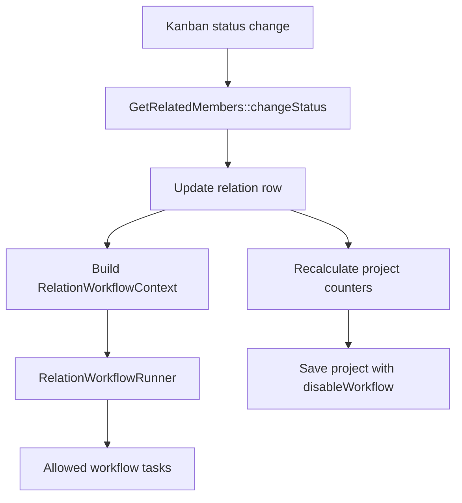

# FreeCRM Workflow Relations Modification — MVP

**Status:** approved MVP — execution plan ready  
**Author:** bmankowski@gmail.com  
**Date:** 2026-05-22  
**Scope:** workflow trigger for changes in relation data, starting with candidate status changes in recruitment projects.

---

## 1. Goal

FreeCRM needs workflow automation for events where a relation row changes, not only where a CRM entity record is created or saved.

The initial MVP targets this business event:

> Candidate changes status inside a recruitment project.

Technically, this is an update of `recruitment_status_rel` in:

```text
u_yf_projekty_rekrutacyjne_relations_members_entity
```

This is not a normal field on `Kandydaci` or `ProjektyRekrutacyjne`, so standard workflow triggers like `ON_MODIFY` or `ON_RELATED` are not enough.

---

## 2. Key decisions

| Topic | Decision |
|------|----------|
| Trigger source | Hook into all successful calls to `GetRelatedMembers::changeStatus()` |
| Trigger type | Add a new workflow trigger, separate from `ON_RELATED` |
| Scope of event | Relation pair, not a single module record |
| Initial relation | `ProjektyRekrutacyjne` ↔ `Kandydaci` |
| Initial relation field | `recruitment_status_rel` |
| Execution moment | Always after successful relation row update |
| Comments | Workflow execution must not depend on ModComments being created |
| Project save workflows | Drag-and-drop status change must not run project `ON_MODIFY` workflows |
| Re-entrant workflow | Tasks triggered by relation workflow must not recursively run workflow again |
| `ONCE` semantics | Once per relation pair, not once per project |
| Administrator access | Workflow definition stays in Settings |
| ModTracker | No additional ModTracker logging in MVP |
| External mail | Workflow may send external email to the candidate |
| Future direction | Generalize to arbitrary relation tables with additional columns |

---

## 3. Why `ON_RELATED` is not enough

`ON_RELATED` should describe linking records, for example adding a candidate to a project. It does not describe modification of a field stored on an existing relation row.

For this MVP, two triggers should remain separate:

| Event | Trigger |
|------|---------|
| Record A linked to record B | `ON_RELATED` |
| Relation row data changes | New relation modification trigger |

Recommended internal name:

```text
ON_RELATION_MODIFY
```

or, if we want the first implementation to explicitly target status:

```text
ON_RELATION_MODIFY
```
---

## 4. RelationWorkflowContext

The MVP should introduce a dedicated context object/value structure for relation workflows.

Minimal context:

```text
sourceModule
sourceRecordId
destinationModule
destinationRecordId
relationTable
relationName
relationDataBefore
relationDataAfter
sourceStatus
destinationStatus
triggerUserId
```

For the recruitment MVP:

```text
sourceModule = ProjektyRekrutacyjne
sourceRecordId = projectId
destinationModule = Kandydaci
destinationRecordId = candidateId
relationTable = u_yf_projekty_rekrutacyjne_relations_members_entity
sourceStatus = previous recruitment_status_rel
destinationStatus = new recruitment_status_rel
```

This context must be available during:

1. workflow condition evaluation,
2. email template variable replacement,
3. notification rendering,
4. custom function execution.

---

## 5. Access to fields from both related modules

The workflow must not be limited to one module's fields. For this type of event, the workflow is about a pair of records and a relation row.

### 5.1 Proposed solution

Use a relation-aware field resolver with three namespaces:

```text
source.*
destination.*
relation.*
```

For recruitment project candidate status changes:

```text
source.nazwa_projektu
source.number
source.assigned_user_id

destination.name
destination.email
destination.status_kandydata

relation.recruitment_status_rel
relation.sourceStatus
relation.destinationStatus
relation.destinationStatusLabel
```

This keeps the context explicit and avoids pretending that relation fields belong to a normal module record.

### 5.2 Email template access

Email tasks should resolve variables through the relation context before falling back to standard record parsing.

Recommended variable syntax:

```text
$source.nazwa_projektu$
$destination.name$
$destination.email$
$relation.sourceStatusLabel$
$relation.destinationStatusLabel$
```

Alternative short aliases can be added later:

```text
$project.nazwa_projektu$
$candidate.name$
$relation.destinationStatusLabel$
```

The MVP should prefer generic `source`, `destination`, and `relation` names, because the long-term goal is to support arbitrary relations.

### 5.3 Mail anchor

The mail task can still need an anchor record for CRM bookkeeping, permissions, and related mail history.

Recommended MVP behavior:

| Purpose | Anchor |
|---------|--------|
| Default email template module context | Relation context |
| CRM source record for audit/linking | Source record, initially `ProjektyRekrutacyjne` |
| Primary recipient candidate email | Destination record, initially `Kandydaci` |
| Related mail visibility | Link outbound mail to both source and destination records when possible |

So yes: the workflow should have access to both modules. The mail task should not be forced to choose only one for variable replacement. It only needs a technical anchor for record linking and permissions.

---

## 6. Should relation fields be added to `vtiger_field`?

Adding `recruitment_status_rel` to `vtiger_field` is useful if FreeCRM wants relation fields to behave consistently in filters, workflow condition builders, labels, field metadata, and picklist handling.

However, it must be represented as a relation field, not as a normal field of `ProjektyRekrutacyjne` or `Kandydaci`.

### 6.1 Recommended metadata approach

For MVP, add or expose metadata for relation fields with a clear convention:

```text
tablename = u_yf_projekty_rekrutacyjne_relations_members_entity
columnname = recruitment_status_rel
fieldname = recruitment_status_rel
fieldlabel = LBL_STATUS_REL
uitype = picklist-compatible UI type
```

Additional metadata or a convention is needed to mark it as relation-only, for example:

```text
relation_only = 1
relation_table = u_yf_projekty_rekrutacyjne_relations_members_entity
relation_source_module = ProjektyRekrutacyjne
relation_destination_module = Kandydaci
```

If adding columns to `vtiger_field` is too invasive, the same metadata can initially live in PHP using `GetRelatedMembers::CUSTOM_FIELDS`, then later be migrated into DB metadata.

### 6.2 Important constraint

Even if `recruitment_status_rel` is added to `vtiger_field`, the value must be read from the relation row, not from:

```text
ProjektyRekrutacyjne::get('recruitment_status_rel')
Kandydaci::get('recruitment_status_rel')
```

The field resolver must know that this is a `relation.*` field.

---

## 7. Workflow configuration UI for MVP

The workflow editor should expose a dedicated relation trigger configuration section when the new trigger is selected.

Minimal MVP fields:

| Field | Required | Description |
|------|----------|-------------|
| Source module | Yes | Initially `ProjektyRekrutacyjne` |
| Destination module | Yes | Initially `Kandydaci` |
| Relation field | Yes | Initially `recruitment_status_rel` |
| Destination status | Yes | New value after change |
| Source status | No | Previous value; empty means any previous value or new relation |

The UI should eventually allow choosing arbitrary relation definitions with additional relation columns

---

## 8. Allowed and disallowed workflow tasks

This trigger modifies a relation, not a normal CRM entity. Therefore tasks that update a normal record can break the event semantics or create workflow recursion.

### 8.1 Allowed in MVP

| Task | Status |
|------|--------|
| Send email | Allowed |
| Send notification | Allowed |
| Invoke custom function | Allowed |
| Add comment | Allowed if intentionally enabled |

### 8.2 Disabled or hidden in MVP

| Task | Reason |
|------|--------|
| Update Fields | Would modify source/destination entity, not the relation |
| Create Entity | Not needed for MVP; can be revisited |
| Update Related Field | Ambiguous in relation context |

If custom functions write records, they must use a no-recursive-workflow guard.

---

## 9. Project save and workflow recursion

Changing candidate status currently recalculates project counters and saves the project.

Business expectation:

> Drag-and-drop changes only the candidate status in the project. Project `ON_MODIFY` workflows must not run because of this background save.

MVP implementation should therefore save project counter changes with workflow execution disabled for that save operation.

Conceptually:

```text
changeStatus()
  update relation row
  run relation workflow
  recalculate project counters
  save project with disableWorkflow
```

The exact order can be adjusted, but the project save must not trigger normal project workflows.

Tasks executed by the relation workflow should also avoid recursively triggering workflows when they perform internal saves.

---

## 10. `ONCE` semantics

For relation workflows, `ONCE` must not mean "once per source record".

Correct MVP behavior:

```text
workflow_id + sourceRecordId + destinationRecordId
```

For recruitment:

```text
workflow_id + projectId + candidateId
```

This allows the same workflow to run once for each candidate in a project.

Whether `destinationStatus` should also be part of the key is a later decision. For MVP, status filtering belongs in conditions, not in the activation key.

---

## 11. Execution flow

Recommended MVP flow:

```text
User drags candidate card on kanban
  -> ChangeCandidateStatusManuallyAjax
    -> GetRelatedMembers::changeStatus(projectId, candidateId, sourceStatus, destinationStatus)
      -> validate source/destination/status
      -> update relation row
      -> build RelationWorkflowContext
      -> execute ON_RELATION_MODIFY workflows matching relation + status conditions
      -> add comments if existing business rules allow it
      -> recalculate project counters
      -> save project with disableWorkflow
      -> return AJAX success
```

`AcceptCandidateManuallyAjax` and `RejectCandidateManuallyAjax` already route through `changeStatus()`, so they should be covered by the same hook.

---

## 12. Storage model
New relation workflow configuration table

Example table:

```text
com_vtiger_workflow_relation_triggers
```

Fields:

```text
workflow_id
source_module
destination_module
relation_table
relation_field
source_value
destination_value
```
---

## 13. Minimal implementation components

| Component | Responsibility |
|----------|----------------|
| New workflow trigger constant | Define `ON_RELATION_MODIFY` |
| Workflow UI trigger list | Show relation modification trigger in Settings |
| Relation trigger config UI | Select source module, destination module, source status, destination status |
| RelationWorkflowContext | Carry source, destination, and relation row data |
| RelationWorkflowRunner | Load matching workflows and execute tasks |
| Relation field resolver | Resolve `source.*`, `destination.*`, `relation.*` variables |
| Mail task integration | Render templates using relation context |
| Task filtering | Hide/disable Update Fields for this trigger |
| `changeStatus()` hook | Build context and run workflow after successful update |
| Project save guard | Disable normal project workflows on counter save |
| `ONCE` relation key | Mark execution per workflow + source + destination |

---

## 14. MVP test checklist

1. Drag candidate from one kanban status to another.
2. Relation workflow for matching destination status executes.
3. Relation workflow with non-matching destination status does not execute.
4. Empty source status means any previous status.
5. Specific source status filters correctly.
6. Accept/reject AJAX paths execute through the same workflow hook.
7. Project `ON_MODIFY` workflow does not run because of the internal project counter save.
8. Email task can use fields from the project.
9. Email task can use fields from the candidate.
10. Email task can use relation status values and translated status labels.
11. Outbound mail can be linked to both project and candidate where supported.
12. `ONCE` executes once per project-candidate pair, not once per project.
13. Relation workflow tasks do not recursively trigger additional workflows.
14. `cache/logs/system.log` has no new errors after browser testing.

---

## 15. Resolved implementation choices

| Topic | Decision |
|------|----------|
| Trigger name | `ON_RELATION_MODIFY` (constant value `11`) |
| Relation field metadata | Prefer real `vtiger_field` row with relation-only guard; fallback `CUSTOM_FIELDS` |
| Mail variable syntax | `$source.field$`, `$destination.field$`, `$relation.field$` |
| Outbound mail linking | Link to both project and candidate where mail APIs support it |
| `doTask()` context | New signature `doTask($recordModel, ?RelationWorkflowContext $context = null)` on `VTTask` and all 17 task classes |
| Workflow cache | Clear `WorkflowsForModule` cache in `Settings\Workflows\Actions\Save` after save |
| Notification recipient | `VTSendNotificationTask` uses source record owner (project recruiter) |
| Task type filtering (MVP) | UI/server validation deferred; allowed types documented only |
| Workflow error isolation | Deferred for MVP |
| Legacy `VTWorkflowEventHandler` | No change required in MVP |

---

## 16. Current conclusion

The MVP is coherent if it is treated as a new class of workflow event:

> workflow on relation data modification.

The system should not force this event into normal entity workflows. The correct model is:

```text
source record + destination record + relation row + relation workflow context
```

This allows FreeCRM to support candidate status automation now and arbitrary relation-field workflow automation later.

---

## 17. Execution plan

Step-by-step implementation guide. Conceptual sections 1–16 above define *what* and *why*; this section defines *how* and *where*.

### 17.0 Assumption

We ship a new trigger `ON_RELATION_MODIFY`, independent of `ON_RELATED`. It runs after a successful Projekt–Kandydat relation UPDATE, exposes fields from both records and the relation row, and does not run project `ON_MODIFY` workflows on the technical counter save. No additional ModTracker logging in MVP.



### 17.1 Implementation todos

| ID | Task | Status |
|----|------|--------|
| `trigger-and-storage` | Add `ON_RELATION_MODIFY` constant, translations, relation trigger config storage | pending |
| `settings-ui` | Extend workflow edit UI: source/destination modules, status filters | pending |
| `vtiger-field-metadata` | Relation-only `vtiger_field` for `recruitment_status_rel`; guard entity forms | pending |
| `relation-runtime` | `RelationWorkflowContext`, `RelationFieldResolver`, `RelationWorkflowRunner`, ONCE per pair | pending |
| `change-status-hook` | Hook runner in `GetRelatedMembers::changeStatus()`; `disableWorkflow` on project save | pending |
| `task-restrictions` | Restrict task types for relation workflows (UI + server) — deferred in MVP | pending |
| `mail-context` | Relation-aware parsing in email task (`source` / `destination` / `relation`) | pending |
| `verification` | Portal + functional checks; `cache/logs/system.log` | pending |

### 17.2 Workflow constants and labels

- `src/Modules/Workflow/VTWorkflowManager.php` — add `static $ON_RELATION_MODIFY = 11`.
- `src/Modules/Workflow/Workflow.php` — extend `executionConditionAsLabel()`; delegate `ONCE` to relation-specific activation for this trigger.
- `src/Modules/Settings/Workflows/Models/Module.php` — add `11 => 'ON_RELATION_MODIFY'` to Settings trigger list.
- `languages/pl_pl/Settings/Workflows.json`, `languages/en_us/Settings/Workflows.json` — labels for trigger, relation fields, source/destination status.

### 17.3 Relation workflow configuration storage

- `src/Modules/Install/install_schema/Base1.php` (+ matching SQL seed if maintained).
- New table `com_vtiger_workflow_relation_triggers`: `workflow_id`, `source_module`, `destination_module`, `relation_table`, `relation_field`, `source_value`, `destination_value`.
- New model `src/Modules/Settings/Workflows/Models/RelationTrigger.php` — load/save by workflow id; `relation_table` / `relation_field` are set server-side (`resolveRelationTable` / `resolveRelationField`), not from the request, and stale DB values are repaired on read.
- `src/Modules/Settings/Workflows/Actions/Save.php` — persist relation config when `execution_condition == ON_RELATION_MODIFY`; clear `WorkflowsForModule` cache for source module after save.

### 17.4 Workflow edit UI

- `src/Modules/Settings/Workflows/Views/Edit.php` — Step 2: relation trigger config, recruitment statuses; MVP limit source `ProjektyRekrutacyjne`, destination `Kandydaci`, field `recruitment_status_rel`.
- `layouts/basic/modules/Settings/Workflows/Step2.tpl` — relation section when `ON_RELATION_MODIFY` selected; destination status required, source status optional.
- `public/layouts/basic/modules/Settings/Workflows/resources/` — toggle section, validate destination status client-side.

### 17.5 `vtiger_field` metadata for relation fields

- Register `recruitment_status_rel`: table `u_yf_projekty_rekrutacyjne_relations_members_entity`, picklist-compatible `uitype`, label `LBL_STATUS_REL`.
- Preferred: real `vtiger_field` row + relation-only marker; fallback: `GetRelatedMembers::CUSTOM_FIELDS` + workflow provider, migrate later.
- Guards: hide on `ProjektyRekrutacyjne` / `Kandydaci` forms; no `Record::get('recruitment_status_rel')` for workflow eval; values via `RelationFieldResolver` only.
- Files: `GetRelatedMembers.php`, `RelationListView.php`, `Base/Models/Field.php`, install schema.

### 17.6 Relation context and field resolution

- New `src/Modules/Workflow/RelationWorkflowContext.php` — source/destination models, relation before/after, statuses, labels, trigger user; `getSourceRecordModel()`, `getDestinationRecordModel()`, `getRelationValue()`, `toParams()`.
- New `src/Modules/Workflow/RelationFieldResolver.php` — `source.*`, `destination.*`, `relation.*`; status labels via `ProjektyRekrutacyjne` labels in MVP.
- **`doTask()` signature**: `src/Modules/Workflow/VTTask.php` → `doTask($recordModel, ?RelationWorkflowContext $context = null)`. All 17 classes in `src/Modules/Workflow/Tasks/` add the optional parameter (PHP 8 compatibility). Only `VTEmailTask`, `VTSendNotificationTask`, `VTEntityMethodTask` use `$context`.

### 17.7 Relation workflow runner

- New `src/Modules/Workflow/RelationWorkflowRunner.php` — load `ON_RELATION_MODIFY` workflows for source module; match modules, table, field, destination status, optional source status; run allowed tasks; `ONCE` key = `workflow_id + sourceRecordId + destinationRecordId`.
- New table `com_vtiger_workflow_relation_activatedonce` (recommended over reusing `entity_id`).

### 17.8 Hook into candidate status change

- `src/Modules/ProjektyRekrutacyjne/Relations/GetRelatedMembers.php` — in `changeStatus()`: capture relation before/after update; build context; call runner after successful UPDATE (before early returns); project counter save with `disableWorkflow`.
- `updateRelationData()` — skip project save or accept flag so `changeStatus()` saves with workflow disabled.

### 17.9 Disable normal workflow on internal saves

- Reuse `EventHandler` / `disableWorkflow` on `$project->save()`.
- Confirm `Base/Models/Module.php` `getHandlerExceptions()` and `Vtiger_Workflow_Handler` removal when `disableWorkflow` is set.

### 17.10 Restrict tasks for relation trigger

- `Settings/Workflows/Views/Edit.php` or `Models/TaskType.php` — when `ON_RELATION_MODIFY`, show only: `VTEmailTask`, `VTEmailTemplateTask`, `VTSendNotificationTask`, `VTEntityMethodTask` (comment/watchdog optional).
- Hide: `VTUpdateFieldsTask`, `VTCreateEntityTask`, `VTUpdateRelatedFieldTask`, todo/event tasks.
- Server-side validation on task save (deferred in MVP per planning).
- `VTSendNotificationTask`: recipient = **source record owner** (project recruiter) via `$context->getSourceRecordModel()`.

### 17.11 Email and template variable support

- `src/Modules/Workflow/Tasks/VTEmailTask.php` — use `$context` in `doTask()`; relation-aware parsers for recipient, subject, body, cc, bcc, from.
- `src/Modules/Workflow/Tasks/VTEmailTemplateTask.php` — same for template-based mail: resolve `email` / `copy_email` via `RelationFieldResolver`, merge template subject/body with relation variables, then `TextParser` on source record.
- `src/TextParser/TextParser.php`, `src/Email/EmailParser.php` — factory/method accepting `RelationWorkflowContext`; syntax `$source.nazwa_projektu$`, `$destination.email$`, `$relation.destinationStatusLabel$`.
- Mail anchor: source record (`ProjektyRekrutacyjne`); link outbound mail to both records where APIs allow.

### 17.12 Tests and verification

Minimum: browser on `http://local.itconnect.pl/`; inspect `cache/logs/system.log`.

#### Portal — workflow creation

1. Open `http://local.itconnect.pl/index.php?module=Workflows&parent=Settings&view=Edit`.
2. Select trigger `ON_RELATION_MODIFY`.
3. Confirm relation section: source module, destination module, status fields.
4. Set source `ProjektyRekrutacyjne`, destination `Kandydaci`, destination status (e.g. `Zaproszony`), source status empty.
5. Add email task with `$source.nazwa_projektu$`, `$destination.email$`, `$relation.destinationStatusLabel$`.
6. Save — no PHP errors; workflow visible in list.

#### Portal — workflow execution

1. Open recruitment project with at least one candidate.
2. Drag candidate to configured destination status on kanban.
3. Confirm workflow runs: email sent, visible in mail history.
4. Drag to non-matching status — workflow must not fire.
5. Accept/Reject candidate — same hook via `changeStatus()`.
6. Repeat matching status on same pair — `ONCE` must block second run.
7. Confirm no project `ON_MODIFY` workflow from counter save.
8. Check `cache/logs/system.log` — no new errors.

#### Remaining functional checks

- Non-matching destination status does not execute.
- Empty source status matches any previous status.
- Specific source status filters correctly.
- Email resolves project, candidate, and relation fields/labels.
- Outbound mail linked to both records where supported.
- Relation workflow tasks do not recursively trigger workflows.

### 17.13 Suggested implementation order

1. Trigger constant/labels and relation config persistence (+ cache clear on Save).
2. Relation-only `vtiger_field` for `recruitment_status_rel`.
3. Step 2 UI for relation trigger settings.
4. `RelationWorkflowContext`, `RelationFieldResolver`, `RelationWorkflowRunner` (+ `doTask()` signature on all tasks).
5. Hook runner into `GetRelatedMembers::changeStatus()`.
6. Project save `disableWorkflow` guard.
7. Task type restrictions (when implemented).
8. Relation-aware email/notification parsing.
9. Portal verification and `system.log` review.
