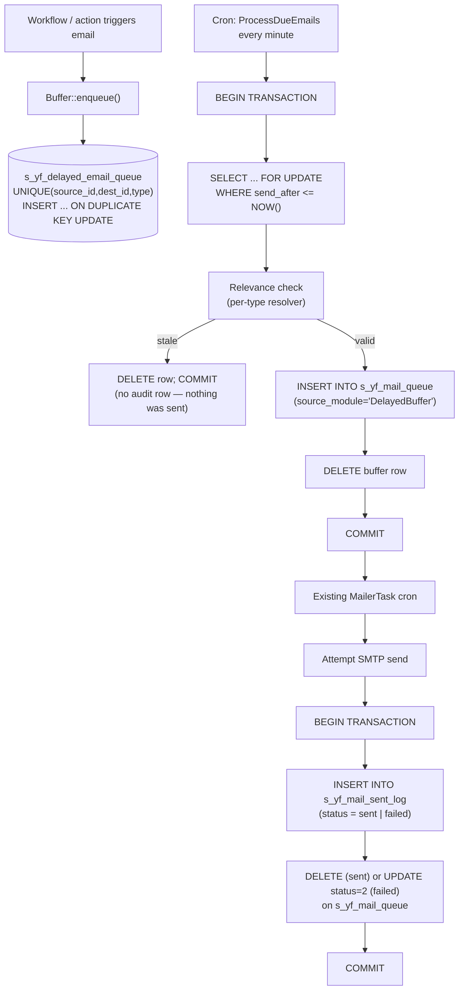

# Delayed and Cancellable Emails — MVP (v2)

**Status:** MVP design — revised after architecture review
**Author:** bmankowski@gmail.com
**Date:** 2026-05-22

---

## 1. Goal

Instead of sending workflow-triggered emails immediately, every email is placed in a
short-lived **buffer** with a configurable delay (default: 2 hours). If another action
on the same business pair fires before the delay expires, the pending email is
**superseded** by the new one. Only the final pending email is promoted into the
existing FreeCRM mail pipeline.

In parallel, every email that actually reaches the SMTP layer is recorded in a small
**delivery audit log** so that the system can always answer the question
*"did we send this email, and if so, when and why?"* — regardless of whether it
came through the new buffer or any other path.

---

## 2. Architecture overview

Three pieces, two of them new:

1. **Buffer** — `s_yf_delayed_email_queue` (NEW). Holds at most one pending email per
   `(source_id, dest_id, type)`. Replace-on-write semantics.
2. **Cron task** — `ProcessDueEmails` (NEW). Every minute, transactionally promotes
   due rows into the existing `s_yf_mail_queue`.
3. **Delivery audit** — `s_yf_mail_sent_log` (NEW) + small hook in the existing
   `MailerTask` (MODIFIED). One row per delivery attempt, success or terminal failure.
   Benefits **every** email path, not just buffered ones.



### Components

| Component | Responsibility |
|-----------|----------------|
| `Buffer::enqueue()` | Upserts a pending row keyed by `(source_id, dest_id, type)`. Renders subject + body at call time and freezes them. Computes `expected_state_hash` via the type's relevance resolver. |
| `s_yf_delayed_email_queue` | Holds only unsent, unsuperseded buffered emails. Unique constraint enforces "at most one per pair+type." |
| `ProcessDueEmails` cron task | Registered in `vtiger_cron_task`. Every minute, transactionally claims, re-checks relevance, and promotes due rows into `s_yf_mail_queue`. |
| `s_yf_mail_queue` (extended) | Existing pipeline. Two new optional columns (`source_module`, `source_id`) thread context through to the audit log. Otherwise unchanged. |
| `MailerTask` (modified) | After every send attempt, writes one audit row in the same transaction as the queue mutation. |
| `s_yf_mail_sent_log` | Append-only delivery audit. One row per delivery attempt. Generic — used by all email paths. |
| `CleanupMailAuditLog` cron task | Periodically deletes audit rows older than the configured retention window. |

---

## 3. Data model

### 3.1 Buffer table

```sql
CREATE TABLE s_yf_delayed_email_queue (
  id                  INT UNSIGNED AUTO_INCREMENT PRIMARY KEY,
  source_id           INT UNSIGNED NOT NULL,
  dest_id             INT UNSIGNED NOT NULL,
  type                VARCHAR(64)  NOT NULL,        -- enum-backed; see §4
  recipients_json     JSON         NOT NULL,        -- {"to":[...], "cc":[...], "bcc":[...]}
  subject             VARCHAR(998) NOT NULL,
  body                MEDIUMTEXT   NOT NULL,
  expected_state_hash CHAR(64)     DEFAULT NULL,    -- NULL = relevance check skipped
  send_after          TIMESTAMP    NOT NULL,
  created_at          TIMESTAMP    NOT NULL DEFAULT CURRENT_TIMESTAMP,
  UNIQUE KEY uniq_pair_type (source_id, dest_id, type),
  KEY idx_due (send_after)
) ENGINE=InnoDB DEFAULT CHARSET=utf8mb4;
```

| Field | Purpose |
|-------|---------|
| `source_id` | First record in the relation (e.g. project). |
| `dest_id` | Second record in the relation (e.g. person). |
| `type` | Enum value (see §4). Independent types between the same pair do not cancel each other. |
| `recipients_json` | Full To/Cc/Bcc set, frozen at enqueue time. |
| `subject`, `body` | Rendered at enqueue, frozen, not re-evaluated on send. |
| `expected_state_hash` | SHA-256 of the domain state at enqueue time, produced by the type's resolver. Re-checked before promote. |
| `send_after` | Computed in SQL as `NOW() + INTERVAL :delay MINUTE` — always UTC-safe via `TIMESTAMP`. |

**No `status` column.** Lifecycle is: row exists ⇒ pending; row deleted ⇒ resolved
(superseded, cancelled, sent, or discarded). The reason is recorded either by the
delivery audit (sent) or by the buffer event log (everything else, see §11).

### 3.2 Delivery audit table (generic)

```sql
CREATE TABLE s_yf_mail_sent_log (
  id              INT UNSIGNED AUTO_INCREMENT PRIMARY KEY,
  mail_queue_id   INT UNSIGNED NOT NULL,                  -- s_yf_mail_queue.id at attempt time
  smtp_id         INT UNSIGNED NOT NULL,
  owner           INT UNSIGNED DEFAULT NULL,
  recipients_json JSON         NOT NULL,                  -- to/cc/bcc preserved
  subject         VARCHAR(998) NOT NULL,
  body_sha256     CHAR(64)     NOT NULL,                  -- verification without retaining full body
  body_excerpt    VARCHAR(500) DEFAULT NULL,              -- first ~500 chars of stripped text
  status          TINYINT      NOT NULL,                  -- 1 = sent, 2 = terminal failure
  error           TEXT         DEFAULT NULL,
  attempted_at    TIMESTAMP    NOT NULL DEFAULT CURRENT_TIMESTAMP,
  source_module   VARCHAR(64)  DEFAULT NULL,              -- e.g. 'DelayedBuffer', 'Workflow', 'Manual'
  source_id       INT UNSIGNED DEFAULT NULL,              -- caller-defined correlation id
  KEY idx_attempted_at (attempted_at),
  KEY idx_status       (status, attempted_at),
  KEY idx_source       (source_module, source_id),
  KEY idx_smtp         (smtp_id, attempted_at)
) ENGINE=InnoDB DEFAULT CHARSET=utf8mb4;
```

Design notes:

- **Bodies are not stored in full.** A SHA-256 plus a 500-char excerpt covers
  the typical support question ("which email was that?") without making the
  table a GDPR liability. Bodies remain available in `s_yf_mail_queue` for the
  brief window before send.
- **`recipients_json`** preserves To/Cc/Bcc — matches the existing `Mailer::addMail()`
  surface, unlike a single `recipient` column.
- **`source_module` + `source_id`** is the back-link to *why*. The buffer sets
  `source_module='DelayedBuffer'` and `source_id` = the buffer row id. Other
  callers can populate freely; absent values stay NULL.

### 3.3 Extension to `s_yf_mail_queue`

Two optional columns added so the audit log can correlate back to the trigger:

```sql
ALTER TABLE s_yf_mail_queue
  ADD COLUMN source_module VARCHAR(64) DEFAULT NULL,
  ADD COLUMN source_id     INT UNSIGNED DEFAULT NULL,
  ADD KEY idx_source (source_module, source_id);
```

Backfilled to NULL for existing rows. Existing callers of `Mailer::addMail()`
do not need to change.

---

## 4. Type registry and relevance resolvers

The previous draft left `isStillRelevant()` and the `type` string as caller
responsibilities. Both are now centralized.

### 4.1 Type enum

```php
namespace App\Email\Delayed;

enum DelayedEmailType: string
{
    case STATUS_CHANGE = 'status_change';
    // add new cases here as new buffered email kinds are introduced

    public function resolver(): ?RelevanceResolver
    {
        return match ($this) {
            self::STATUS_CHANGE => new StatusChangeResolver(),
        };
    }
}
```

Typo-safe: callers pass `DelayedEmailType::STATUS_CHANGE`, not the raw string.

### 4.2 Relevance resolver

```php
interface RelevanceResolver
{
    /**
     * Returns a SHA-256 hex digest of the domain state for (source, dest)
     * that is relevant for this email type. The hash MUST be deterministic
     * and MUST change iff the buffered email should no longer go out.
     */
    public function hash(int $sourceId, int $destId): string;
}
```

Example for status-change emails:

```php
final class StatusChangeResolver implements RelevanceResolver
{
    public function hash(int $sourceId, int $destId): string
    {
        $state = (new \App\Db\Query())
            ->select(['status'])
            ->from('u_yf_projektyrekrutacyjne_kandydaci')
            ->where(['project_id' => $sourceId, 'kandydat_id' => $destId])
            ->scalar();
        return hash('sha256', (string) $state);
    }
}
```

The buffer (not the caller) computes the hash at enqueue and re-computes it at
promote time. If they differ, the email is silently discarded — the business
state has moved on since enqueue.

If no resolver is registered for a type, `expected_state_hash` is `NULL` and
the relevance check is skipped (the supersede/cancel mechanism alone is then
the only correctness safeguard).

---

## 5. Enqueue (replace semantics)

```php
function enqueue(
    int $sourceId,
    int $destId,
    DelayedEmailType $type,
    Email $email,           // ->recipients (to/cc/bcc), ->subject, ->body (already rendered)
    ?int $delayMinutes = null
): void {
    $delay = $delayMinutes
        ?? \App\Core\AppConfig::module('Mail', 'DELAYED_EMAIL_DEFAULT_MINUTES', 120);

    $hash = $type->resolver()?->hash($sourceId, $destId);

    \App\Db\Db::getInstance('admin')->createCommand(
        'INSERT INTO s_#__delayed_email_queue
             (source_id, dest_id, type, recipients_json, subject, body,
              expected_state_hash, send_after, created_at)
         VALUES
             (:src, :dst, :type, :rcpts, :subj, :body,
              :hash, NOW() + INTERVAL :delay MINUTE, NOW())
         ON DUPLICATE KEY UPDATE
             recipients_json     = VALUES(recipients_json),
             subject             = VALUES(subject),
             body                = VALUES(body),
             expected_state_hash = VALUES(expected_state_hash),
             send_after          = VALUES(send_after),
             created_at          = VALUES(created_at)',
        [
            ':src'   => $sourceId,
            ':dst'   => $destId,
            ':type'  => $type->value,
            ':rcpts' => \App\Utils\Json::encode($email->recipients),
            ':subj'  => $email->subject,
            ':body'  => $email->body,
            ':hash'  => $hash,
            ':delay' => $delay,
        ]
    )->execute();
}
```

Single statement, atomic by virtue of the unique key. No outer transaction
needed. `NOW()` is taken from the database — never from PHP — so the cron
container's timezone is irrelevant.

---

## 6. Cron task — `ProcessDueEmails`

```php
// src/Modules/Cron/Tasks/DelayedEmailQueueTask.php

final class DelayedEmailQueueTask extends AbstractCronTask
{
    public function execute(): void
    {
        $dueIds = (new \App\Db\Query())
            ->select(['id'])
            ->from('s_#__delayed_email_queue')
            ->where(['<=', 'send_after', new \App\Db\Expression('NOW()')])
            ->orderBy(['send_after' => SORT_ASC])
            ->limit(50)
            ->column();

        foreach ($dueIds as $id) {
            $this->promoteOne((int) $id);
        }
    }

    private function promoteOne(int $id): void
    {
        $db = \App\Db\Db::getInstance('admin');

        $db->transaction(function () use ($db, $id) {
            $row = (new \App\Db\Query())
                ->from('s_#__delayed_email_queue')
                ->where(['id' => $id])
                ->one($db, true /* forUpdate */);

            if (!$row) {
                return; // claimed (and removed) by another worker
            }

            if (!$this->isStillRelevant($row)) {
                $db->createCommand()->delete('s_#__delayed_email_queue', ['id' => $id])->execute();
                $this->logEvent($row, 'stale_discarded');
                return;
            }

            $recipients = \App\Utils\Json::decode($row['recipients_json']);

            \App\Email\Mailer::addMail([
                'smtp_id'       => \App\Email\Mail::getDefaultSmtp(),
                'to'            => \App\Utils\Json::encode($recipients['to']  ?? []),
                'cc'            => isset($recipients['cc'])  ? \App\Utils\Json::encode($recipients['cc'])  : null,
                'bcc'           => isset($recipients['bcc']) ? \App\Utils\Json::encode($recipients['bcc']) : null,
                'subject'       => $row['subject'],
                'content'       => $row['body'],
                'source_module' => 'DelayedBuffer',
                'source_id'     => (int) $row['id'],
            ]);

            $db->createCommand()->delete('s_#__delayed_email_queue', ['id' => $id])->execute();
        });
    }

    private function isStillRelevant(array $row): bool
    {
        if ($row['expected_state_hash'] === null) {
            return true;
        }
        $resolver = DelayedEmailType::from($row['type'])->resolver();
        if ($resolver === null) {
            return true;
        }
        return hash_equals(
            $row['expected_state_hash'],
            $resolver->hash((int) $row['source_id'], (int) $row['dest_id'])
        );
    }
}
```

Why this is safe:

- **`SELECT ... FOR UPDATE`** locks the buffer row. Concurrent cron workers either
  see the row (one wins) or see no row (the rest skip). No double promotion.
- **`Mailer::addMail()` and `DELETE` run inside the same transaction.** A crash,
  OOM-kill, or container restart between the two rolls both back: the row stays
  pending and will be retried on the next cron pass. No silent loss.
- **The relevance check is inside the transaction**, after the lock, so the state
  cannot change between check and promote without invalidating the hash on the
  next pass anyway.

---

## 7. Delivery audit hook in `MailerTask`

Replace the post-attempt block in `MailerTask::execute()`:

```php
foreach ($smtpRows as $rowQueue) {
    $errorMsg = null;
    $status   = false;
    try {
        $status = \App\Email\Mailer::sendByRowQueue($rowQueue, $sessionMailer);
    } catch (\Throwable $e) {
        $errorMsg = $e->getMessage();
    }

    $db->transaction(function () use ($db, $rowQueue, $status, $errorMsg) {
        $db->createCommand()->insert('s_#__mail_sent_log', [
            'mail_queue_id'   => (int) $rowQueue['id'],
            'smtp_id'         => (int) $rowQueue['smtp_id'],
            'owner'           => $rowQueue['owner'] ?? null,
            'recipients_json' => \App\Utils\Json::encode([
                'to'  => $rowQueue['to']  ?? null,
                'cc'  => $rowQueue['cc']  ?? null,
                'bcc' => $rowQueue['bcc'] ?? null,
            ]),
            'subject'         => mb_substr((string) $rowQueue['subject'], 0, 998),
            'body_sha256'     => hash('sha256', (string) $rowQueue['content']),
            'body_excerpt'    => mb_substr(strip_tags((string) $rowQueue['content']), 0, 500),
            'status'          => $status ? 1 : 2,
            'error'           => $status ? null : $errorMsg,
            'source_module'   => $rowQueue['source_module'] ?? null,
            'source_id'       => isset($rowQueue['source_id']) ? (int) $rowQueue['source_id'] : null,
        ])->execute();

        if ($status) {
            $db->createCommand()->delete('s_#__mail_queue', ['id' => $rowQueue['id']])->execute();
        } else {
            $db->createCommand()->update('s_#__mail_queue', ['status' => 2], ['id' => $rowQueue['id']])->execute();
        }
    });
}
```

Both the audit insert and the queue mutation share one transaction. The audit
log and `s_yf_mail_queue` can never disagree.

---

## 8. Cancellation

### Automatic — supersede

Handled by the `ON DUPLICATE KEY UPDATE` in §5. The previous pending row is
overwritten in place; no separate delete is required.

### Manual — administrator action

```php
function cancel(int $sourceId, int $destId, ?DelayedEmailType $type = null): int
{
    $conditions = ['source_id' => $sourceId, 'dest_id' => $destId];
    if ($type !== null) {
        $conditions['type'] = $type->value;
    }
    return \App\Db\Db::getInstance('admin')
        ->createCommand()
        ->delete('s_#__delayed_email_queue', $conditions)
        ->execute();
}
```

### How to prove a cancellation happened

A cancelled or superseded email has **no row in `s_yf_mail_sent_log`** for that
correlation. Combined with the buffer's row no longer existing, "we did not
send" is provable by absence.

For installations that need a positive record of suppression events (e.g.
audited recruitment processes), a thin future addition `s_yf_delayed_email_event_log`
can record SUPERSEDED / CANCELLED / STALE_DISCARDED. Out of scope for V1 —
add only if real support load requires it.

---

## 9. Admin UI — `Settings → Delayed Emails`

Single list view, no editor. Columns:

| Column | Source |
|--------|--------|
| Source / Dest | resolved from `source_id` / `dest_id` |
| Type | `type` |
| Recipient(s) | first address from `recipients_json` |
| Subject | `subject` |
| Sends at | `send_after` |
| Created | `created_at` |
| Actions | **Cancel** (delete row), **Send now** (`UPDATE send_after = NOW()`) |

One controller, one Smarty template, both wired into the existing `Settings`
infrastructure (analogous to `Settings:CronTasks`). No new permission system —
inherits the existing "Settings" admin gate.

Operators can also point a separate report at `s_yf_mail_sent_log` to inspect
what actually went out and when; that table is a generic system log and is
discoverable through the existing log-viewer module.

---

## 10. Retention and cleanup

### Buffer

Self-cleaning: rows are deleted on promote, supersede, cancel, or stale-discard.
No background cleanup needed.

### Delivery audit

Configurable retention window, default **365 days**. A second cron task
deletes expired rows:

```php
final class CleanupMailAuditLogTask extends AbstractCronTask
{
    public function execute(): void
    {
        $days = (int) \App\Core\AppConfig::module('Mail', 'AUDIT_LOG_RETENTION_DAYS', 365);
        \App\Db\Db::getInstance('admin')
            ->createCommand()
            ->delete('s_#__mail_sent_log',
                ['<', 'attempted_at', new \App\Db\Expression("NOW() - INTERVAL :d DAY", [':d' => $days])])
            ->execute();
    }
}
```

GDPR posture: only metadata (recipients, subject, hash, excerpt) is retained,
not full message bodies. Retention window is administrator-configurable per
deployment.

---

## 11. Configuration

| Key | Default | Purpose |
|-----|---------|---------|
| `Mail.DELAYED_EMAIL_DEFAULT_MINUTES` | `120` | Default delay applied when caller does not pass an explicit `$delayMinutes`. |
| `Mail.AUDIT_LOG_RETENTION_DAYS` | `365` | Retention window for `s_yf_mail_sent_log`. |

Per-type / per-template overrides are added later by passing `$delayMinutes`
to `enqueue()`. No schema change required.

---

## 12. Failure modes and guarantees

| Failure | Guarantee |
|---------|-----------|
| Cron container restart between claim and promote | Both `Mailer::addMail()` and the buffer `DELETE` are in one transaction. Restart rolls back. Row stays pending. Retried next minute. |
| Cron container restart between `MailerTask` send and audit insert | Both inserts/updates share one transaction. Restart rolls back. Email may be re-attempted by `MailerTask` on next pass (existing semantics). |
| Two cron workers race | `SELECT ... FOR UPDATE` serializes them. Loser sees no row and moves on. No double send. |
| Two simultaneous `enqueue()` for the same key | `UNIQUE(source_id, dest_id, type)` + `ON DUPLICATE KEY UPDATE` is atomic. Exactly one row survives. |
| State changed during delay (cancellation missed) | Relevance hash mismatch at promote → row deleted, email not sent, no audit row created. |
| State changed during delay (cancellation correctly recorded) | Buffer row already gone via supersede / cancel. No attempt is made. |
| DB outage during delay | On recovery, cron picks up overdue rows. Relevance check re-validates. |
| Clock skew between PHP and DB | None. All `send_after` arithmetic is performed inside SQL using `NOW()`. |
| SMTP provider succeeds but local marks failed | Inherits existing `MailerTask` behavior (`status=2`); audit row records the failure. Duplicate-send risk is the **pre-existing** behavior of the mail pipeline and is out of scope for this MVP. |
| Recipient or template changed during 2h delay | Subject, body, recipients are frozen at enqueue time. The email reflects the state at enqueue, not at send. Documented limitation. |
| Workflow code emits duplicate trigger events | Idempotent: every duplicate `enqueue()` collapses into the same single row by the unique key. |

---

## 13. Edge cases

| Scenario | Handling |
|----------|----------|
| Recruiter drags Interview → Rejected → Interview within 1 minute | `enqueue()` for "rejected" inserts; second action either calls `cancel()` (explicit) or — if the workflow re-fires for "interview" — overwrites under the same key. Relevance hash on the surviving row reflects the latest state and the cron either sends the correct email or discards it. |
| Two recruiters edit the same candidate from different tabs | Unique key serializes the two `enqueue()` calls. The last writer wins. |
| Admin clicks "Cancel" in `Settings → Delayed Emails` | Row deleted. No audit row appears. Operator can verify by absence in `s_yf_mail_sent_log`. |
| Admin clicks "Send now" | `send_after` set to `NOW()`. Next cron pass within ≤ 60 s promotes through the normal path, including relevance check. |
| System down for longer than the delay | All overdue rows are picked up at the next cron run. Each is independently relevance-checked. |
| Type added to enum without a resolver | `expected_state_hash` is NULL; relevance check is a no-op. Supersede/cancel remain the only safeguards. Document this when adding the type. |
| Caller passes a typo for `type` | Impossible: `type` is a PHP `enum`. Compile-time error. |

---

## 14. Acceptance criteria

- An email triggered by an action is queued, not sent immediately.
- Default delay is 2 hours and is configurable.
- A second action on the same `(source_id, dest_id, type)` replaces the previous
  pending email in a single, race-free statement.
- Only the final pending email for a pair+type is promoted.
- The relevance check discards stale rows whose domain state hash no longer
  matches the value captured at enqueue.
- A crash, OOM, or deploy between buffer claim and queue insert leaves the
  buffer row intact for retry; no email is silently lost.
- Two concurrent cron workers cannot promote the same row twice.
- Overdue rows are processed correctly after system restart.
- Every successful send and every terminal failure in `MailerTask` produces
  exactly one row in `s_yf_mail_sent_log`, in the same transaction as the
  underlying `s_yf_mail_queue` mutation.
- `s_yf_mail_sent_log` retention is enforced by a dedicated cleanup cron task
  using a configurable window.
- `Settings → Delayed Emails` shows current pending rows and exposes Cancel /
  Send-now actions.
- Schema migration is forward-only: no existing `s_yf_mail_queue` callers need
  to change.

---

## 15. Explicitly out of scope (V2 candidates)

- Buffer-side event log of suppression reasons (SUPERSEDED / CANCELLED /
  STALE_DISCARDED). Provable by absence in V1.
- Per-type / per-template configurable delays in the UI (only `$delayMinutes`
  parameter is supported in V1).
- Re-resolving recipients at send time (subject, body, and recipients are
  frozen at enqueue in V1).
- Storing full message bodies in the audit log (only hash + excerpt in V1).
- Dead-letter queue for the delivery layer — current behavior (`status=2`,
  manual intervention) is preserved.
- Replacement of the polling cron with a real job queue.
