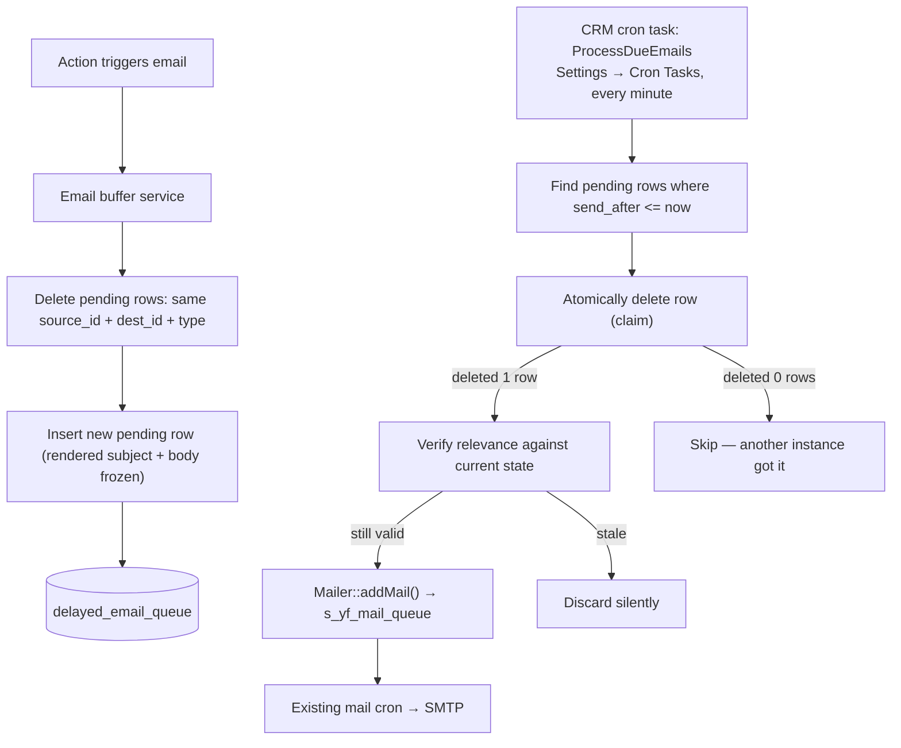

# Delayed and Cancellable Emails — MVP

**Status:** MVP design  
**Author:** bmankowski@gmail.com  
**Date:** 2026-05-22

---

## 1. Goal

Instead of sending workflow-triggered emails immediately, every email is placed in a queue with a configurable delay (default: 2 hours). If another relevant action occurs before the delay expires, the pending email is replaced by a new one. Only the final pending email sends.

---

## 2. Data model

Single table:

```sql
CREATE TABLE delayed_email_queue (
  id           INT UNSIGNED AUTO_INCREMENT PRIMARY KEY,
  source_id    INT UNSIGNED NOT NULL,
  dest_id      INT UNSIGNED NOT NULL,
  type         VARCHAR(128) NOT NULL,
  recipient    VARCHAR(255) NOT NULL,
  subject      TEXT NOT NULL,
  body         MEDIUMTEXT NOT NULL,
  status       VARCHAR(16) NOT NULL DEFAULT 'pending',
  send_after   DATETIME NOT NULL,
  created_at   DATETIME NOT NULL,
  KEY idx_due       (status, send_after),
  KEY idx_pair_type (source_id, dest_id, type, status)
);
```

| Field | Purpose |
|-------|---------|
| `source_id` | First record in the relation (e.g. project). |
| `dest_id` | Second record in the relation (e.g. person). |
| `type` | Free string grouping emails by purpose, e.g. `status_change`. Independent types between the same pair do not cancel each other. |
| `status` | `pending` or `cancelled`. Sent rows are deleted — the buffer is not an audit log. |
| `send_after` | Earliest time the cron task may send. |
| `subject`, `body` | Rendered at queue time — frozen, not re-evaluated on send. |

---

## 3. Architecture

The buffer sits before the existing FreeCRM mail pipeline. It does not send via SMTP directly — when a row is due, the cron task promotes it into the existing `s_yf_mail_queue` via `Mailer::addMail()`. The mail cron handles SMTP from there.



### Components

| Component | Responsibility |
|-----------|----------------|
| Email buffer service | Deletes existing pending rows for the pair+type, inserts the new pending row with rendered content. |
| `delayed_email_queue` | Holds only unprocessed emails. Once promoted, the row is deleted. |
| CRM cron task `ProcessDueEmails` | Registered in `com_vtiger_crontasks`. Runs via `cron/vtigercron.php` every minute. Visible and togglable in Settings → Cron Tasks. |
| `Mailer::addMail()` | Existing FreeCRM method. Inserts into `s_yf_mail_queue`. No new sending code needed. |
| `s_yf_mail_queue` + mail cron | Existing pipeline. Handles the actual SMTP connection. Unchanged. |

---

## 4. Enqueue / replace pseudocode

```php
function enqueue(int $sourceId, int $destId, string $type, Email $email, int $delayMinutes = 120): void
{
    $now = now();

    db()->transaction(function () use ($sourceId, $destId, $type, $email, $now, $delayMinutes) {
        db()->createCommand()->delete(
            'delayed_email_queue',
            ['source_id' => $sourceId, 'dest_id' => $destId, 'type' => $type, 'status' => 'pending']
        )->execute();

        db()->createCommand()->insert('delayed_email_queue', [
            'source_id'  => $sourceId,
            'dest_id'    => $destId,
            'type'       => $type,
            'recipient'  => $email->recipient,
            'subject'    => $email->subject,
            'body'       => $email->body,
            'status'     => 'pending',
            'send_after' => $now->modify("+{$delayMinutes} minutes"),
            'created_at' => $now,
        ])->execute();
    });
}
```

One transaction: delete previous pending rows, insert new one. The buffer always holds at most one pending email per pair+type.

---

## 5. Cron task pseudocode

```php
// cron/modules/DelayedEmailQueue/ProcessDueEmails.php

function process(): void
{
    $due = db()->createCommand(
        'SELECT id FROM delayed_email_queue
          WHERE status = :s AND send_after <= :now
          ORDER BY send_after ASC LIMIT 50'
    )->bindValues([':s' => 'pending', ':now' => now()])->queryColumn();

    foreach ($due as $id) {
        $row = loadRow($id);

        $claimed = db()->createCommand()->delete(
            'delayed_email_queue',
            ['id' => $id, 'status' => 'pending']
        )->execute();

        if (!$claimed) {
            continue; // another cron instance already claimed it
        }

        if (!isStillRelevant($row)) {
            continue; // stale — discard silently
        }

        \App\Email\Mailer::addMail([
            'smtp_id'  => \App\Email\Mail::getDefaultSmtp(),
            'to'       => \App\Utils\Json::encode([$row['recipient'] => $row['recipient']]),
            'subject'  => $row['subject'],
            'content'  => $row['body'],
        ]);
    }
}
```

`DELETE WHERE id = X AND status = 'pending'` is the duplicate-send guard. If two cron instances race, only one gets `affected = 1`. The row is gone from the buffer on claim regardless of what follows.

`Mailer::addMail()` inserts into the existing `s_yf_mail_queue`. The buffer worker never touches SMTP — it only promotes the row into the existing mail pipeline.

---

## 6. Relevance check

Before sending, verify the current state still matches what was queued.

```php
function isStillRelevant(array $row): bool
{
    $currentState = loadCurrentState($row['source_id'], $row['dest_id']);
    return $currentState === $row['expected_state']; // domain-specific check
}
```

Guards against missed cancellations, downtime during the delay window, or direct database edits.

---

## 7. Cancellation

### Automatic — new action on the same pair+type

Handled inside `enqueue()`: previous pending row is deleted before the replacement is inserted.

### Manual — administrator action

```php
function cancel(int $sourceId, int $destId, ?string $type = null): void
{
    $conditions = ['source_id' => $sourceId, 'dest_id' => $destId, 'status' => 'pending'];
    if ($type !== null) {
        $conditions['type'] = $type;
    }
    db()->createCommand()->delete('delayed_email_queue', $conditions)->execute();
}
```

---

## 8. Edge cases

| Scenario | Handling |
|----------|----------|
| Rapid repeated state changes | Each `enqueue()` deletes the previous pending row. Only the last one survives. |
| System downtime during delay | Cron task processes overdue `pending` rows on restart. Relevance check discards stale ones. |
| Two cron instances running simultaneously | Atomic `DELETE WHERE id = X AND status = 'pending'` — only one instance gets `affected = 1`. |
| State changed after cron claims row | `isStillRelevant()` discards the email after deletion, before send. |
| Cron crashes after delete but before send | Email silently lost. Acceptable for MVP — the window is microseconds. Add a `email_send_log` later if an audit trail is needed. |

---

## 9. Configuration

One global setting for MVP:

```text
delayed_email_default_delay_minutes = 120
```

Per-type delays can be added later without schema changes by passing `$delayMinutes` to `enqueue()`.

---

## 10. Acceptance criteria

- An email triggered by an action is queued, not sent immediately.
- Default delay is 2 hours.
- A second action on the same `source_id + dest_id + type` replaces the previous pending email.
- Only the final pending email for a pair+type sends.
- Cron task does not send stale rows.
- Two concurrent cron instances cannot send the same email twice.
- Overdue emails are processed correctly after system restart.
- The buffer table contains only unprocessed emails at all times.
