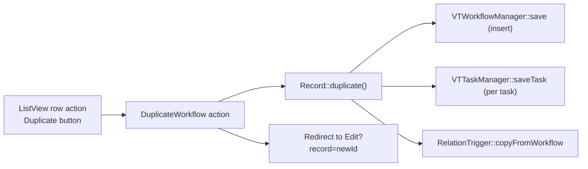

# Workflow Duplicate — MVP

**Status:** MVP design  
**Author:** bmankowski@gmail.com  
**Date:** 2026-05-23

---

## 1. Goal

On the Settings → Workflows list view (`module=Workflows&parent=Settings&view=ListView`), allow an admin to **duplicate an entire workflow including all assigned tasks** with one click — without export/import XML.

Success criteria:

- New workflow row in `com_vtiger_workflows` with copied definition (module, conditions, trigger, schedule).
- All tasks from `com_vtiger_workflowtasks` copied with the same configuration and active/inactive state.
- Relation trigger config (`com_vtiger_workflow_relation_triggers`) copied when present.
- User lands on the new workflow’s edit screen (or list with success) and can adjust the name immediately.

---

## 2. Assumptions

| # | Assumption |
|---|------------|
| A1 | Only **admin users** may duplicate (same as other Settings → Workflows actions). |
| A2 | **System/default workflows** (`defaultworkflow = 1`) cannot be duplicated — button hidden or action rejected. |
| A3 | Copy suffix for summary: ` (copy)` — language key `LBL_WORKFLOW_COPY_SUFFIX` in `Settings:Workflows`. |
| A4 | Duplicated workflow is **inactive at workflow level** only in the sense of `defaultworkflow`; task `active` flags are copied as-is (admin may deactivate via existing bulk actions). |
| A5 | **No** copy of runtime state: `com_vtiger_workflow_activatedonce` is not duplicated. |
| A6 | **VTEntityMethodTask**: custom PHP methods are **not** re-imported; task blob still references existing `method_name` (same as XML import). |
| A7 | Scheduled workflows: schedule fields (`sch*`, `nexttrigger_time`) are copied verbatim; admin reviews before enabling in production. |

---

## 3. Architecture overview

Reuse existing persistence layer; add a thin duplicate orchestrator and ListView action.



### Components

| Component | Responsibility |
|-----------|----------------|
| `Record::getRecordLinks()` | Add `LBL_DUPLICATE_RECORD` link (glyphicon duplicate), same pattern as Export. |
| `Actions/DuplicateWorkflow.php` | Permission check, call `duplicate()`, redirect or JSON error. |
| `Record::duplicate()` | Load source, insert workflow + tasks + relation trigger in one transaction. |
| `Module::importWorkflow()` | **Reference only** — duplicate inlines same task-insert logic without XML. |
| `ListView.js` (optional) | Confirm dialog before navigation (MVP: simple GET + redirect is enough). |

No new tables, cron jobs, or background workers.

---

## 4. Functional requirements

### 4.1 MVP (in scope)

| ID | Requirement |
|----|-------------|
| F1 | Per-row **Duplicate** action on Workflows ListView. |
| F2 | Creates new `workflow_id`; copies all columns from `Module::$allFields` except identity/runtime. |
| F3 | Appends ` (copy)` to `summary` (if already ends with suffix, append ` (copy 2)` etc. — see §8). |
| F4 | Copies every row in `com_vtiger_workflowtasks` for source `workflow_id`. |
| F5 | Resets `task_id` / `workflowId` inside serialized task objects. |
| F6 | Copies `com_vtiger_workflow_relation_triggers` when row exists for source. |
| F7 | Sets `defaultworkflow` to `NULL` / `0` on copy (never create another system workflow). |
| F8 | After success, redirect to `index.php?module=Workflows&parent=Settings&view=Edit&record={newId}`. |
| F9 | Flash/success message: `LBL_WORKFLOW_DUPLICATED`. |
| F10 | Block duplicate when source is missing or `defaultworkflow = 1`. |

### 4.2 Out of scope (future)

| Item | Reason |
|------|--------|
| Bulk duplicate (multi-select) | Not needed for MVP. |
| Duplicate from Edit/TasksList views | ListView only. |
| Inline duplicate (stay on list, AJAX refresh) | Redirect to Edit is simpler. |
| Cross-instance / cross-module copy | Use existing XML export/import. |
| Versioning / audit trail of who duplicated | Optional later. |
| Rename wizard before save | Edit screen is the wizard. |
| Copy `com_vtiger_workflow_activatedonce` | Runtime per-entity state. |

---

## 5. Data model

### 5.1 Tables (existing)

**`com_vtiger_workflows`**

| Field | Copy? | Notes |
|-------|-------|-------|
| `workflow_id` | No | New PK from sequence. |
| `module_name` | Yes | |
| `summary` | Yes + suffix | User-visible name. |
| `test` | Yes | JSON conditions. |
| `execution_condition` | Yes | |
| `defaultworkflow` | Force `NULL` | Never duplicate system flag. |
| `type` | Yes | e.g. `basic`. |
| `filtersavedinnew` | Yes | |
| `schtypeid`, `schdayofmonth`, `schdayofweek`, `schannualdates`, `schtime` | Yes | |
| `nexttrigger_time` | Yes | Copied; cron may fire — acceptable for MVP with admin review. |

**`com_vtiger_workflowtasks`**

| Field | Copy? | Notes |
|-------|-------|-------|
| `task_id` | No | New via `getUniqueID` / insert. |
| `workflow_id` | New FK | |
| `summary` | Yes | |
| `task` | Yes (rewritten) | Unserialize → set `id`/`workflowId` → serialize. |

**`com_vtiger_workflow_relation_triggers`** (FreeCRM extension)

| Field | Copy? |
|-------|-------|
| All except `workflow_id` | Yes → new `workflow_id` |

**Not copied:** `com_vtiger_workflow_activatedonce`, `com_vtiger_workflowtasks_entitymethod` (definitions stay global).

### 5.2 Example

Source workflow `workflow_id = 42`, summary `Projekt → Kandydat: status zmiana`, 3 tasks (2 active).

After duplicate:

- `workflow_id = 187`
- `summary = Projekt → Kandydat: status zmiana (copy)`
- 3 tasks with new `task_id`s, same serialized payloads except `workflowId = 187`

---

## 6. Processing logic

### 6.1 Event flow

1. User clicks Duplicate on list row.
2. `GET index.php?module=Workflows&parent=Settings&action=DuplicateWorkflow&record={id}`
3. Action validates admin + record + not default workflow.
4. `Record::duplicate($sourceId)` runs in DB transaction.
5. Redirect to Edit for new id.

### 6.2 Pseudocode

```php
// Record.php
public function duplicate(): self
{
    $source = self::getInstance($this->getId());
    if ($source->isDefault()) {
        throw new AppException('LBL_CANNOT_DUPLICATE_DEFAULT_WORKFLOW');
    }

    $db = Db::getInstance();
    $transaction = $db->beginTransaction();
    try {
        $wf = $source->getWorkflowObject();
        $wf->id = null;
        $wf->defaultworkflow = null;
        $wf->description = self::buildCopySummary($wf->description);

        $wm = new VTWorkflowManager();
        $wm->save($wf); // INSERT
        $newId = (int) $wf->id;

        $taskManager = new VTTaskManager();
        foreach ($source->getTasks(false) as $taskRecord) {
            $task = $taskRecord->getTaskObject(); // or retrieve via VTTaskManager
            $task->id = null;
            $task->workflowId = $newId;
            $taskManager->saveTask($task);
        }

        RelationTrigger::copyFromWorkflow($source->getId(), $newId);

        $transaction->commit();
        return self::getInstance($newId);
    } catch (\Throwable $e) {
        $transaction->rollBack();
        throw $e;
    }
}

// RelationTrigger.php
public static function copyFromWorkflow(int $sourceWorkflowId, int $targetWorkflowId): void
{
    $row = (new Query())->from('com_vtiger_workflow_relation_triggers')
        ->where(['workflow_id' => $sourceWorkflowId])->one();
    if (!$row) {
        return;
    }
    unset($row['id'] ?? null);
    $row['workflow_id'] = $targetWorkflowId;
    Db::getInstance()->createCommand()->insert('com_vtiger_workflow_relation_triggers', $row)->execute();
}

// DuplicateWorkflow.php
public function process(Vtiger_Request $request)
{
    $this->checkPermission($request);
    $recordId = (int) $request->get('record');
    $model = Record::getInstance($recordId);
    $copy = $model->duplicate();
    header('Location: ' . $copy->getEditViewUrl());
}
```

### 6.3 Summary suffix helper

```php
private static function buildCopySummary(string $summary): string
{
    $suffix = ' (' . translate('LBL_WORKFLOW_COPY_SUFFIX') . ')';
    if (!str_ends_with($summary, $suffix)) {
        return $summary . $suffix;
    }
    // Projekt (copy) → Projekt (copy 2)
    if (preg_match('/ \(copy(?: (\d+))?\)$/', $summary, $m)) {
        $n = isset($m[1]) ? (int)$m[1] + 1 : 2;
        return preg_replace('/ \(copy(?: \d+)?\)$/', " (copy $n)", $summary);
    }
    return $summary . $suffix;
}
```

### 6.4 UI link (Record::getRecordLinks)

Insert after Export, before Edit:

```php
[
    'linktype' => 'LISTVIEWRECORD',
    'linklabel' => 'LBL_DUPLICATE_RECORD',
    'linkurl' => 'index.php?module=Workflows&parent=Settings&action=DuplicateWorkflow&record=' . $this->getId(),
    'linkicon' => 'glyphicon glyphicon-duplicate',
],
```

Hide link when `$this->isDefault()` is true.

---

## 7. Reliability

| Concern | Handling |
|---------|----------|
| **Concurrency** | Two admins duplicate same workflow → two independent copies; acceptable. |
| **Idempotency** | Each click creates a **new** workflow; not idempotent by design. |
| **Partial failure** | Single DB transaction; rollback leaves no orphan workflow without tasks. |
| **Duplicate clicks** | Each creates another `(copy)` / `(copy 2)` row — acceptable; optional confirm dialog reduces accidents. |
| **Cache** | After insert, invalidate `WorkflowsForModule` and `getTasksForWorkflow` cache keys for affected module if cache is used on read path. |
| **Retries** | User retries by clicking again after error message. |

---

## 8. Edge cases

| Case | Behavior |
|------|----------|
| Source workflow deleted mid-request | 404 / `LBL_RECORD_NOT_FOUND`. |
| Default/system workflow | No button; action returns permission/validation error. |
| Workflow with 0 tasks | Still duplicate workflow definition. |
| Invalid serialized task | Fail transaction; log to `system.log`; show generic error. |
| `ON_RELATION_MODIFY` without relation row | Duplicate workflow + tasks only (same as today if misconfigured). |
| Entity method task missing on disk | Duplicate task anyway; failure at runtime (same as source). |
| Very long summary | Truncate only if DB column limit hit — unlikely; document 255 char limit if applicable. |
| Rapid double-click | Two copies — optional JS `data-confirm` or disable button after click (phase 2). |

---

## 9. API / interfaces

### Request

```
GET /index.php?module=Workflows&parent=Settings&action=DuplicateWorkflow&record=42
```

### Response

- **302** → `...&view=Edit&record={newId}`
- **403** — not admin
- **400** — default workflow / invalid id

### Permissions

```php
public function checkPermission(Vtiger_Request $request)
{
    $currentUser = $request->getUser();
    if (!$currentUser->isAdminUser()) {
        throw new AppException('LBL_PERMISSION_DENIED');
    }
}
```

---

## 10. Decision rationale

| Decision | Why |
|----------|-----|
| Server-side copy, not XML roundtrip | One click; no file handling; reuses DB shape directly. |
| Extend `Record` model vs only `importWorkflow` | Import expects parsed XML array; duplicate reads live rows — clearer and testable. |
| Redirect to Edit | Matches MailSmtp `from_record` pattern; immediate rename/tweak. |
| Do not copy `activatedonce` | Prevents wrong “already ran once” behavior on new workflow. |
| Clear `defaultworkflow` | Prevents undeletable system workflows. |
| GET action | Consistent with `ExportWorkflow`; MVP simplicity (CSRF: Settings admin-only mitigates). |

---

## 11. Tradeoffs

| Choice | Pro | Con |
|--------|-----|-----|
| GET duplicate | Simple link in ListView | Not REST-idempotent; CSRF surface (low for admin) |
| Copy schedule as-is | Faithful copy | Duplicate scheduled WF may run on same schedule |
| No AJAX | Less JS | Full page redirect |
| Reuse task serialize blob | 100% fidelity | Must reset ids carefully |

---

## 12. Implementation phases

### Phase 1 — Core (MVP)

1. `Record::duplicate()` + `buildCopySummary()`.
2. `RelationTrigger::copyFromWorkflow()`.
3. `Actions/DuplicateWorkflow.php` + permission.
4. Link in `getRecordLinks()` + language strings (`pl_pl`, `en_us`).
5. Manual test on localhost ListView: duplicate custom WF with 2+ tasks; verify Edit opens with tasks on TasksList.

### Phase 2 — Polish

1. Confirmation dialog in `ListView.js`.
2. Cache invalidation after duplicate.
3. Success banner on Edit view.
4. PHPUnit: duplicate workflow + task count assertion.

### Phase 3 — Enhancements

1. Bulk duplicate.
2. POST + CSRF token.
3. Optional “duplicate to module X” (advanced).

---

## 13. Files to touch

| File | Change |
|------|--------|
| `src/Modules/Settings/Workflows/Models/Record.php` | `duplicate()`, `buildCopySummary()`, link |
| `src/Modules/Settings/Workflows/Models/RelationTrigger.php` | `copyFromWorkflow()` |
| `src/Modules/Settings/Workflows/Actions/DuplicateWorkflow.php` | **New** action |
| `languages/pl_pl/Settings/Workflows.php` | Labels |
| `languages/en_us/Settings/Workflows.php` | Labels |

No schema migration.

---

## 14. Test plan

1. **Happy path:** Custom workflow with email + update field tasks → duplicate → new row in list, summary ends with `(copy)`, task count matches, Edit loads.
2. **Default workflow:** Events/Calendar system WF — no duplicate button / error on forced URL.
3. **Relation workflow:** `ON_RELATION_MODIFY` with `com_vtiger_workflow_relation_triggers` row → copy has identical relation config.
4. **Empty tasks:** Workflow with no tasks still duplicates.
5. **Logs:** No new errors in `cache/logs/system.log` after duplicate.
6. **Web only:** Verify via browser on `http://localhost/...ListView...` (not CLI-only).

---

## 15. Risks

| Risk | Mitigation |
|------|------------|
| Serialized task class mismatch | Use `VTTaskManager::unserializeTask` / `saveTask` only |
| Forgotten related table | Document; add `RelationTrigger` in MVP |
| Duplicate scheduled WF fires unexpectedly | Document in UI; phase 2: clear `nexttrigger_time` on copy |
| Accidental mass duplicate | Confirm dialog in phase 2 |

---

## 16. Future improvements

- Bulk duplicate from list mass actions.
- “Duplicate to another module” with field mapping.
- Duplicate from workflow Edit header.
- Export duplicate as template library entry.
- Audit log: `created_from_workflow_id`.

---

## 17. Reference code (existing)

Duplicate/export patterns already in codebase:

- Export: `src/Modules/Settings/Workflows/Actions/ExportWorkflow.php`
- Import insert: `src/Modules/Settings/Workflows/Models/Module.php` → `importWorkflow()`
- List links: `src/Modules/Settings/Workflows/Models/Record.php` → `getRecordLinks()`
- MailSmtp copy UX: `src/Modules/Settings/MailSmtp/Views/Edit.php` (`from_record`)
